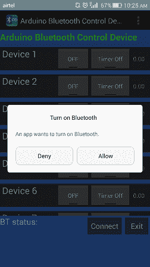
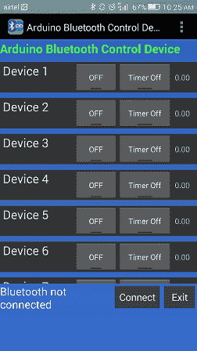
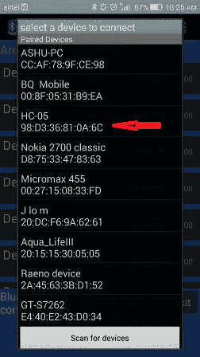
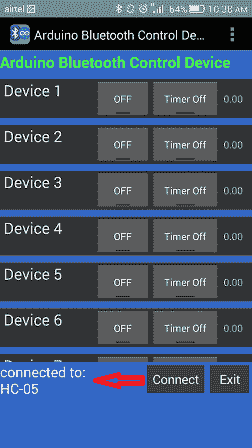
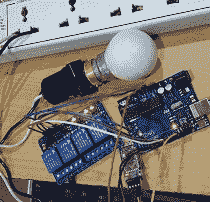
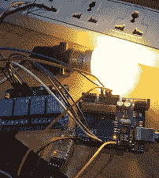

# 利用蓝牙模块、Arduino 设备和 4 通道中继模块控制家庭照明的物联网项目

> 原文：<https://www.javatpoint.com/iot-project-controlling-home-light-using-bluetooth-module-arduino-relay>

在这个项目中，我们将使用蓝牙网络构建一个家庭灯光控制系统。在这个项目中，我们使用了蓝牙模块 HC-05、Arduino 设备、4 通道中继模块等。

## 硬件要求

1.  烧板
2.  USB 缆线连接 arduino
3.  蓝牙模块 HC-05
4.  4 通道继电器模块(5V)
5.  跳线公到母
6.  家用灯(灯泡)
7.  灯座
8.  电线
9.  交流 220 伏/120 伏家用电器或 9v 高瓦特电池

## 软件要求

1.  Arduino 软体

## Arduino-蓝牙模块的工作原理

在这个项目中，使用了四个主要组件:安卓智能手机蓝牙应用程序、蓝牙收发器、Arduino 设备和 4 通道中继模块。


安卓应用程序通过点击开按钮将串行数据发送到连接的蓝牙模块 HC-05。蓝牙设备从 app 接收数据，并通过蓝牙模块的 TX 引脚发送到 Arduino 的 RX 引脚。Arduino 设备读取输入数据，并根据其内部上传的程序对其进行处理，并产生输出至 4 香奈儿继电器模块。

当蓝牙应用程序的按钮打开时，它将家庭照明设置为打开，当蓝牙应用程序的按钮关闭时，它将家庭照明设置为关闭。

**编写一个 Arduino 程序，使用蓝牙模块控制家庭灯光，4 个香奈儿继电器模块配合安卓应用。**

```

String inputs;
#define relay1 2 //connect relay1 to pin 9
#define relay2 3 //connect relay2 to pin 8
#define relay3 4 //connect relay3 to pin 7
#define relay4 5 //connect relay4 to pin 6
#define relay5 6 //connect relay5 to pin 5
#define relay6 7 //connect relay6 to pin 4
#define relay7 8 //connect relay7 to pin 3
#define relay8 9 //connect relay8 to pin 2
void setup(){
  Serial.begin(9600); //set rate for communicating with phone
  pinMode(relay1, OUTPUT); //set relay1 as an output
  pinMode(relay2, OUTPUT); //set relay2 as an output
  pinMode(relay3, OUTPUT); //set relay1 as an output
  pinMode(relay4, OUTPUT); //set relay2 as an output
  pinMode(relay5, OUTPUT); //set relay1 as an output
  pinMode(relay6, OUTPUT); //set relay2 as an output
  pinMode(relay7, OUTPUT); //set relay1 as an output
  pinMode(relay8, OUTPUT); //set relay2 as an output
  digitalWrite(relay1, LOW); //switch relay1 off
  digitalWrite(relay2, LOW); //switch relay2 off
  digitalWrite(relay3, LOW); //switch relay1 off
  digitalWrite(relay4, LOW); //switch relay2 off
  digitalWrite(relay5, LOW); //switch relay1 off
  digitalWrite(relay6, LOW); //switch relay2 off
  digitalWrite(relay7, LOW); //switch relay1 off
  digitalWrite(relay8, LOW); //switch relay2 off
}
void loop(){
  while(Serial.available()){ //check if there are available bytes to read
    delay(10); //delay to make it stable
    char c = Serial.read(); //conduct a serial read
    if (c == '#'){
      break; //stop the loop once # is detected after a word
    }
    inputs += c; //means inputs = inputs + c
  }
  if (inputs.length() >0){
    Serial.println(inputs);
    if(inputs == "A"){
      digitalWrite(relay1, LOW);
    }
    else if(inputs == "a"){
      digitalWrite(relay1, HIGH);
    }
    else if(inputs == "B"){
      digitalWrite(relay2, LOW);
    }
    else if(inputs == "b"){
      digitalWrite(relay2, HIGH);
    }
    else if(inputs == "C"){
      digitalWrite(relay3, LOW);
    }
    else if(inputs == "c"){
      digitalWrite(relay3, HIGH);
    }
    else if(inputs == "D"){
      digitalWrite(relay4, LOW);
    }
    else if(inputs == "d"){
      digitalWrite(relay4, HIGH);
    }
    else if(inputs == "E"){
      digitalWrite(relay5, LOW);
    }
    else if(inputs == "e"){
      digitalWrite(relay5, HIGH);
    }
    else if(inputs == "F"){
      digitalWrite(relay6, LOW);
    }
    else if(inputs == "f"){
      digitalWrite(relay6, HIGH);
    }
    else if(inputs == "G"){
      digitalWrite(relay7, LOW);
    }
    else if(inputs == "g"){
      digitalWrite(relay7, HIGH);
    }
    else if(inputs == "H"){
      digitalWrite(relay8, LOW);
    }
    else if(inputs == "h"){
      digitalWrite(relay8, HIGH);
    }
    inputs="";
  }
}

```

使用 Arduino USB 电缆将您的代码编译并上传到 Arduino 设备。而上传代码不会用 Arduino 连接其他设备。

## 数字电路图

**蓝牙模块 HC-05 arduino 1**
【rx】>【tx】>【rx】
【gnd】>
>3.3v

**4 通道继电器模块 Arduino UNO**T2】GND->GND
IN1->引脚 9
IN2 - >引脚 8
IN3 - >引脚 7
IN4 - >引脚 6
VCC - > 5V

**继电器模块、灯泡和输入电源之间的连接:**

1.  将继电器模块的公共点(com)与家用灯连接。
2.  将继电器模块的常闭触点接通电源。
3.  将剩余的一根家用电灯线与电源连接。

下载安装 ***Arduino 蓝牙控制器. apk*** 文件的安卓应用。 [点击此处下载](tutorial/iot/download/ArduinoBluetoothController.apk)

 
 

**项目产出:**

 