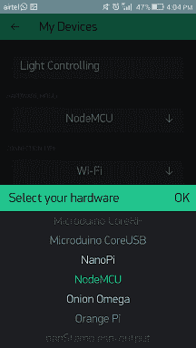

# 利用无线节点单片机和中继模块控制家庭照明的物联网方案

> 原文：<https://www.javatpoint.com/iot-project-controlling-light-using-nodemcu-relay-wifi>

在这个项目中，我们将使用无线网络或互联网(移动数据)构建一个家庭灯光控制系统。利用这个项目，我们能够从世界任何地方控制我们的家庭照明。在这个项目中，我们将使用无线节点微控制器、4 通道中继模块等。

## 硬件要求

1.  无线节点单片机 ESP8266
2.  连接节点微控制器的标准通用串行总线电缆
3.  4 通道继电器模块(5V)
4.  跳线母到母
5.  家用灯(灯泡)
6.  灯座
7.  电线
8.  交流 220 伏/120 伏家用电器或 9v 高瓦特电池

## 软件要求

1.  Arduino 软体
2.  闪烁应用程序

## 本项目工作原理(节点单片机、继电器模块)

在这个项目中，有三个主要组件使用了一个安卓应用程序、无线节点微控制器和 4 通道中继模块。


安卓 Blynk 应用程序通过点击开按钮将串行数据发送到无线节点微控制器。无线网络节点读取输入数据，并根据内部上传的程序进行处理，生成输出到 4 香奈儿中继模块。

当 Blynk 应用程序的按钮打开时，它会打开家庭灯，当 Blynk 应用程序的按钮关闭时，它会关闭家庭灯。

**从 play store 下载**Blynk 应用程序，并将其安装在您的设备上。

 
 
 
 
 
 


**在 Arduino IDE 上编写的程序，使用 WiFi Node MCU、4 香奈儿中继模块控制家庭灯光:**

```

#define BLYNK_PRINT Serial
#include <ESP8266WiFi.h>
#include <BlynkSimpleEsp8266.h>

char auth[] = "f839fcfeaf4a47cfb5d0f20771e8xxxx"; // the auth code that you got on your gmail and Blynk app
char ssid[] = "NETGEAR64"; // username or ssid of your WI-FI
char pass[] = "password"; // password of your Wi-Fi

void setup()
{
// Debug console
Serial.begin(9600);
pinMode(D1,OUTPUT); //extend these to D8 if you are using a 8 pin relay
pinMode(D2,OUTPUT);
pinMode(D3,OUTPUT);
pinMode(D4,OUTPUT);

digitalWrite(D1,HIGH); // Make it low if you want everything to go off
digitalWrite(D2,HIGH); // in case of a power cut
digitalWrite(D3,HIGH);
digitalWrite(D4,HIGH);
Blynk.begin(auth, ssid, pass);
}

void loop()
{
Blynk.run();
}

```

## 将板类型添加到您的 Arduino IDE 中

如果在编译之前没有添加，请将板类型添加到您的 Arduino IDE 中。转到文件>首选项>设置，在附加板管理器网址中添加[并点击确定。](http://arduino.esp8266.com/stable/package_esp8266com_index.json)


在编译上述代码之前包含 **esp8266 板社区**，否则会产生错误。

要包括库，单击**工具>板>板管理**...


搜索并安装 esp8266。


**选择您的板类型**

现在，选择你的板卡类型，转到**工具>板卡:> NodeMCU 1.0** 。


**添加库**

从[https://github.com/blynkkk/blynk-library/releases/latest](https://github.com/blynkkk/blynk-library/releases/latest)下载最新的 Blynk 库并添加到程序中


如果 Blynk 库不能添加到您的程序中，那么提取它并粘贴 Arduino 库中的所有目录**C:\程序文件(x86)\Arduino\libraries** 。

现在，使用标准的通用串行总线电缆将节点微控制器设备与您的个人计算机连接，以连接节点微控制器并上传其中的程序。


## 数字电路图

**4 通道继电器模块节点 MCU**

GND(全国大学生体育协会)

IN1 - > D0

IN2 - > D1

IN3 - > D2

IN4 - > D3

VCC - > Vin

**继电器模块、灯泡和输入电源之间的连接:**

1.  将继电器模块的公共点(com)与家用灯连接。
2.  将继电器模块的常开(否)连接到电源。
3.  将剩余的一根家用电灯线与电源连接。

**该项目使用无线网络和移动数据运行。**

**输出:**

 