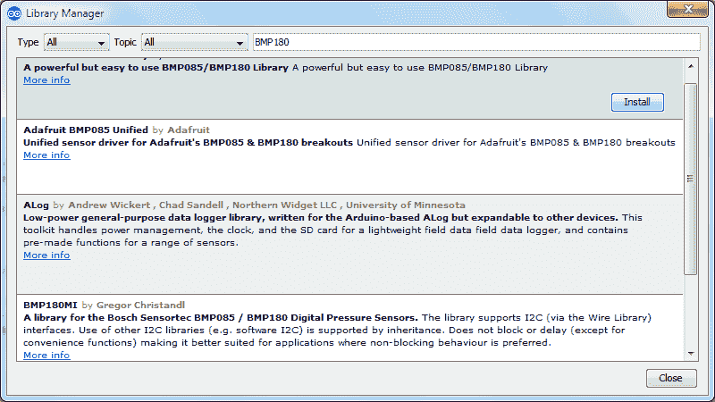

# 利用压力传感器 BMP180 和 Arduino 器件进行温度和压力测量的物联网项目

> 原文：<https://www.javatpoint.com/iot-temperature-pressure-measurement-pressure-sensor-arduino>

在这个项目中，我们将建立一个**温度和压力**测量系统。在这个项目中，我们将使用 BMP180 型号的压力传感器来检测温度和压力，Arduino 设备和 16×2 字符的液晶显示器来显示温度和压力。

## 硬件要求

1.  烧板
2.  Arduino 设备的 USB 电缆连接器
3.  压力传感器 BMP180
4.  16 X 2 字符液晶显示器
5.  项目委员会
6.  跳线(公对母，公对公)

## 软件需求

1.  arduino 软体

## 压力传感器 BMP180 的工作原理

压力传感器 BMP180 由压阻传感器、模拟和数字转换器、带 E2PROM 的控制单元和串行 I2C 接口组成。它提供温度和压力的贡献值。传感器设备的微控制器发送开始序列来测量温度和压力。温度和压力可以通过 16 X 2 字符的液晶显示器读取。

计算的温度和压力分别以℃和 hPa(赫克托帕斯卡)为单位进行测量。在这种情况下，测量温度和压力的速率是每秒一次。


**编写 Arduino 程序，使用压力传感器 BMP180 和字符液晶显示器测量温度和压力。**

```

#include <Adafruit_BMP085.h>
#include <Wire.h>
#include <LiquidCrystal.h>
LiquidCrystal lcd(13, 12, 11, 10, 9, 8);//RS,EN,D4,D5,D6,D7

char PRESSURESHOW[4];// initializing a character of size 4 to display pressure result
char TEMPERATURESHOW[4];// initializing a character of size 4 to display temperature result
Adafruit_BMP085 bmp;

void setup() {
  lcd.begin(16, 2);
  // Print a logo message to the LCD.
  lcd.print(" BMP180 Sensor");
  lcd.setCursor(0, 1);
  lcd.print("Temp. & Pressure");
  lcd.setCursor(0, 2);
  delay (3000);

  lcd.clear();//clear display
  Serial.begin(9600);
  if (!bmp.begin()){
    Serial.println("ERROR");///if there is an error in communication
    while (1) {}
  }
}
void loop(){
  lcd.print("Pressure= "); // print pressure
  String PRESSUREVALUE = String(bmp.readPressure());
  // convert pressure reading to a char array
  PRESSUREVALUE.toCharArray(PRESSURESHOW, 4);
  lcd.print(PRESSURESHOW);
  lcd.print("hPa ");
  lcd.setCursor(0, 1);
  lcd.print("Temperature=");// print temperature
  String TEMPERATUREVALUE = String(bmp.readTemperature());
  // convert the reading to a char array
  TEMPERATUREVALUE.toCharArray(TEMPERATURESHOW, 4);
  lcd.print(TEMPERATURESHOW);
  lcd.print("C ");
  lcd.setCursor(0,0);//set the cursor to row and column 0, line1
  delay(500);
}

```

编译上述代码前包含 **BMP180 库**否则会产生错误阿达果 _BMP085.h 文件或库找不到。

要包含库，单击**草图>包含库>管理库**...


搜索 **BMP180** 库，安装 BMP085/BMP180 库。



编译并上传代码到 Arduino 设备。

 

现在，相应地连接所有设备。Arduino、BMP180 和 16×2 字符 LED 的数字电路如下:


**结果**

**我们测量冬季德里的气压和温度。**

