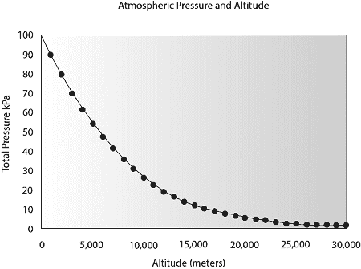
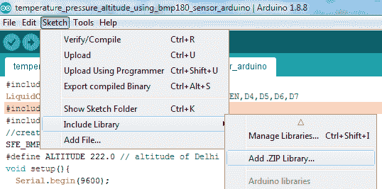
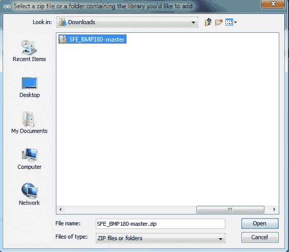
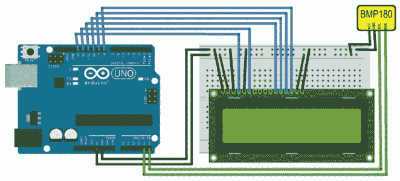
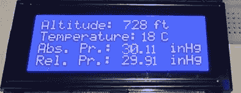

# 利用压力传感器 BMP180 和 Arduino 设备进行温度、压力和高度测量的物联网项目

> 原文：<https://www.javatpoint.com/iot-temperature-pressure-altitude-measurement-using-pressure-sensor-arduino>

在这个项目中，我们将建立一个**温度、压力和高度**测量系统。在这个项目中，我们将使用 BM 180 型大气压力传感器来检测温度、大气压力和高度，使用 Arduino 设备和 16 X 4 字符液晶显示器来显示计算出的温度、压力和高度。

## 硬件要求

1.  烧板
2.  Arduino 设备的 USB 电缆连接器
3.  压力传感器 BMP180
4.  16×4 字符液晶显示器
5.  项目委员会
6.  跳线(公对母，公对公)

## 软件需求

1.  arduino 软体

## 压力传感器 BMP180 的工作原理

压力传感器 BMP180 由压阻传感器、模拟和数字转换器、带 E2PROM 的控制单元和串行 I2C 接口组成。它提供温度、大气压力和海拔的贡献值。传感器设备的微控制器发送开始序列来测量温度、压力和高度。温度、压力和高度的值通过 16×4 字符的液晶显示器读取。

计算的温度、压力和高度分别以摄氏度、百帕和英尺为单位。在这种情况下，测量温度、大气压力和高度的速率是每秒一次。

高度和压力成反比。当高度增加时，压力下降，当高度降低时，导致大气压力增加。



**编写一个 Arduino 程序，使用压力传感器 BMP180、Arduino 和字符液晶显示器测量温度、压力和高度。**

```

#include <LiquidCrystal.h>
LiquidCrystal lcd(13, 12, 11, 10, 9, 8);//RS,EN,D4,D5,D6,D7
#include <SFE_BMP180.h>
#include <Wire.h>
//create an SFE_BMP180 object, here called "pressure":
SFE_BMP180 pressure;
#define ALTITUDE 222.0 // altitude of Delhi in meters
void setup(){
  Serial.begin(9600);
  Serial.println("BMP180 Measurements");
  lcd.begin(20, 4);
  lcd.setCursor(0, 0);
  lcd.print("BMP180 Measurements");
  lcd.setCursor(0, 1);
  lcd.print(" 1\. Temperature");
  lcd.setCursor(0, 2);
  lcd.print(" 2\. Pressure");
  lcd.setCursor(0, 3);
  lcd.print(" 3\. Altitude");
  delay (5000);
  lcd.clear();//clear display
  // initialize the sensor (it is important to get calibration values stored on the device).
  if (pressure.begin())
  Serial.println("BMP180 init success");
  else{
    // oops, something went wrong, this is usually a connection problem,
      // see the comments at the top of this sketch for the proper connections.
    Serial.println("BMP180 init fail\n\n");
    while(1); // pause forever.
  }
}
void loop(){
  char status;
  double T,P,p0,a;
  // loop here getting pressure readings every 10 seconds.
    // if you want sea-level-compensated pressure, as used in weather reports,
    // you need to find dinamically altitude of place.
    // here, we are using constant called ALTITUDE in this sketch:
  Serial.println();
  Serial.print("provided altitude: ");
  lcd.setCursor(0, 0);
  lcd.print("Altitude: ");
  Serial.print(ALTITUDE,0);
  Serial.print(" meters, ");
  Serial.print(ALTITUDE*3.28084,0);
  lcd.print(ALTITUDE*3.28084,0);
  Serial.println(" feet");
  lcd.print(" ft");
  // start a temperature measurement:
    // if request is successful, the number of ms to wait is returned.
    // if request is unsuccessful, 0 is returned.
  status = pressure.startTemperature();
  if (status != 0){
    // wait for the measurement to complete:
    delay(status);
    // retrieve the completed temperature measurement:
      // note that the measurement is stored in the variable T.
      // function returns 1 if successful, 0 if failure.
    status = pressure.getTemperature(T);
    if (status != 0){
      // Print out the measurement:
      Serial.print("temperature: ");
      Serial.print(T,2);
      Serial.print(" deg C, ");
      Serial.print((9.0/5.0)*T+32.0,2);
      Serial.println(" deg F");
      lcd.setCursor(0, 1);
      lcd.print("Temperature: ");
      lcd.print(T,2);
      lcd.print(" C ");
      // start a pressure measurement:
          // the parameter is the oversampling setting, from 0 to 3 (highest res, longest wait).
          // if request is successful, the number of ms to wait is returned.
          // if request is unsuccessful, 0 is returned.
      status = pressure.startPressure(3);
      if (status != 0){
        // wait for the measurement to complete:
        delay(status);
            // Retrieve the completed pressure measurement:
            // Note that the measurement is stored in the variable P.
            // Note also that the function requires the previous temperature measurement (T).
            // (If temperature is stable, you can do one temperature measurement for a number of pressure measurements.)
            // Function returns 1 if successful, 0 if failure.
        status = pressure.getPressure(P,T);
        if (status != 0){
          // print out the measurement:
          Serial.print("absolute pressure: ");
          Serial.print(P,2);
          Serial.print(" mb, ");
          Serial.print(P*0.0295333727,2);
          Serial.println(" inHg");
          lcd.setCursor(0, 2);
          lcd.print("Abs. Pr.: ");
          lcd.print(P*0.0295333727,2);
          lcd.print(" inHg");
            // The pressure sensor returns absolute pressure, which varies with altitude.
                // To remove the effects of altitude, use the sea level function and your current altitude.
                // This number is commonly used in weather reports.
                // Parameters: P = absolute pressure in mb, ALTITUDE = current altitude in m.
                // Result: p0 = sea-level compensated pressure in mb
          p0 = pressure.sealevel(P,ALTITUDE); // we are at 222 meters (Delhi)
          Serial.print("relative (sea-level) pressure: ");
          Serial.print(p0,2);
          Serial.print(" mb, ");
          Serial.print(p0*0.0295333727,2);
          Serial.println(" inHg");
          lcd.setCursor(0, 3);
          lcd.print("Rel. Pr.: ");
          lcd.print(p0*0.0295333727,2);
          lcd.print(" inHg");
          // On the other hand, if you want to determine your altitude from the pressure reading,
          // use the altitude function along with a baseline pressure (sea-level or other).
          // Parameters: P = absolute pressure in mb, p0 = baseline pressure in mb.
          // Result: a = altitude in m.
          a = pressure.altitude(P,p0);
          Serial.print("computed altitude: ");
          Serial.print(a,0);
          Serial.print(" meters, ");
          Serial.print(a*3.28084,0);
          Serial.println(" feet");
        }
        else 
          Serial.println("error retrieving pressure measurement\n");
      }
      else 
        Serial.println("error starting pressure measurement\n");
    }
    else
      Serial.println("error retrieving temperature measurement\n");
  }
  else
    Serial.println("error starting temperature measurement\n");
  delay(5000); // Pause for 5 seconds.
}

```

从[https://github.com/LowPowerLab/SFE_BMP180](https://github.com/LowPowerLab/SFE_BMP180)下载 **SFE_BMP180-master.zip** 文件

在编译上述代码之前，添加 **SFE_BMP180-master** zip 文件，否则会生成错误 SFE_BMP180.h:没有这样的文件或目录。

要添加压缩文件，单击**草图>包括库>添加。压缩库...**并添加您下载的 SFE _ BMP 180-主 zip。

 

编译并上传你的代码到 Arduino 设备。

现在，相应地连接所有设备。Arduino、BMP180 和 16×4 字符 LED 的数字电路如下:



**结果**

