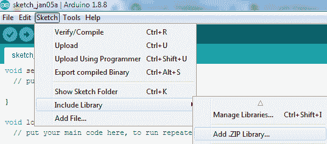

# 物联网项目:使用 NodeMCU ESP8266 的谷歌 Firebase

> 原文：<https://www.javatpoint.com/iot-project-google-firebase-nodemcu>

在这个物联网项目中，我们将 Arduino NodeMCU 设备与谷歌 Firebase 数据库连接，并使用安卓应用程序向 Firebase 发送数据以控制发光二极管。

谷歌 Firebase 数据库是由谷歌提供的实时、高速、免费的数据库。

## 硬件要求

1.  无线节点单片机 ESP8266
2.  连接节点微控制器的标准通用串行总线电缆
3.  跳线母到母
4.  发光二极管
5.  灯座
6.  电线
7.  交流 220 伏/120 伏家用电器或 9v 高瓦特电池

## 软件要求

1.  Arduino 软体
2.  Android Studio

## 项目工作原理(安卓应用、谷歌 Firebase、Node MCU)

在这个项目中，有三个主要组件使用安卓应用程序、Firebase 数据库和无线节点微控制器。


安卓应用程序将串行数据 1 或 0 发送到 Firebase 数据库。Firebase 数据库与 Wi-Fi 节点微控制器交互，该节点微控制器基于从 Firebase 数据库接收的数据进行操作。如果节点微控制器接收到串行数据 1，则打开发光二极管，如果节点微控制器接收到串行输入 0，则关闭发光二极管。

**本项目分为三个不同的步骤:**

1.  用谷歌 Firebase 连接 Arduino 节点微控制器
2.  [使用火炉控制台控制发光二极管](iot-project-google-firebase-controlling-led-with-nodemcu)
3.  [使用 Firebase 数据库用安卓应用控制 Led](iot-project-google-firebase-controlling-led-using-android-app)

## 用谷歌 Firebase 连接 Arduino 节点微控制器

从[https://github.com/FirebaseExtended/firebase-arduino](https://github.com/FirebaseExtended/firebase-arduino)下载 Firebase Arduino 库


将 Firebase Arduino 库添加到 Arduino IDE 中，单击草图->包含库->添加。压缩库....并选择下载的库。



如果 Firebase Arduino 库添加成功，它将显示在包含库中。

现在，用你的谷歌账号登录[谷歌 Firebase]( https://console.firebase.google.com/) 。通过单击添加项目来创建 Firebase 项目。


提供项目名称并创建项目。


单击**项目概述设置**，您将找到项目的详细信息。现在，单击服务帐户选项查看数据库机密。

**Arduino IDE 上的一个连接 NodeMCU 和谷歌 Firebase 的程序**

点击，**文件>示例>firebasarduino>FirebaseDemo _ ESP8266**

点击**项目概述>项目设置>服务帐户>数据库机密**查看 firebase auth 机密，将此机密添加到您的 Arduino 程序的 FIREBASE_AUTH 中。

转到左侧菜单的数据库部分，搜索实时数据库，在那里您可以找到 Firebase 主机网址。复制这个末尾没有“https://”和“/”的网址，粘贴到程序中的 FIREBASE_HOST。

在项目中添加实时数据库，点击**项目概述设置>实时数据库**。


分别在 WIFI_SSID 和 WIFI_PASSWORD 中添加您的 WIFI 名称和密码。

```
#include <Firebase.h>
#include <FirebaseArduino.h>
#include <FirebaseCloudMessaging.h>
#include <FirebaseError.h>
#include <FirebaseHttpClient.h>
#include <FirebaseObject.h>

//
// Copyright 2015 Google Inc.
//
// Licensed under the Apache License, Version 2.0 (the "License");
// you may not use this file except in compliance with the License.
// You may obtain a copy of the License at
//
//     http://www.apache.org/licenses/LICENSE-2.0
//
// Unless required by applicable law or agreed to in writing, software
// distributed under the License is distributed on an "AS IS" BASIS,
// WITHOUT WARRANTIES OR CONDITIONS OF ANY KIND, either express or implied.
// See the License for the specific language governing permissions and
// limitations under the License.
//

// FirebaseDemo_ESP8266 is a sample that demo the different functions
// of the FirebaseArduino API.

#include <ESP8266WiFi.h>
#include <FirebaseArduino.h>

// Set these to run example.
#define FIREBASE_HOST "nodemcu-demo-697d8.firebaseio.com"
#define FIREBASE_AUTH "YOUR_FIREBASE_AUTH"
#define WIFI_SSID "NETGEAR64"
#define WIFI_PASSWORD "*JAVATPOINT#"

void setup() {
  Serial.begin(9600);

  // connect to wifi.
  WiFi.begin(WIFI_SSID, WIFI_PASSWORD);
  Serial.print("connecting");
  while (WiFi.status() != WL_CONNECTED) {
    Serial.print(".");
    delay(500);
  }
  Serial.println();
  Serial.print("connected: ");
  Serial.println(WiFi.localIP());

  Firebase.begin(FIREBASE_HOST, FIREBASE_AUTH);
}

int n = 0;

void loop() {
  // set value
  Firebase.setFloat("number", 42.0);
  // handle error
  if (Firebase.failed()) {
      Serial.print("setting /number failed:");
      Serial.println(Firebase.error());  
      return;
  }
  delay(1000);

  // update value
  Firebase.setFloat("number", 43.0);
  // handle error
  if (Firebase.failed()) {
      Serial.print("setting /number failed:");
      Serial.println(Firebase.error());  
      return;
  }
  delay(1000);

  // get value 
  Serial.print("number: ");
  Serial.println(Firebase.getFloat("number"));
  delay(1000);

  // remove value
  Firebase.remove("number");
  delay(1000);

  // set string value
  Firebase.setString("message", "hello world");
  // handle error
  if (Firebase.failed()) {
      Serial.print("setting /message failed:");
      Serial.println(Firebase.error());  
      return;
  }
  delay(1000);

  // set bool value
  Firebase.setBool("truth", false);
  // handle error
  if (Firebase.failed()) {
      Serial.print("setting /truth failed:");
      Serial.println(Firebase.error());  
      return;
  }
  delay(1000);

  // append a new value to /logs
  String name = Firebase.pushInt("logs", n++);
  // handle error
  if (Firebase.failed()) {
      Serial.print("pushing /logs failed:");
      Serial.println(Firebase.error());  
      return;
  }
  Serial.print("pushed: /logs/");
  Serial.println(name);
  delay(1000);
}

```

通过标准的 USB 电缆将您的 NodeMCU ESP8266 与您的个人电脑连接，并在其中上传代码。将代码上传到 NodeMCU 时，设备持续闪烁。

现在打开**串口监视器**表单工具，你会发现数据都上传到 Firebase 数据库了。

#### 注意:如果设置/编号失败:串行监视器中的消息然后更新指纹:转到 C://Users/{ username }/My Documents/Arduino/libraries/firebase-Arduino-master/src 打开 FirebaseHttpClient.h 文件，并用= > 6F D0 9A 52 C0 E9 E4 CD A0 D3 02 A4 B7 A1 92 38 2D CA 2F 26 更新指纹

**输出:**


谷歌 Firebase 数据库是物联网最快、实时和免费的数据库之一。