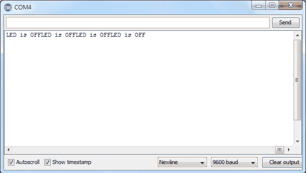
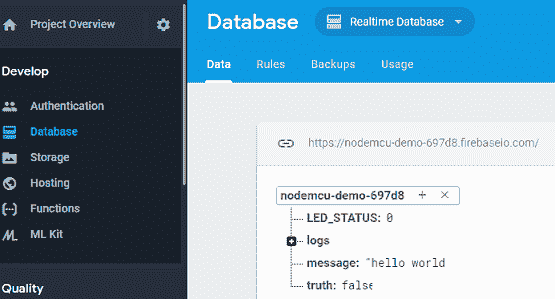
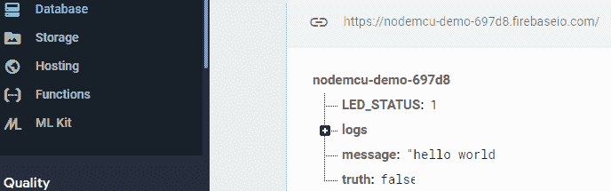

# 物联网项目:谷歌 Firebase 用 NodeMCU 控制 LED

> 原文：<https://www.javatpoint.com/iot-project-google-firebase-controlling-led-with-nodemcu>

在本节中，我们将使用 Firebase 数据库使用 NodeMCU 控制发光二极管。在本项目的前一部分中，[谷歌 Firebase 使用 NodeMCU ESP8266](iot-project-google-firebase-nodemcu) 我们介绍了如何在 Firebase 上创建项目及其使用 NodeMCU 的配置。在完成这个项目之前，我们建议您阅读我们之前的教程。

## 一个利用谷歌 Firebase 数据库和 NodeMCU 控制发光二极管(开/关)的程序

打开你之前的代码，做一些小的改变:增加 pin 连接，设置 firebase 状态。

```
#include <Firebase.h>
#include <FirebaseArduino.h>
#include <FirebaseCloudMessaging.h>
#include <FirebaseError.h>
#include <FirebaseHttpClient.h>
#include <FirebaseObject.h>

//
// Copyright 2015 Google Inc.
//
// Licensed under the Apache License, Version 2.0 (the "License");
// you may not use this file except in compliance with the License.
// You may obtain a copy of the License at
//
//     http://www.apache.org/licenses/LICENSE-2.0
//
// Unless required by applicable law or agreed to in writing, software
// distributed under the License is distributed on an "AS IS" BASIS,
// WITHOUT WARRANTIES OR CONDITIONS OF ANY KIND, either express or implied.
// See the License for the specific language governing permissions and
// limitations under the License.
//

// FirebaseDemo_ESP8266 is a sample that demo the different functions
// of the FirebaseArduino API.

#include <ESP8266WiFi.h>
#include <FirebaseArduino.h>

// Set these to run example.
#define FIREBASE_HOST "nodemcu-demo-697d8.firebaseio.com"
#define FIREBASE_AUTH "YOUR_FIREBASE_AUTH"
#define WIFI_SSID "NETGEAR64"
#define WIFI_PASSWORD "*JAVATPOINT#"

void setup() {
  Serial.begin(9600);

  // connect to wifi.
  WiFi.begin(WIFI_SSID, WIFI_PASSWORD);
  Serial.print("connecting");
  while (WiFi.status() != WL_CONNECTED) {
    Serial.print(".");
    delay(500);
  }
  Serial.println();
  Serial.print("connected: ");
  Serial.println(WiFi.localIP());

  Firebase.begin(FIREBASE_HOST, FIREBASE_AUTH);
  pinMode(D1,OUTPUT);
  Firebase.set("LED_STATUS",0);
}

int n = 0;

void loop() {
  // set value
  n=Firebase.getInt("LED_STATUS");
  // handle error
  if (n==1) {
      Serial.print("LED is ON");
      digitalWrite(D1,HIGH);
      Serial.println(Firebase.error());  
      return;
       delay(100);
  }
 else{
   Serial.print("LED is OFF");
   digitalWrite(D1,LOW);
 }

  // update value

}

```

编译并上传代码到 NodeMCU ESP8266。打开串行监视器查看状态，当前状态为 0，指示灯熄灭。



在数据库中，我们得到了 LED_STATUS: 0，并且 LED 已经关闭。




现在，手动将指示灯状态更改为 1，它会打开指示灯。


