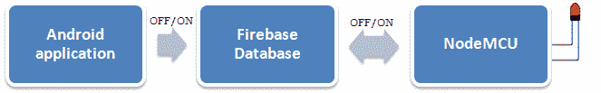
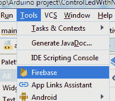
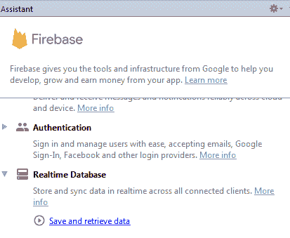
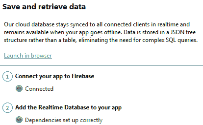
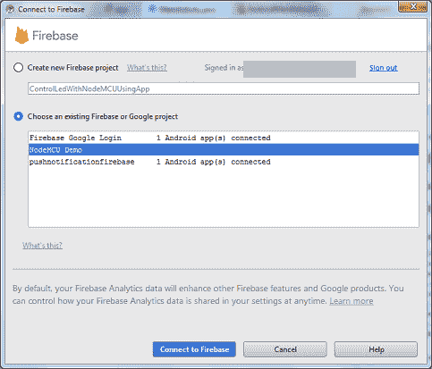
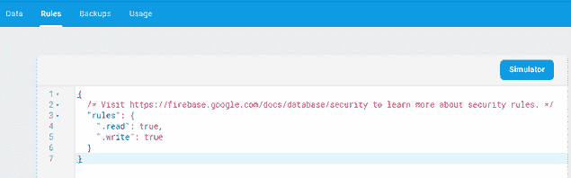
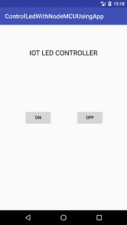

# 物联网项目谷歌 Firebase 使用安卓应用控制发光二极管

> 原文：<https://www.javatpoint.com/iot-project-google-firebase-controlling-led-using-android-app>

在这一部分，我们将使用 Firebase 数据库和安卓应用程序来控制与 NodeMCU 连接的**发光二极管。在上一节[谷歌 Firebase 控制 LED 与本项目的 NodeMCU ESP8266](iot-project-google-firebase-controlling-led-with-nodemcu) 连接，我们通过手动编辑 Firebase 数据中 LED 的状态来控制 LED。每次改变 LED 状态是不可能的，需要时间，不符合逻辑。**

为了克服上述问题，我们构建了一个安卓应用程序，它与 Firebase 数据库交互，并更新打开/关闭发光二极管的发光二极管状态。

### 项目工作原理(安卓应用、谷歌 Firebase、Node MCU)

在这个项目中，有三个主要组件被使用，一个安卓应用程序，一个 Firebase 数据库和一个无线节点微控制器。



安卓应用程序将串行数据 1 或 0 发送到 Firebase 数据库。Firebase 数据库与 Wi-Fi 节点微控制器交互，该节点微控制器基于从 Firebase 数据库接收的数据进行操作。如果节点微控制器接收到串行数据 1，则打开发光二极管，如果节点微控制器接收到串行输入 0，则关闭发光二极管。

### 现在，编写一个安卓代码与谷歌 Firebase 数据库交互，并更新 LED 状态:

打开 AndroidStudio，创建一个空项目。

首先，我们需要将我们的安卓应用与 Firebase 项目连接起来。为此**点击工具>火焰基地>T1**



点击**实时数据库>保存和检索数据。**



点击选项“ **1 将你的应用连接到 Firebase** ”，选择你在 Firebase 上创建的项目。




选择项目后，点击**连接到 Firebase** ，将**实时数据库添加到你的应用**

## activity_main.xml

在布局文件中，我们使用两个按钮来发送串行数据，以更改 LED 状态 1(开)和 0(关)

```

<?xml version="1.0" encoding="utf-8"?>
<android.support.constraint.ConstraintLayout xmlns:android="http://schemas.android.com/apk/res/android"
    xmlns:app="http://schemas.android.com/apk/res-auto"
    xmlns:tools="http://schemas.android.com/tools"
    android:layout_width="match_parent"
    android:layout_height="match_parent"
    tools:context="example.javatpoint.com.controlledwithnodemcuusingandroidapp.MainActivity">

    <Button
        android:id="@+id/button_on"
        android:layout_width="wrap_content"
        android:layout_height="wrap_content"
        android:layout_marginBottom="8dp"
        android:layout_marginEnd="8dp"
        android:layout_marginStart="8dp"
        android:layout_marginTop="8dp"
        android:text="ON"
        app:layout_constraintBottom_toBottomOf="parent"
        app:layout_constraintEnd_toStartOf="@+id/button_off"
        app:layout_constraintStart_toStartOf="parent"
        app:layout_constraintTop_toTopOf="parent" />

    <Button
        android:id="@+id/button_off"
        android:layout_width="wrap_content"
        android:layout_height="wrap_content"
        android:layout_marginBottom="8dp"
        android:layout_marginEnd="76dp"
        android:layout_marginRight="76dp"
        android:layout_marginTop="8dp"
        android:text="OFF"
        app:layout_constraintBottom_toBottomOf="parent"
        app:layout_constraintEnd_toEndOf="parent"
        app:layout_constraintTop_toTopOf="parent" />

    <TextView
        android:id="@+id/textView2"
        android:layout_width="wrap_content"
        android:layout_height="40dp"
        android:layout_marginEnd="8dp"
        android:layout_marginStart="8dp"
        android:layout_marginTop="76dp"
        android:text="IOT LED CONTROLLER"
        android:textAppearance="@style/TextAppearance.AppCompat.Large"
        app:layout_constraintEnd_toEndOf="parent"
        app:layout_constraintHorizontal_bias="0.502"
        app:layout_constraintStart_toStartOf="parent"
        app:layout_constraintTop_toTopOf="parent" />

</android.support.constraint.ConstraintLayout>

```

## MainActivity.java

在 MainActivity.java 文件中，我们创建了两个按钮，一个用于“开”，另一个用于“关”。单击“开”按钮，它会将 Firebase 数据库的 LED_STATUS 更新为“1”，单击“关”按钮，它会将 Firebase 数据库的 LED_STATUS 更新为“0”。

在按钮点击监听器中添加第四个选项代码“写入您的数据库”。

```

package example.javatpoint.com.controlledwithnodemcuusingandroidapp;

import android.support.v7.app.AppCompatActivity;
import android.os.Bundle;
import android.view.View;
import android.widget.Button;
import com.google.firebase.database.DatabaseReference;
import com.google.firebase.database.FirebaseDatabase;

public class MainActivity extends AppCompatActivity {
    Button on;
    Button off;
    @Override
    protected void onCreate(Bundle savedInstanceState) {
        super.onCreate(savedInstanceState);
        setContentView(R.layout.activity_main);
        on = findViewById(R.id.button_on);
        off = findViewById(R.id.button_off);
        on.setOnClickListener(new View.OnClickListener(){
            @Override
            public void onClick(View view) {
                // Write a message to the database
                FirebaseDatabase database = FirebaseDatabase.getInstance();
                DatabaseReference myRef = database.getReference("LED_STATUS");//LED_STATUS is Firebase database LED_STATUS
                myRef.setValue(1);
            }
        });
        off.setOnClickListener(new View.OnClickListener(){
            @Override
            public void onClick(View view) {
                FirebaseDatabase database = FirebaseDatabase.getInstance();
                DatabaseReference myRef = database.getReference("LED_STATUS");//LED_STATUS is Firebase database LED_STATUS
                myRef.setValue(0);
            }
        });
     }
}

```

在 AndroidManifest.xml 文件中添加互联网权限

```

<uses-permission android:name="android.permission.INTERNET"/>

```

更新 Firebase 数据库读取规则，将状态从假写入真。

#### 注意:使 rules 属性为 true 将它设置为可从任何人访问的公共属性。因此，出于安全原因，不要设置为 true 或了解更多关于安全规则的信息。



运行您的项目并控制与 NodeMCU ESP8266 连接的 LED。

**输出:**


 