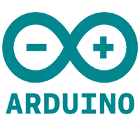
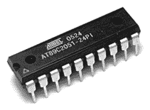
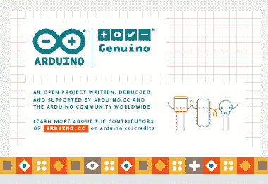
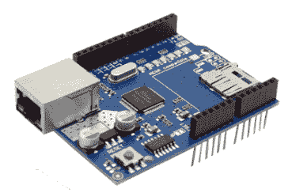

# Arduino 教程

> 哎哎哎:# t0]https://www . javatppoint . com/arduino

Arduino 是一个用于设计和构建电子设备的项目、开源硬件和软件平台。它为建筑电子项目设计和制造微控制器套件和单板接口。

Arduino 委员会最初是为了帮助有非技术背景的学生而创建的。

[Arduino 板](https://www.javatpoint.com/arduino-boards)的设计使用了多种控制器和微处理器。

Arduino 板由多组模拟和数字 I/O(输入/输出)引脚组成，这些引脚进一步连接到**试验板、扩展板、**和其他**电路**。这种板具有通用串行总线( **USB** )和**串行通信接口**的模式，用于从计算机加载程序。

它还提供了一个 **IDE** (集成开发环境)项目，基于处理语言将代码上传到物理板上。

该项目授权于**GPL****LGPL**。 **GPL** 被命名为**GNU 通用公共许可证。**许可的 **LGPL** 命名为 **GNU 小众通用公共许可证**。它允许使用 Arduino 板，它的软件分发，可以由任何人制造。

它也以自我练习套件的形式提供。

[Arduino](https://www.javatpoint.com/arduino) 有多种用途，例如:

*   手指按钮
*   电机启动按钮
*   光作为传感器
*   发光二极管按钮
*   设计
*   电子设备的制造

## 什么是 Arduino？

Arduino 是一个帮助制作电子项目的软件和硬件平台。它是一个开源平台，拥有多种控制器和微处理器。有各种类型的 Arduino 板用于各种目的。

Arduino 是一个单一的电路板，由不同的接口或部分组成。电路板由一组数字和模拟引脚组成，这些引脚用于连接各种器件和元件，这些器件和元件用于电子器件的功能。

大多数 Arduino 由 14 个数字输入/输出引脚组成。

Arduino 中的模拟引脚主要用于细粒度控制。Arduino 板上的引脚以特定的模式排列。Arduino 板上的其他器件有 USB 口、小元器件(稳压器或振荡器)、微控制器、电源连接器等。

## 特征

Arduino 的特性如下:

*   Arduino 编程是 C++的简化版，使得学习过程变得简单。
*   Arduino IDE 用于控制板的功能。它还将该组规格发送给微控制器。
*   Arduino 不需要额外的板或片来加载新代码。
*   Arduino 可以读取模拟和数字输入信号。
*   软硬件平台易于使用和实现。

## 历史

该项目始于意大利艾弗里亚的交互设计研究所。在凯西·雷耶斯和马西莫·班齐的监督下，埃尔南多酒吧于 2003 年创建了**接线**(一个开发平台)。它被认为是 IDII 的硕士论文项目。布线平台包括印刷电路板。印刷电路板由 **ATmega168 微控制器操作。**

ATmega168 微控制器是一个集成开发环境。它基于库和处理函数，用于方便地对微控制器进行编程。

2005 年，马西莫·班齐、大卫·夸蒂莱斯、大卫·梅利斯和另一名 IDII 学生支持将 ATmega168 连接到接线平台。他们进一步将该项目命名为 Arduino。

阿尔杜伊诺项目始于 2005 年，对象是意大利伊夫雷亚的学生。它旨在为业余爱好者和专业人士提供一种使用执行器和传感器与环境交互的简单且低成本的方法。初学者的设备是简单的运动探测器、机器人和恒温器。

2011 年年中，阿尔杜伊诺的商业产量估计为 30 万。2013 年，使用的 Arduino 板约为 70 万块。

2017 年 4 月左右，马西莫·班齐将阿尔杜伊诺基金会介绍为“阿尔杜伊诺的新开端”。2017 年 7 月，Musto 继续从 Arduino 网站上获取许多开源许可证和代码。2017 年 10 月，Arduino 引入了与 ARM 控股的合作。Arduino 继续与架构和技术供应商合作。

## 微控制器

Arduino 最重要的部分是微控制器，如下所示:

*   微控制器是小型低功耗计算机。像其他计算机系统一样，大多数微控制器都有随机存取存储器、中央处理器和存储器。
*   它的内存非常小，只有 2KB(两千字节)。由于内存较少，一些微控制器一次只能运行一个程序。
*   它是一个单芯片，包括内存、输入/输出(I/O)外围设备和处理器。
*   芯片上的通用输入输出引脚帮助我们从程序中控制其他电子设备或电路。

## 我们身边的电子设备

我们身边有许多电子设备。该设备的大部分功能由微控制器组成。让我们讨论一些例子。

*   微波炉中的微控制器接受用户输入，控制产生微波射线的磁铁运行来烹饪食物，并显示输出定时器。
*   现代汽车还包含数十个串联工作的微控制器(一个接一个)，以控制照明、无线电接口等功能。

## 项目

让我们考虑一个简单的 LED 闪烁项目。

我们需要一个软件来安装我们的草图或代码到 Arduino 板。成功上传代码后，指示灯会闪烁。该软件被称为 Arduino IDE(集成开发环境)。

在阿尔杜伊诺的帮助下，创造了各种各样的项目。下面列出了一些项目:

*   使用 IOT(物联网)的家庭自动化系统。
*   太阳能水垃圾收集器。
*   火灾探测器等。

有些项目需要组件列表。因此，为了方便和实际操作，Arduino 套件在市场上很容易买到。

## Arduino 套件

我们可以使用完整的套件轻松地开始我们的电子项目。它还帮助我们创建动手和参与项目。

下面列出了一些流行的 Arduino 套件:

*   Arduino 初学者工具包
*   机器人链接联合国学习工具包
*   Arduino UNO 3 终极入门套件
*   联合国大学超级初学者工具包
*   Mega 2560 入门套件

## Arduino IDE

集成开发环境使传统项目变得更加容易和简单。USB 电缆用于在特定的 Arduino 板上加载程序或草图。

IDE 应用适用于 [Windows](https://www.javatpoint.com/windows) 、Mac OS X、 [Linux](https://www.javatpoint.com/linux-tutorial) 。支持编程语言 [C](https://www.javatpoint.com/c-programming-language-tutorial) 和 [C++](https://www.javatpoint.com/cpp-tutorial) 。我们需要将 Genuino 和 Arduino 板与 IDE 连接，以上传 Arduino IDE 软件中编写的草图。

包括 Sparkfun Electronics 在内的许多其他公司也生产自己的与 [Arduino IDE](https://www.javatpoint.com/arduino-ide) 兼容的电路板。

## 阿尔杜伊诺董事会

有多种 Arduino 板用于不同的目的。该板的输入/输出引脚、尺寸等各不相同。 [Arduino 电路板](https://www.javatpoint.com/arduino-boards)上的各种组件包括微控制器、数字输入/输出引脚、USB 接口和连接器、模拟引脚、复位按钮、电源按钮、发光二极管、晶体振荡器和稳压器。某些组件可能因板的类型而异。

让我们讨论一些流行的 Arduino 板。

*   Arduino 一号
*   纳米 Arduino
*   Arduino Mega 公司
*   arduino 号
*   蓝牙 Arduino

## 盾

*   屏蔽被定义为可以安装在电路板上以提高项目能力的硬件设备。
*   盾牌如下所示:
    
*   盾牌和 Arduino 一起可以使项目更加智能和简单。例如，以太网屏蔽用于将 Arduino 板连接到互联网。
*   防护罩可以很容易地与 Arduino 电路板连接和分离。它不需要任何复杂的布线。

## 先决条件

学习 Arduino 的要求是 **C** 和 **C++** 编程语言的基础知识。对**电路**、**微控制器**和**电子设备**的基本了解也是必不可少的。

## 观众

Arduino 供学生、工程师和业余爱好者使用。在开始学习 Arduino 教程之前，需要掌握电子元件和编程的基本知识。

## 问题

我们向您保证，您不会发现这个 Arduino 教程有任何问题。但是如果有任何错误，请在联系表格中发布问题。

* * *