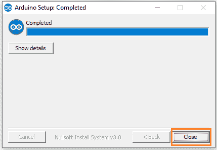

# Arduino 下载

> 原文：<https://www.javatpoint.com/arduino-download>

Arduino 软件(IDE)是开源软件。我们需要编写代码并将代码上传到电路板上，以执行一些任务。

Arduino IDE 软件可用于任何类型的 [Arduino 板](https://www.javatpoint.com/)。该软件可用于各种操作系统，例如，**视窗、Linux 和苹果操作系统 x。**

下载 Arduino 软件的步骤如下:

1.前往 Arduino([https://www.arduino.cc/](https://www.arduino.cc/))>点击**软件** <点击**下载**，如下图:

或者

打开网址[https://www.arduino.cc/en/Main/Software](https://www.arduino.cc/en/Main/Software)

2.将出现一个页面，如下所示:

3.稍微滚动屏幕，如下所示:

4.当我们使用窗口操作时，点击“**窗口安装程序**”。我们可以相应地选择 [Linux](https://www.javatpoint.com/linux-tutorial) 或者 Mac OS X。

5.将出现一个投稿窗口。我们可以根据自己的选择做出贡献，并点击“CONTRIBUTE &DOWNLOAD”选项。否则，点击“**只是下载”**选项，如下图:

6.下载过程将开始。下载的文件如下图所示:

7.等待几秒钟以完成下载过程。

8.打开下载的文件。

9.授予您计算机上 Arduino 软件的权限。

10.点击**我同意**按钮接受许可，如下图:

11.点击**下一步**按钮。如下所示:

12.将出现指定已安装文件夹位置的窗口。

点击**安装**按钮。如下所示:

如果你想改变位置，点击**浏览**按钮。

13.Arduino 的安装过程将开始，如下所示:

等待安装过程完成。

14.现在，我们必须接受安装的安全性。我们需要接受三次安全安装。

点击**安装**按钮。图像如下所示:

15.再次点击**安装**按钮。如下所示:

16.再次点击**安装**按钮。如下所示:

17.安装过程现已完成。该窗口现在将显示为:

18.点击底部的**关闭**按钮。

Arduino IDE 软件将出现在您的桌面上，如下所示:

19.现在，打开 Arduino 软件。

20.Arduino IDE 环境是用名为 Java 的编程语言编写的。因此，我们需要允许访问 Java 平台。

我们一打开 Arduino 软件，就会出现一个许可窗口，如下所示:

点击“**允许访问**”按钮接受许可。

21.Arduino 窗口将显示为:

## 已连接硬件端口的可见性

我们可以查看连接到电脑的硬件 [Arduino IDE](https://www.javatpoint.com/arduino-ide) 的端口。

步骤如下:

1.  进入文件管理器，右键点击**这台电脑**选项，如下图:
    
2.  点击**管理**
3.  首先，我们需要将 Arduino 板连接到我们的计算机。
4.  将出现一个窗口，如下图:
    
5.  点击**设备管理器**
6.  在 **PORT** 选项下，我们可以看到连接的硬件的端口。

* * *