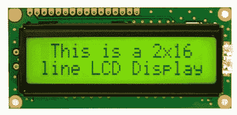

# Arduino 套件

> 哎哎哎:# t0]https://www . javatppoint . com/arduino-kit

Arduino 套件包括用于构建数字或电子设备的所有组件。Arduino 板也可以以 DIY 套件的形式提供。这里，DIY 指定自己动手。DIY 工具包是为教学和作为学生的实践工具而创建的。非工科学生也可以在他们的项目中使用这样的工具包。

我们可以使用完整的套件轻松地开始我们的电子项目。它还帮助我们创建动手和参与项目。该工具包有助于理解编程、电压、电流和数字逻辑的基础。数字和模拟信号的概念可以通过项目中执行机构和传感器的实施来理解。

部分 [Arduino](https://www.javatpoint.com/arduino) 项目为飞船接口(为飞船设计控制面板)、键盘仪表、敲锁(一种暗码，用来开门)等。

市场上有各种类型的 Arduino 套件。让我们讨论一些 Arduino 套件:

## 1.Arduino 初学者工具包

初学者工具包通常是电子产品系列中用于新鲜空气的基本工具包。它基于 [Arduino UNO](https://www.javatpoint.com/arduino-uno) 板。

初学者工具包中的组件如下所示:

*   烧板
*   **面包板**
*   **发光二极管(亮白色、绿色、红色、黄色、蓝色和 RGB)**
*   **液晶字母数字**
*   **易于组装的木质底座**
*   **实芯跳线**
*   **红色和黑色的绞合跳线**
*   **9V 电池**
*   **220 欧姆、560 欧姆、1 欧姆、4.7 千欧、10 欧姆、1 欧姆和 10 欧姆的电阻**
*   **6/9V 小 DC 电机**
*   **(40 x 1)公带销**
*   **红色、蓝色和绿色透明凝胶**
*   **二极管**
*   **100uF 的电容器**
*   **光耦合器**
*   **小型伺服仪**
*   **压电胶囊**
*   **按钮**
*   **倾斜传感器**
*   **电位计**
*   **光电晶体管**
*   **温度传感器**
*   **场效应晶体管**
*   **H 桥电机驱动器**
*   USB 电缆

### 烧板

### 单元:1

阿尔杜伊诺联合国办事处是阿尔杜伊诺的标准董事会。Arduino UNO 基于一个 **ATmega328P 微控制器**。与其他板相比，它很容易使用，例如 Arduino Mega 板等。Arduino 板上的组件有 ATmega328P 微控制器、ICSP 引脚、电源指示灯、数字输入/输出引脚、模拟引脚、AREF 引脚、16 兆赫晶体振荡器、GND 引脚、Vin 引脚、稳压器、发射和接收发光二极管、USB 和一个复位按钮。

[Arduino 板](https://www.javatpoint.com/arduino-boards)如下图:

### 面包板

### 单位:1 (400 分)

实验板被定义为矩形板，由塑料制成。它上面有小孔，用来插入电子元件的电线，如发光二极管、电阻器等。

将电子元件连接到电路板上不需要任何焊接。我们需要用电线把这些部件连接起来，让电流从一个部件流到另一个部件。

### 亮白色发光二极管

### 单元:1

[LED](https://www.javatpoint.com/led-full-form) 代表**发光二极管**，定义为半导体光源。明亮的白色发光二极管产生白光，而其他白光产生黄色。

当电子与半导体中的空穴结合时，能量以光子的形式释放，从而产生光。

### 绿色发光二极管

### 单元:8

当电流通过其端子时，绿色发光二极管发出绿光。这个过程被称为电致发光。

### 红色发光二极管

### 单元:8

当电流通过它的终端时，红色发光二极管发出红光。

### 黄色发光二极管

### 单元:8

当电流通过其终端时，黄色发光二极管发出黄光。

### 蓝色发光二极管

### 单元:3

当电流通过它的终端时，蓝色发光二极管发出蓝光。

### RGB LED 指示灯

### 单元:1

RGB 发光二极管使用三种颜色(红色、绿色和蓝色)的组合来发光。这三种通用颜色的组合可以创造出数百万种色调的光。

这些颜色是通过使用脉宽调制引脚调整三种颜色的亮度而产生的。

### 液晶字母数字

### 单元:1

液晶显示器是一种数字显示器，它以字母或数字的形式提供信息。它是套件中的基本组件。

[液晶](https://www.javatpoint.com/lcd-full-form)显示器的配置可以从 16×2、40×4 和 8×1 不等。

这里，8 x 1 表示一行中有 8 个字符。

### 易于组装的木质底座

### 单元:1

木质底座是一种兼容的底座，用于在其底座上组装 Arduino 板和面包板。

### 实芯跳线

### 单位:70

这些是线路板中最常见的电线。电线有不同的长度和颜色。这些线很便宜，是线轴的形式。我们需要根据需要的长度切断电线。

### 红色绞合跳线

### 单元:1

绞合跳线具有实心尖端。

红色绞合跳线如下所示:

### 黑色绞合跳线

### 单元:1

黑色绞合跳线如下所示:

### 9V 电池

### 单元:1

这是一个标准尺寸的电池，用于不同的目的。长方形电池的顶部连接有一个极化卡扣。

### 220 欧姆、560 欧姆、1 欧姆、4.7 千欧姆、10 欧姆、1 欧姆和 10 欧姆的电阻

**单位:20 (** 220 欧姆**)，5 (** 560 欧姆**)，5 (** 1kOhms **)，5 (** 4.7kOhms **)，20 (** 10kOhms】

电阻器是具有特定电阻的双端元件。

电阻器的功能是管理电流。它控制流向其他元件的电流。其他功能有分压、调节信号电平等。

具有电阻值的电阻器如下所示:

### 6/9V 小型 DC 电机

### 单元:1

它是一个小电机，电压范围从 6V 到 9V。

### (40 x 1)公带销

### 单元:1

40 x 1 连接器引脚的标准间距为 2.54 毫米。它是一个单行公引脚，由 40 个引脚头连接而成。

如下所示:

### 红色、蓝色和绿色透明凝胶

### 单元:3

有色凝胶充当传感器的过滤器，允许特定的有色光通过凝胶。

### 二极管(1N4007)

### 单元:5

二极管向一个方向传导电流。二极管是具有两个端子的电子元件。二极管可用作信号调制器、解调器、开关、电压调节器等。

### 100uF 的电容器

### 单元:5

电容器是储存电能的装置。能量以静电场的形式储存在电容器的极板之间。

100uF/450V 的图像如下所示:

100uF/25V、100uF/50V 等电容。，也是可用的。

### 光耦合器

### 单元:1

电信号中的噪声由光耦合器消除。它还用于将低功率电路与高功率电路分开，并在这些分开的电路之间传输电信号。

### 小型伺服电机

### 单元:1

伺服电机用于控制位置、线速度和转速。伺服电机的优点是高效率、高精度、低发热等。

伺服计看起来像下图:

### 压电胶囊

### 单元:1

Arduino 中的压电被定义为一种电子设备，当被一些机械应变、声波或振动变形时，它会产生电压。

### 按钮

### 单元:10

按钮用作开关。我们可以通过按下按钮来接通电路板电源或连接。

### 倾斜传感器

### 单元:1

倾斜传感器用于测量相对于参考平面的倾斜。它也用于检测平面的倾斜度。

### 电位计(10k 欧姆)

### 单元:3

电位计充当旋钮，用于提供可变电阻。它也可以用来改变它的抵抗力。电阻值是作为模拟值测量的。

### 光电晶体管

### 单元:6

光电晶体管使用 NPN 晶体管来感测光水平，并将其转换为电流。

### 温度传感器

### 单元:1

温度传感器用于记录周围的温度。它将输入数据转换成电子数据。

### 场效应晶体管

### 单元:2

我们可以使用 Mosfet 晶体管控制高电压 Arduino 项目。一个端子用作电源，另外两个端子在船上使用。

### h 桥电机驱动器[L293D]

### 单元:1

这些马达能够驱动 DC 马达。在 H 桥电机驱动器的帮助下，我们可以双向转动电机。

### USB 电缆

### 单元:1

通用串行总线是用于连接 Arduino 板和计算机的电缆。我们可以通过电脑上的 Arduino IDE 进一步对 Arduino 板进行编程。

## 其他流行套件

其他流行的 Arduino 套件如下所示:

*   **Elegoo UNO 超级启动套件**

它包括一张光盘，由解释套件规格的 [PDF](https://www.javatpoint.com/pdf-full-form) 组成。它由一些附加组件组成，如操纵杆、红外接收器和遥控器。初学者在使用这种工具包时可能会遇到一些困难。

*   **Elegoo Mega 2560 入门套件**

它是为初学者和高级用户设计的终极工具包。

*   **邪恶的阿尔杜伊诺终极套装**

这是专为专业人士设计的终极套件。有高级知识的初学者可以使用。

套件中的组件如下所示:

Arduino Uno R3、温度传感器 TMP36、USB 电缆、移位寄存器、Arduino、试验板及其支架、NPN 晶体管、小型伺服电机、5V 继电器、跳线、带导线的 DC 电机、压电式蜂鸣器、12 个单位的大 12mm 按钮、光电池、led(1x RGB、10 x 红色、10 x 黄色)、10K Trimpot、电阻器(45 x 330Ω和 45 x 10KΩ)和 2 个单位的 1N4148 二极管。

*   **SunFounder 超级启动套件**

它包含大量组件。套件中的组件如下所示:

MEGA2560 控制器板、红外接收器、按钮(小)(5)、电源模块、步进电机、温湿度传感器、4 位 7 段显示、杜邦线(母对公)(10)、5V 继电器、遥控器、伺服电机(SG90)、USB 电缆(5)、步进电机驱动器、跳线(公对公)(65)、9V 电池夹连接器、操纵杆 PS2、试验板、热敏电阻、电容陶瓷 100nF、光敏电阻、倾斜开关、有源蜂鸣器、LCD1602 字符显示 led(5 x 黄色、5 x 红色、5 电阻(10ω、100ω、220ω、330ω、1kω、2kω、5.1KΩ、10KΩ、100KΩ、1mω各 10 个)、电位计、NPN 晶体管、小电机、风扇和超声波传感器模块。

* * *