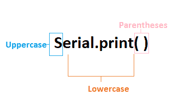

# Arduino Serial.print()

> 原文：<https://www.javatpoint.com/arduino-serial-print>

Arduino 中的 serial.print()将数据打印到串行端口。打印数据以 ASCII(美国信息交换标准代码)格式存储，这是一种人类可读的文本。

数字的每个数字都是用 ASCII 字符打印的。

打印的数据将在工具栏右上角的**串行监视器**中可见。

Serial.print()以两种格式声明，如下所示:

*   打印(值)
*   打印(值、格式)

#### 注意:在 Serial.print()中，S 必须用大写字母书写。



哪里，

**串口**:表示串口对象。

**打印**:print()返回指定的写入字节数。

**值**:表示要打印的值，包括任何数据类型值。

**格式**:由数字基数组成，如 OCT(八进制)、BIN(二进制)、HEX(十六进制)等。对于整型数据类型。它还指定小数位数。

### Serial.print(值)

serial.print()接受数字，每个数字使用 [ASCII](https://www.javatpoint.com/ascii-full-form) 字符，浮点数的值最多为两位小数。

**例 1:**

```

Serial.print(15.452732)

```

**输出:**

Fifteen point four five

它将字节作为单个字符发送到打印机。在 [Arduino](https://www.javatpoint.com/arduino) 中，使用 Serial.print()的字符串和字符按原样发送。

**例 2:**

```

Serial.print("Hello Arduino")

```

**输出:**

你好 Arduino

### Serial.print(值、格式)

它指定基本格式，并根据指定的格式给出输出。它包括八进制-十进制(基数为 8)、二进制-二进制(基数为 2)、十进制-十进制(基数为 10)和十六进制-十六进制(基数为 16)格式。

让我们通过几个例子来理解。

**例 1:**

```

Serial.print(25, BIN)

```

**输出:**

Eleven thousand and one

它将十进制数 25 转换成二进制数 11001。

**例 2:**

```

Serial.print(58, HEX)

```

**输出:**

3A

它将十进制数 58 转换成十六进制数 3A。

**例 3:**

```

Serial.print(58, OCT)

```

输出:

seventy-two

它将十进制数 58 转换成八进制数 72。

**例 4:**

```

Serial.print(25, DEC)

```

**输出:**

Twenty-five

从十进制到十进制的转换。所以，输出会是一样的。

**基于闪存的字符串**

如果要基于字符串传递 Serial.print()中的闪存，需要用 **F** 包装函数语句。

例如，

Serial.print( F ( "Hello Arduino "))。

**打印制表符空间**

我们还可以在输出中打印选项卡。

让我们考虑下面的代码:

```

void setup ( )
{ 
Serial.begin ( 4800);
}
void loop ( )
{
Serial.print(" Hello Arduino" );
Serial.print(" \ t '');
}

```

这里，serial . print(“\ t”)用于打印输出程序中的标签。

### Serial.println()

Serial.println()表示打印行，它发送后跟回车符(' r '或 ASCII 13)和换行符(' n '或 ASCII 10)的字符串。它的效果类似于使用文本编辑器键入时按键盘上的回车键。

Serial.println()也以两种格式声明，如下所示:

*   println(值)
*   println(值，格式)

【Serial.print()和 Serial.println()有什么区别？

在 Serial.println()的左括号和右括号中写入的文本会移动到新的一行。在 Serial.print()和 Serial.println()的帮助下，我们可以计算出代码中某些事情的顺序和执行情况。

让我们用一个例子来理解:

考虑下面的代码。

```

void setup ( )
{ 
Serial.begin ( 4800);
}
void loop ( )
{
Serial.print(" Hello");
delay(1000);   
Serial.println("Arduino");  // It will print Arduino followed by a new line.
delay ( 1500);  // delay of 1.5 seconds between each printed line.
}

```

点击**上传**按钮- > **串口监视器**进行输出。

在输出中，单词 **Hello** 将出现，1 秒后出现单词 **Arduino** 。1.5 秒后，将打印另一行。

**输出**

```

Hello Arduino
Hello Arduino // The next line will be printed after the specified duration.
.
.
.
.
The output will be printed repeatedly.

```

**Arduino Mega**

[Arduino Mega 板](https://www.javatpoint.com/arduino-mega)(Arduino 板的类型)有四个串口。在编程 Mega 时，我们需要声明所有四个串行端口。所有四个串行端口的波特率应该不同。

如下所示:

```

void setup() {
  Serial.begin(4800);
  Serial1.begin(28800);
  Serial2.begin(38400);
  Serial3.begin(9600);

  Serial.println("Serial port");
  Serial1.println("Serial port 1");
  Serial2.println("Serial port 2");
  Serial3.println("Serial port 3");
}
void loop() 
{
}

```

* * *