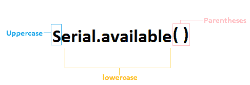
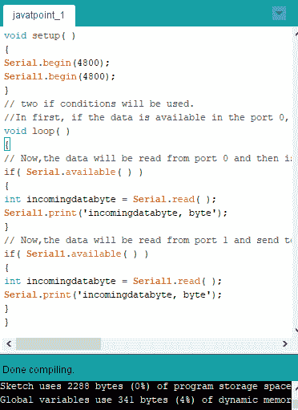

# Serial.available()

> 原文：<https://www.javatpoint.com/arduino-serial-available>

Arduino 中的 **Serial.available( )** 函数从串行端口获取可读取的存储字节。它是已经存储并到达串行缓冲区的数据。Arduino 中的串行缓冲区保存 64 个字节。

Serial.available()函数继承了名为**流**的实用程序类。仅当调用依赖它的函数时，才会调用流。流类被认为是二进制和基于字符的流的基类。



让我们用一个例子来理解。

考虑下面的代码。

```

int arrivingdatabyte = 0; // initializing the incoming serial byte
void setup( )
{
Serial.begin(9600); // 9600 is the data rate in bps (bits per second).
}
void loop( ) // loop function that executes repeatedly
{
if(Serial.available( ) > 0) //  It will only send data when the received data is greater than 0.
{
arrivingdatabyte = Serial.read( );  // It will read the incoming or arriving data byte
Serial.print("data byte received:");
Serial.println(arrivingdatabyte, DEC); // here, DEC means Decimal
}
}

```

对于 Arduino Mega，可用的端口有:

Serial1.available()

Serial2.available()

Serial3.available()

让我们用一个例子来理解 Mega 的概念。

在本例中，数据将从一个端口读取并发送到另一个端口。

它将从端口 0 读取数据，然后将数据发送到端口 1。

考虑下面的代码。

```

void setup( )
{
Serial.begin(4800);
Serial1.begin(4800);
}
// two if conditions will be used.
//In first, if the data is available in the port 0, it will send to the port 1\. In second, if the data is available in the port 1, it will send to the port 0.
void loop( )
{
// Now,the data will be read from port 0 and will be sent to the port 1.
if( Serial.available( ) )
{
int incomingdatabyte = Serial.read( );
Serial1.print('incomingdatabyte, byte');
}
// Now,the data will be read from port 1 and will be sent to the port 0.
if( Serial1.available( ) )
{
int incomingdatabyte = Serial1.read( );
Serial.print('incomingdatabyte, byte');
}
}

```

我们也可以通过编译来检查代码中的错误。为此，点击**验证**按钮。

[Arduino](https://www.javatpoint.com/arduino) 屏幕如下图所示:



**完成编译**将表示代码编译成功。

#### 注意:在 Arduino 板的帮助下，我们无法将串行设备连接到我们的计算机。

* * *