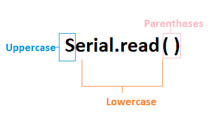
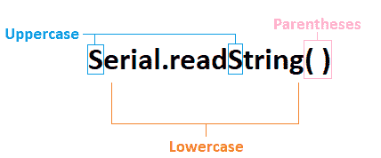
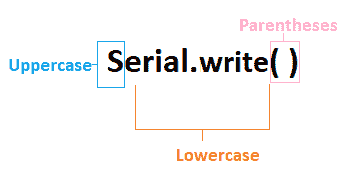

# Arduino 串行读取( )和串行写入( )

> 原文：<https://www.javatpoint.com/arduino-serial-read-and-serial-write>

## Arduino Serial.read()

Arduino 中的**串行读取()**读取 Arduino 中的输入串行数据。这里使用的是 **int** 数据类型。它返回到达的串行数据的第一个数据字节。当串行端口上没有数据可用时，它也会返回-1。

Arduino 编程中使用的语法是 Serial.read()，

哪里，

**串口**:表示串口对象。



数据以字节的形式存储，其中 1 字节= 8 位。

让我们用一个例子来理解。

考虑下面的代码。

```

int arrivingdatabyte;
void setup( )
{
Serial.begin(9600);
}
void loop( )
{
if(Serial.available( ) > 0)
{
arrivingdatabyte = Serial.read( );  // It will read the incoming or arriving data byte
Serial.print("data byte received:");
Serial.println(arrivingdatabyte);
}
}

```

上面的代码清楚地解释了 [Serial.available( )](https://www.javatpoint.com/arduino-serial-available) 用于获取大于 0 的可用字节数。Serial.read()函数将从数据字节中读取数据，并在收到数据时打印一条消息。数据从串行监视器发送到[阿尔杜伊诺](https://www.javatpoint.com/arduino)。

### Serial.readString()

它从字符串中的串行缓冲区读取输入的串行数据。这里使用的是**字符串**数据类型。



让我们用一个例子来理解。

考虑下面的代码。

```

String b;
void setup( )
{
Serial.begin(4800);
}
void loop( )
{
while( Serial.available( ) )
{
b = Serial.readString( );
Serial.println(b);
}
}

```

上面的代码清楚地解释了 **Serial.readString( )** 是用来将串行数据读入字符串的。这里指定的字符串是 **b** 。

在上面的代码中，串行函数中的数据被读取为字符串。

**Serial.readstring()和 serial . read()如何读取串行数据？**

Serial.read()函数以字节为单位读取数据，而 Serial.readString()函数以字符串为单位读取数据。

## Serial.write()

它将二进制数据发送到 Arduino 的串行端口。通过串行写入的数据以一系列字节或单个字节的形式发送。数据类型为 **size_t** 。

函数的作用是:返回写入的字节数。

如果我们想发送由字符表示的数字，我们需要使用 Serial.print()函数，而不是 Serial.write()。



Serial.write()以三种格式声明，如下所示:

*   写入(字符串)
*   写入(值)
*   写入(缓冲器、透镜)

哪里，

**串口**:表示串口对象。

**str**:str 表示字符串，以一系列字节的形式发送数据。

**缓冲区**:是一个数组，用于将数据作为一系列字节发送。

**值**:它以单字节的形式将数据发送到 Arduino。

**len** :表示可以从数组发送的字节数。

让我们用一个简单的例子来理解。

考虑下面的代码。

```

void setup( )
{
Serial.begin(14400);
}
void loop( )
{
Serial.write(55); // the specified value is 55.
// Serial.write( ) send the data as a byte with this value (55).
int Bytestosend = Serial.write( " Arduino" );
// It sends the Arduino string. 
//The length of the string is a return parameter in this function.
}

```

* * *