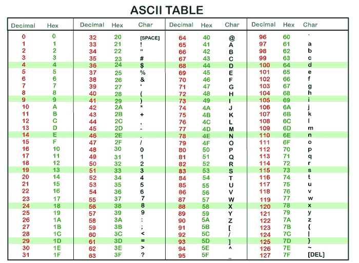

# Arduino 数据类型

> 原文：<https://www.javatpoint.com/arduino-data-types>

数据类型用于标识数据类型和处理数据的相关函数。它用于声明函数和变量，这决定了位模式和存储空间。

我们将在 Arduino 中使用的数据类型如下所示:

*   无效数据类型
*   内部数据类型
*   字符数据类型
*   浮点数据类型
*   双数据类型
*   无符号整数数据类型
*   短数据类型
*   长数据类型
*   无符号长数据类型
*   字节数据类型
*   单词数据类型

## 无效数据类型

void 数据类型指定空的值集，并且仅用于声明函数。它用作不返回值的函数的返回类型。

我们用 [Arduino](https://www.javatpoint.com/arduino) 中的一个例子来理解。

考虑下面的代码。

```

int a = 3;
void setup( )
{
.   //
}
void loop ( )    
{
.
.
}

```

## 内部数据类型

整数数据类型是 5、-6、10、-123 等整数。它们没有任何小数部分。整数数据类型由 **int** 表示。它被认为是存储数字的主要数据类型。

int 的大小是 2 字节(16 位)。

最小范围:-32768 到 32767 或- (2^ 15)到((2 ^ 15) - 1)

在 ATmega 和 [Arduino UNO 板](https://www.javatpoint.com/arduino-uno)中，int 数据类型存储 2 字节的值。

在像 Arduino Zero 和 MKR1000 (SAMD 板)和 Arduino Due 这样的板上，int 数据类型存储 4 字节或 32 位的值。这种情况下的最小范围是- (2^ 31)到((2 ^ 31) - 1)或-2，147，483，648 到 2，147，483，647。

负数以 2 的补码形式存储，其中符号位或最高位被标记为负数。

语法如下:

```

int var = val;

```

哪里，

**var** =变量

**值** =分配给变量的值

例如，

```

int a;
int b = 3;

```

任何变量或标识符都变成整数变量，并且只能保存整数值。

让我们用 Arduino 中的一个例子来理解。

考虑下面的代码。

```

int Sum = 0;
void setup( )
{
Serial.begin(9600);
}
void loop ( )
{
Sum++;  // on every loop, it adds 1 to the Sum int
Serial.println ( Sum);  // it prints the current state of the Sum variable
delay(1500);  // delay of 1.5 seconds
}

```

## 字符数据类型

字符数据类型可以存储任意数量的字符集。声明为字符的标识符成为字符变量。文字写在单引号内。

字符类型通常被称为整数类型。正是因为，符号、字母等。，在内存中由关联的数字代码表示，并且这些数字代码只是整数。

字符数据类型的大小为**最小 8 位**。我们可以将字节数据类型用于 8 位或 1 字节的无符号字符数据类型。

例如，字符“A”的 ASCII 值为 65。

如果我们指定‘A’+2，它将具有 67 的 ASCII 值。

语法是:

```

char var = val;

```

哪里，

**var** =变量

**值** =分配给变量的值。

让我们用一个例子来理解。

考虑下面的代码。

```

char myvariable = ' B ';
char myvariable = 66 ;  // both the value are equivalent

```

ASCII 表如下所示:



## 浮点数据类型

具有小数部分和小数部分的数被认为是浮点数。例如，4.567 是一个浮点数。数字 13 是整数，而 13.0 是浮点数。由于其更高的分辨率，小数被用来近似连续的模拟值。

浮点数也可以写成指数形式。数字可以大至 3.4028235E+38，也可以小至-3.4028235E+38。浮点数据类型的大小是 4 字节或 32 位。

语法是:

```

float var = val;

```

哪里，

**var** =变量

**值** =分配给变量的值

让我们用一个例子来理解。

考虑下面的代码。

```

int a ;
int b ;
float c ;
void setup ( )
{
Serial.begin (9600);
}
void loop ( )
{
a = 3 ;
b = a/2 ;  // b is an integer. It cannot hold fractions. The output will be 1.
c = (float) a / 2.0 ;  // c now contains 1.5.
// Here, we have to use 2.0 instead of 2.
}

```

#### 注意:我们需要给一个数字加一个小数点。否则，它将被视为整数。例如，14.0 被认为是浮点数，而 14 是整数。

浮点数也可以转换成整数。例如，

```

float a = 3.6 ;
int b = a + 0.6 ; // output = 4

```

## 双数据类型

双数据类型也用于处理十进制或浮点数。它占用的内存是 float 的两倍。它以更大的精度和范围存储浮点数。它代表双精度浮点数。

它在 ATmega 和 UNO 板上占用 4 个字节，而在 Arduino Due 上占用 8 个字节。

语法是:

```

double var = val;

```

哪里，

**var** =变量

**值** =分配给变量的值

## 无符号整数数据类型

无符号 int 存储的值最多为 2 字节或 16 位。它只存储正值。无符号整数数据类型的范围是从 0 到 65，535 或从 0 到((2 ^ 16) - 1)。

Arduino Due 存储 4 字节或 32 位的无符号数据值。

无符号和有符号数据类型的区别在于符号位。Arduino 中的 int 类型是带符号的 int。在 16 位数字中，15 位被解释为 2 的补码，而高位被解释为正数或负数。如果高位为“1”，则视为负数。

语法是:

```

unsigned int var = val;

```

哪里，

**var** =变量

**值** =分配给变量的值

例如，

```

unsigned int pinofLED = 8;

```

## 短数据类型

short 是存储两个字节或 16 位数据的整数数据类型。

短数据类型的范围从-32768 到 32767 或- (2^ 15)到((2 ^ 15) - 1)。基于 ARM 和 ATmega 的 Arduino 通常存储 2 字节的数据值。

语法是:

```

short var = val;

```

哪里，

**var** =变量

**值** =分配给变量的值

例如，

```

short pinofLED = 8 ;

```

## 长数据类型

长数据类型被视为扩展大小变量，存储 4 个字节(32 位)。规模从-2，147，483，648 到 2，147，483，647 不等。

使用整数时，至少有一个数字后面应该跟 L，这就迫使数字成为长数据类型。

语法是:

```

long var = val;

```

哪里，

**var** =变量

**值** =分配给变量的值

例如，

```

long speed = 186000L;

```

## 无符号长数据类型

无符号长数据类型也被视为扩展大小变量，存储 4 个字节(32 位)。它不像其他无符号数据类型那样存储负数，这使得它们的大小范围从 0 到 4，294，967，295 或(2^32 - 1)。

语法是:

```

unsigned long var = val;

```

哪里，

**var** =变量

**值** =分配给变量的值

例如

```

unsigned long currenTtime;

```

## 字节

1 字节= 8 位。

它被认为是一个无符号数，存储 0 到 255 之间的值。

语法是:

```

byte var = val;

```

哪里，

**var** =变量

**值** =分配给变量的值

例如，

```

byte c = 20;

```

## 单词

它被认为是 16 位或 2 字节的无符号数，存储 0 到 65535 之间的值。

语法是:

```

word var = val;

```

哪里，

**var** =变量

**值** =分配给变量的值

例如，

```

word c = 2000;

```

* * *