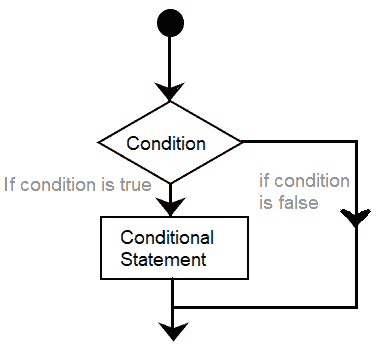

# Arduino If 语句

> 原文：<https://www.javatpoint.com/arduino-if-statement>

if()语句是条件语句，是所有类型编程语言的基础。

如果代码中的条件为真，则相应地执行相应的任务或功能。如果程序中的条件为**真**，则返回一个值。如果条件为**假**，则进一步返回另一个值。

这意味着 if()语句检查条件，然后执行一条语句或一组语句。

让我们借助流程图来理解这个概念。



它清楚地解释了语句的执行过程。如果条件为假，则它来自 If()语句。如果条件为真，则执行该功能。

if()语句写成:

```

if ( condition)
{
// include statements
// if the condition is true
// then performs the function or task specified inside the curly braces
}

```

在这里，

**条件** =包括布尔表达式，可以是真也可以是假。

我们还可以在括号内使用一个或多个运算符。

可以用作括号内条件的比较运算符如下所示:

*   a！= b ( a 不等于 b)
*   a < b ( a 小于 b)
*   a > b ( a 大于 b)
*   a = = b ( a 等于 b)
*   a < = b ( a 小于或等于 b)
*   a > = b ( a 大于或等于 b)

哪里，

**a** 和 **b** 是变量。

### 代码示例

让我们借助两个编码示例来理解。

**例 1:**

考虑下面的代码。

```

int a = 6; // initiaization of values to variables a and b
int b = 4;
void setup()
{
Serial.begin(9600); 
}
void loop()
{
  if (a > b )
  {
    Serial.println( " a is greater than b "); 
  }
  if (b > a )
  {
    Serial.println( " b is greater than a "); 
  }
}

```

**输出:a 大于 b**

代码显示了两个变量 a 和 b 的初始化值。在这个例子中，第一个条件是真。因此，相应的信息被打印。

**例 2:**

考虑下面的代码。

```

const int LED1 = 2;
const int LED2 = 13;
int x = 80 ;
void setup ( )
{ 
Serial.begin( 9600 );
pinMode ( LED1, OUTPUT);
pinMode ( LED2, OUTPUT);
}
void loop ( )
{ 
if ( x > 100 )
{
digitalWrite(LED1, HIGH);
delay (500);
}
if ( x < 100 )
{
digitalWrite(LED2, HIGH);
delay (500);
}
}

```

例如[两个发光二极管](https://www.javatpoint.com/arduino-blinking-two-led)。

在上面的例子中，我们已经初始化了 x 的值。由于 x 的值小于 100，所以第二个条件为真。因此，LED2 将点亮。

如果 x 的值大于 100，LED1 将点亮。

同样，我们可以根据自己的要求使用 **if** 语句。

#### 注意:我们在使用=(等号)时应该小心。
例如，x = 5。它是赋值运算符，其中值 5 将赋给变量 x。相反，我们需要使用 x = = 5，因为它是比较运算符。

* * *