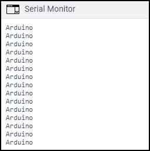
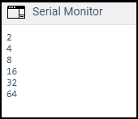
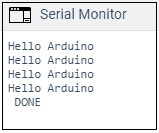

# 循环的 Arduino

> 原文：<https://www.javatpoint.com/arduino-for-loop>

for 循环下花括号内的语句根据指定的条件重复执行。for 循环中的增量计数器用于增加或减少循环重复次数。

for 语句通常用于重复性任务或操作，或者与数组一起对一组数据/引脚进行操作。

语法是:

```

for (initialization; condition; increment)
{
\\ statements
}

```

哪里，

*   **初始化**:定义为变量的初始化。
*   **条件**:每次执行时都会测试该条件。如果条件为**真**，则执行给定任务。只有当条件变为**假**时，循环才结束。
*   **增量**:包括增量运算符，如 i + +、I----、i + 1 等。每次都会递增，直到条件保持为真。

**例如**

```

for ( i = 0 ; i < 5 ; i + +)

```

上面的语句将循环执行五次。I 的值将从 0 到 4。

如果陈述是:

```

for ( i = 0 ; i < = 5 ; i + +)

```

上面的语句将循环执行六次。I 的值将从 0 到 5。

#### 注意:如果我们不想一次又一次地执行 for 循环。然后，我们可以在 void setup()函数中插入 for 循环。

### 例 1:

**打印一条信息‘Arduino’15 次。**
使用 Serial.println()打印一条消息 15 次或更多是相当复杂的，因为代码会变得太长。

为了克服这个问题，程序员更喜欢使用 for 循环多次执行一个任务，同时使用一条语句。

让我们考虑下面的代码。

```

int i;
void setup ( )
{
  Serial.begin(9600);
  for ( i = 0 ; i < 15 ; i ++ )
  {
   Serial.println( "Arduino");
  }
}
void loop ( ) {
}

```

**输出:**



### 例 2:

**使用乘法增量**

for 循环中的乘法增量将生成对数级数。

考虑下面的代码:

```

int x;
void setup ( )
{
  Serial.begin(9600);
  for (x = 2; x < 100; x = x * 2) 
  {
  Serial.println(x);
  }
}
void loop ( ) {
}

```

**输出:**



我们也可以在 for 循环中直接声明 int 数据类型。

例如，

```

for (int x = 2; x < 100; x = x * 2) 

```

### 示例 3:要淡化发光二极管

这里，褪色和 LED 表示 LED 会慢慢变暗。

考虑下面的代码:

```

const int pinPWM = 11; // here, we have initialized the PWM pin.
void setup ( )
{
  Serial.begin(9600);
}
void loop ( )
 {
  int x = 1;
  for (int i = 0; i > -1; i = i + x)
 {
    analogWrite(pinPWM, i);
    if (i == 255)
 {
      x = -1;  // It will switch the direction at peak
    }
    delay(10); // It is delay time of 10 milliseconds
    // the lesser the time, the more fading effect can be seen clearly
  }
}

```

对于连接，我们将与电阻器串联的发光二极管的正端连接到引脚 11(脉宽调制引脚)，发光二极管的负端连接到 GND。

#### 注意:C++编程语言中的 for 循环比其他类型的编程语言灵活得多。

### 例 4:

考虑下面的代码:

```

void setup ( )
{
  int i;
  Serial.begin(9600);
  for (i = 0; i < 4; i = i + 1)
  {
    Serial.println( "Hello Arduino" );
  }
  Serial.println( " DONE");
}
void loop ( ) 
{ 
}

```

上面的代码将打印四次“Hello Arduino”。之后，条件变为假，控制退出循环，并打印“完成”。

**输出:**



同样，我们可以相应地使用 for 循环创建任何程序。

* * *