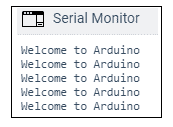
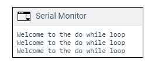

# Arduino while 循环

> 原文：<https://www.javatpoint.com/arduino-while-loop>

while 循环()是条件循环，它继续执行括号内的代码，直到指定的条件变为 false。

在测试条件改变或停止之前，while 循环永远不会退出。 [Arduino](https://www.javatpoint.com/arduino) 中 while 循环的常用包括**传感器测试、校准(校准传感器的输入)、变量增量等。**

语法是:

```

while (condition)
{
// code or set of statements
}

```

哪里，

**条件**:指定布尔表达式，确定条件为真或假。

例如，

```

variable = 0;
while (variable < 100) {
  // performs the specified task 100 times repeatedly
  variable++ ;  // increments after every execution
}

```

只要变量小于 100，while 循环中大括号内的上述代码就会连续重复执行。

### 流程图

流程图如下所示:


### 代码示例

为了改变程序的流程，我们需要改变 while 循环括号内的指定条件。这个过程很像 if 语句。

让我们通过两个例子来理解 while 循环的概念。

**例 1:**

考虑下面的代码:

```

int a = 0;
void setup()
{
  Serial.begin(9600);
while( a < 5)
{
  Serial.println("Welcome to Arduino");
  a = a + 1;
}
}
  void loop()
  {
  }

```

**输出:**

循环中的消息将被打印五次，如下所示:



让我们看看代码。

**说明:**首先，我们将变量 **a** 定义为 0，并照常初始化串行监视器(意思是 Serial.begin())。循环首先检查括号中指定的条件。一开始，a =0。条件为真(0 < 5)。大括号内的代码将被执行，消息将被打印出来。

现在， **a** 的值递增(加 1 到 a)，循环再次执行。

同样，五倍的条件仍然成立。当 a =5 时，条件变为假，循环退出并停止。执行循环外的代码。

让我们考虑另一个例子。

**例 2:**

代码类似于上面的例子。我们将只在循环外添加一些语句。

考虑下面的代码:

```

int a = 0;
void setup()
{
  Serial.begin(9600);
while( a < 5)
{
  Serial.println("Welcome to Arduino");
  a = a + 1;
}
  Serial.println("DONE");
  Serial.println("Welcome to the code outside the loop");
}
  void loop()
  {
  }

```

**输出:**


我们可以注意到，一旦循环中的条件变为假，循环外指定的消息就会被打印出来。

## 做...正在…

do-while 循环的工作方式类似于 while 循环。do-while 中的条件将至少执行一次。这是因为条件是在循环结束时而不是开始时测试的。

语法是:

```

do
{
// code or set of statements
} while (condition);

```

哪里，

**条件**:指定布尔表达式，确定条件为真或假。

例如，

```

int b = 0;
do {
  delay(100);          // wait for stabilization of the sensors
  b = readSensors();  // It checks the sensors
} while (x < 100); // specified condition

```

### 流程图

流程图如下所示:


### 代码示例

让我们通过一个例子来理解 do-while 循环的概念。

**例 1:**

考虑下面的代码:

```

int a = 0;
void setup()
{
  Serial.begin(9600);
do
{
  Serial.println("Welcome to the do while loop");
  a = a + 1;
} while( a < 3);
} 
  void loop()
  {
  }

```

**输出:**



* * *