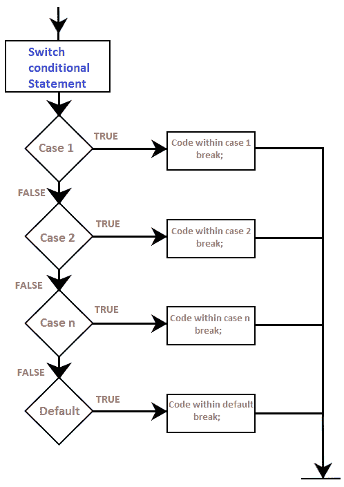
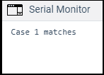

# Arduino 开关盒

> 原文：<https://www.javatpoint.com/arduino-switch-case>

**开关情况**通过在各种情况下执行代码来控制程序的流程。switch 语句将变量的特定值与其他情况下的语句进行比较。当案例中的语句与变量值匹配时，与该案例关联的代码就会执行。

每个案例的结尾都使用了 **break** 关键字。例如，如果有五种情况，break 语句也将是五个。break 语句退出开关盒。

没有中断的 switch 语句将继续执行所有案例，直到结束。因此，在每个案例的结尾包含一个 break 语句是非常重要的。

让我们用一个例子来理解。

```

switch(variable)
{
case 1:
// statements related to case1
break;
case 2:
// statements related to case2
break;
.
.
case n:
// statements related to case n
break;
default:
// it contains the optional code
//if nothing matches in the above cases, the default statement runs
break;
}

```

哪里，

**变量**:包括其值将与多种情况进行比较的变量

**值**:由一个要比较的值组成。这些值是常数。允许的数据类型是 **int** 和 **char** 。

### 开关柜流程图

考虑以下流程图:



**我们可以用 if 语句代替 switch case 吗？**

是的。

但是在某些情况下，实现 switch case 比 if 语句稍微容易一些。

当比较一个非平凡表达式的多个条件时，建议使用 switch cases 而不是 if 语句。

if 语句允许我们在两个选项中进行选择，TRUE 或 FALSE。对于两种以上的情况，我们也可以使用多个 if 语句。开关盒允许我们在各种离散选项之间进行选择。

### 代码示例

我们将在 setup()函数中包含开关情况，因为我们不需要重复执行。

考虑下面的代码:

```

// switch case example
void setup()
{
  	Serial.begin(9600);
  int a = 1;
  switch(a) // the case matching the value in the declared variable will run
  {
    case 1:
    Serial.println(" Case 1 matches"); 
    // the value of variable matches with the value in case 1\. 
// The message associated with case 1 will be printed
    break;
    case 2:
    Serial.println(" Case 2 matches");
    break;
    case 3:
    Serial.println(" Case 3 matches");
    break;
    default:
    Serial.println(" default matches");
    break;
  }
}
void loop()
{
}

```

**输出:**



* * *