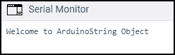

# Arduino 字符串对象

> 原文：<https://www.javatpoint.com/arduino-string-object>

### Arduino 中的对象是什么？

一个对象就像一个变量，**指向一个保存一些数据的内存位置**。与该对象关联的函数称为**成员函数**。因此，我们可以使对象执行一些动作。

**例如**

**begin()、print()、**和 **println()** 是使用串行对象声明的函数。系列(打印)后的时期(等)。)指定我们正在访问 serial 对象中的一些成员。成员可以是函数，也可以是变量。

print()和 println()函数后面的括号决定了在串行中调用的函数。这些函数不能在代码的全局范围内单独声明。因此，它们是用 Serial.print()和 Serial.println()这样的 serial 对象声明的。

## 字符串对象

String 对象允许我们存储字符数组并对其执行操作。字符串对象比常规字符串占用更多的内存。

字符串对象总是以大写字母“S”显示。它生成字符串类的一个实例。

它可以由不同的数据类型构成，如下所示:

*   使用特定基数的常数整数
*   使用特定基数的长整数
*   字符串对象的实例
*   用单引号括起来的常量字符
*   双引号内的字符串。
*   浮动和双重

字符串中指定的数字的默认基数为 10。例如，

```

String myString = String(15);

```

它创建了一个由数字 15 的 ASCII 表示组成的字符串。

要指定基数不是 10 的数字，字符串可以创建为:

```

String myString = String(15, HEX);

```

它会给我们字符串“F”。它表示十进制数 15 的十六进制转换。

我们也可以在 BIN 中表示一个字符串。例如，

```

String myString = String(15, BIN);

```

它会给出字符串“1111”。它表示十进制数 15 的十六进制转换。

语法是:

```

String(value)
String(value, base)
String(value, PlacesofaDecimal)

```

哪里，

**值**:表示格式化或表示字符串所需的值。

数据类型有字节、无符号整数、字符、浮点、双精度、无符号长整型、长整型、整数型和字符串型。

**基数**:表示基数，需要格式化整数值。例如，HEX、BIN 等。

底座可选择包括。

**PlacesofaDecimal** :指定需要的小数位数，只有值为双精度或浮点时才需要。

## 带字符串对象的函数

我们可以在字符串中使用各种函数。

*   **charAT()** 的缩写

它用于访问特定字符。

语法是:

```

thisString.charAT(n)

```

哪里，

**该字符串**是声明的变量

**n** 也是一个变量

允许的数据类型是**无符号整数**。

上述语法将返回指定字符串的第 n 个字符。

*   **compareTo()**

它用于比较两个字符串。使用字符的 ASCII 值比较指定的字符串。

语法是:

```

thisString.compareTo(myString)

```

哪里，

**这个字符串**和**我的字符串**是声明的变量

如果该字符串在 myString 之前，上述语法将返回一个**负数**。

如果这个字符串在我的字符串之后，它将返回一个**正数**。

*   **end with()**

它测试一个字符串**是否以其他字符串的字符结束**。

语法是:

```

thisString.endsWith(myString)

```

哪里，

**这个字符串**和**我的字符串**是声明的变量

如果这个字符串以 myString 的字符结束，它将返回 **true** 。否则，将返回**假**。

*   **开头为()**

它测试一个字符串**是否以其他字符串的字符开始**。

语法是:

```

thisString.startsWith(myString)

```

哪里，

**这个字符串**和**我的字符串**是声明的变量

如果该字符串以 myString 的字符开头，它将返回 **true** 。否则，将返回**假**。

*   **tolpower case()**

它获取指定字符串的小写版本。

语法是:

```

thisString.toLowerCase()

```

哪里，

**该字符串**是声明的变量

*   toupper case()

它获取指定字符串的大写版本。

语法是:

```

thisString.toUpperCase()

```

哪里，

**该字符串**是声明的变量

*   **等于()**

它比较两个字符串的相等性。比较非常敏感，字符串“ARDUINO”不等于字符串“Arduino”。

语法是:

```

thisString.equals(myString)

```

哪里，

**这个字符串**和**我的字符串**是变量

如果该字符串等于我的字符串，它将返回**真**。否则，将返回**假**。

*   **位元组()**

它将字符串的字符复制到提供的缓冲区。

语法是:

```

thisString.getBytes(buffer, length)

```

哪里，

**该字符串**是声明的变量

**缓冲区**:字符复制到缓冲区。所需的数据类型是**字节**。

**长度**:表示缓冲区的大小。所需的数据类型是**无符号整数**。

*   **最后索引的（）**

它在另一个字符串中定位一个字符串或字符。

语法是:

```

thisString.lastIndexOf(value)
thisString.lastIndexOf(value, from)

```

哪里，

**该字符串**是声明的变量

**值:**包括要搜索的特定值。所需数据类型为**字符串**和**字符**。

**从**开始:定义为向后工作的指标

*   **子串()**

它被声明为获取特定字符串的子字符串。

语法是:

```

thisString.substring(from)
thisString.substring(from, to)

```

哪里，

**该字符串**是声明的变量

**从**开始:定义为索引，子串从这里开始

**到**:也是之前结束子串的索引。它是可选的。

*   **屋顶()**

它将 [Arduino](https://www.javatpoint.com/arduino) 中的有效字符串转换为整数类型。

语法是:

```

thisString.toInt()

```

哪里，

**该字符串**是变量

所需数据类型为**长**。如果对话无效或字符串不以整数开头，则返回零。

*   **toFloat（）**

它将 Arduino 中的有效字符串转换为浮点数。

例如，字符串“150”将被转换为“150.00”

语法是:

```

thisString.toFloat()

```

哪里，

**该字符串**是变量

所需数据类型为**浮点**。如果对话无效或字符串不以数字开头，则返回零。

*   **修剪()**

它通过删除多余的空格来修改字符串。

语法是:

```

thisString.trim()

```

哪里，

**该字符串**是变量

### 代码示例

让我们用两个例子来理解字符串对象。

**例 1:**

让我们使用 **charAt()** 功能。

考虑下面的代码:

```

void setup()
{
  Serial.begin(9600);
  String thisString = "Welcome to Arduino";
  Serial.println(thisString.charAt(8));
}
void loop()
{
}

```

输出: **t**

t 是索引 8 处的字符，在 charAt()函数中声明。

**例 2:**

让我们使用 concat 函数。

concat()-concat()函数用于组合字符串。

考虑下面的代码:

```

void setup()
{
  Serial.begin(9600);
  String thisString = "Welcome to Arduino";

  thisString.concat("String Object");

  Serial.println(thisString);
}
void loop()
{
}

```

**输出**



同样，我们也可以使用其他字符串对象函数。

* * *