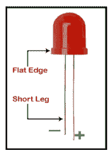
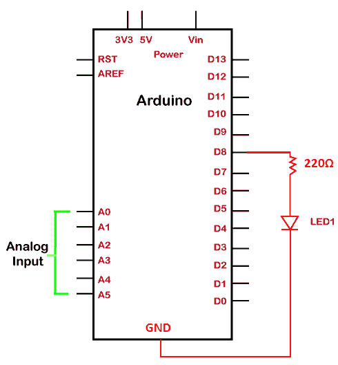
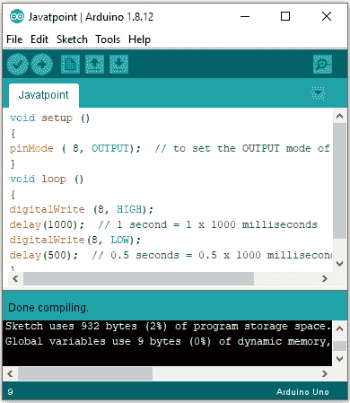
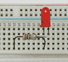
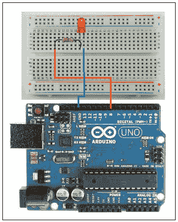

# 闪烁发光二极管

> 原文：<https://www.javatpoint.com/arduino-blinking-an-led>

这是使用 Arduino 创建的简单的基本项目。LED(发光二极管)是一种电子器件，当电流通过其端子时就会发光。发光二极管用于各种应用。它还在不同的电子设备中用作开/关指示器。

在本项目中，我们将把 LED 连接到 [Arduino](https://www.javatpoint.com/arduino) 板上的数字引脚。发光二极管将作为一个简单的灯工作，可以在指定的时间内打开和关闭。

### 发光二极管的结构

发光二极管是一种双端设备。这两个终端称为阴极和阳极。

如下所示:



长端称为阳极，短端称为阴极。这里，阴极是负极端子，阳极是正极端子。

### 项目的组成部分

以下列出了用于闪烁指示灯的组件:

1.  1 个 Arduino UNO 板。
    我们可以使用任何版本的 UNO 板，比如 UNO R3 等。我们也可以使用其他类型的 [Arduino 板](https://www.javatpoint.com/arduino-boards)，如 Arduino Zero、Arduino Micro 等。
2.  1 个面包板
3.  2 根跳线
4.  1 个发光二极管
5.  1 个 220 欧姆的电阻器。

我们可以使用一个阻值高达 470 欧姆的电阻。根据电路要求，我们也可以使用其他电阻值。通常，该值不应超过允许的正向电流。

### 项目结构

该结构清楚地显示了 UNO 板的引脚排列。它还显示连接到电路板的发光二极管和电阻。

如下所示:



### 素描

我们需要安装 [Arduino IDE](https://www.javatpoint.com/arduino-ide) ，开始编码，已经讨论过了。

打开 IDE，从下面给出的编码开始:

```

void setup ()
{
pinMode ( 8, OUTPUT);  // to set the OUTPUT mode of pin number 8.
}
void loop ()
{
digitalWrite (8, HIGH); 
delay(1000);  // 1 second = 1 x 1000 milliseconds
digitalWrite (8, LOW);
delay(500);  // 0.5 second = 0.5 x 1000 milliseconds
}

```

我们可以根据自己的选择或要求修改延迟时间。

编码的每一个陈述都在 [Arduino 编码基础](https://www.javatpoint.com/arduino-coding-basics)中解释。可以打开[网址](https://www.javatpoint.com/url-full-form)了解清楚。

#### 注意:确保代码没有错误。

草图经过正确的编辑后会上传到板子上，如下图所示:



我们需要点击验证按钮来编译代码。

成功上传代码后，板上的接收和发送指示灯将亮起。

### 程序

连接项目组件的过程如下所示:

*   在试验板上安装一个发光二极管。我们需要将一个发光二极管的两个端子插入实验板的孔中。

我们可以在实验板上的任何地方插入发光二极管。

*   将电阻器与发光二极管串联，如下所示:



*   将电阻的左腿(与红色 LED 串联)连接到 UNO 板的数字输出引脚，即引脚 **8** 。
*   使用导线将发光二极管的负/短端子(阴极)连接到联合国办事处板的 GND 引脚，如下所示:



这里，橙色导线连接到 PIN 8，蓝色导线连接到 GND。

较短的端子表示负极。因此，我们将把较短的终端连接到地面(GND)。

*   连接 USB 电缆。
*   在 Arduino IDE 中选择主板和串行端口。
*   将草图或代码上传到板上。
*   指示灯将在指定的持续时间内变暗并亮起。

**重要点**

本项目中需要考虑的要点如下:

*   电阻器必须与发光二极管串联。

电阻器防止过量电流到达发光二极管。连接中的过量电流会烧毁发光二极管。因此，在连接中使用了与发光二极管串联的电阻器。

*   我们可以使用任何引脚作为输出引脚。例如，8、13、7、4 和 3。其他引脚是脉宽调制和模拟引脚。
*   发光二极管的一端接地，另一端连接到数字引脚。数字引脚只有两个值 0 或 1。
    *   高= 1
    *   低= 0
*   所有基本项目都推荐使用 Arduino UNO 板，因为它易于理解和实现。它也是所有类型电路板中的标准 Arduino 电路板。它提供电源，也充当串行端口。

* * *