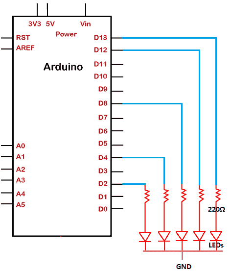
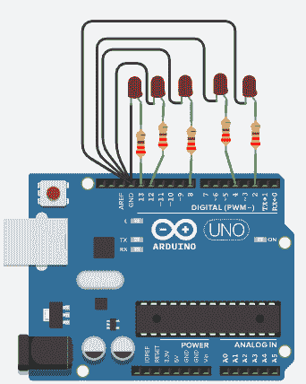

# 使用阵列闪烁各种指示灯

> 原文：<https://www.javatpoint.com/arduino-blinking-various-leds-using-arrays>

在前面的主题中，我们已经讨论了如何闪烁单个发光二极管、两个发光二极管和使用环路的发光二极管。

在这里，我们将讨论一个使用阵列闪烁五个发光二极管的项目。所有五个指示灯将一个接一个地点亮。

### 所需硬件

项目所需的组件如下所示:

*   5 个红色发光二极管
*   5 x 220 欧姆电阻器
*   烧了 R3 板
*   跳线

我们可以根据自己的选择使用任何颜色的发光二极管。

### 原则

我们将把五个发光二极管连接到 [Arduino](https://www.javatpoint.com/arduino) 板的引脚 13、12、8、4 和 2。电阻器所需的电阻足以点亮发光二极管，而不会损坏电路板和其他组件。

一个接一个排列的 [LED](https://www.javatpoint.com/led-full-form) 会亮起。我们还可以更改或重新排列连接到板上指定管脚号的发光二极管。

### 项目结构

该结构清楚地显示了 UNO 板的引脚排列，五个带有串联电阻的发光二极管连接到板上。

如下所示:



### 关系

上述项目的联系讨论如下:

*   将 220 欧姆的电阻器与五个发光二极管串联。现在将其连接到 Arduino 板的第 13、12、8、4 和 2 号引脚。
*   将五个指示灯的负极端子连接到 GND(接地)上。

### 素描

点亮五个指示灯的代码如下所示:

```

int timer = 500;           
int LEDPins[] = {13, 12, 8, 4, 2};       // an array of declared pin numbers on the board
int countOFpin = 6;           // the number of arrays
void setup() 
{
  // we have declared an array to intialize the LED pins as OUTPUT
  for (int PIN = 0; PIN < countOFpin; PIN= PIN + 1) 
{
    pinMode(LEDPins[PIN], OUTPUT);
  }
}
void loop()
 {
  // loop starting from the lowest pin in the array to the highest:
  for (int PIN = 0; PIN < countOFpin; PIN++) {
    // turns the pin ON:
    digitalWrite(LEDPins[PIN], HIGH);
    delay(timer);
    // turnS the pin OFF:
    digitalWrite(LEDPins[PIN], LOW);
  }
  // loop from the highest pin in the array to the lowest: 
  // It means the LEDs will light in the reverse direction as used above
  for (int PIN = countOFpin - 1; PIN >= 0; PIN- -)
 { 
    digitalWrite(LEDPins[PIN], HIGH);
    delay(timer);
    digitalWrite(LEDPins[PIN], LOW);
    // We can also specify the time inside the delay( ) instead of the delcaring the timer
  }
}

```

### 接线图

我们将使用模拟器显示连接，因为连接变得更加清晰和精确。

我们可以使用硬件设备进行同样的连接。



* * *