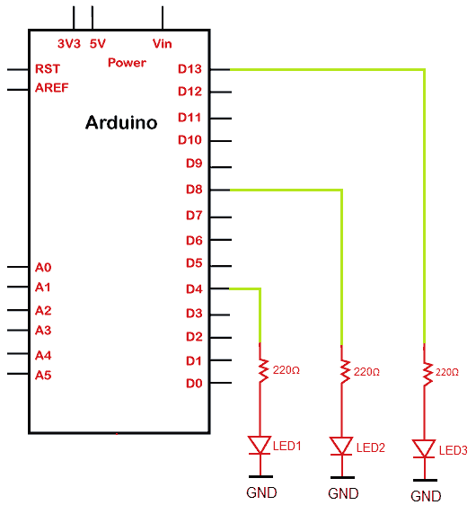
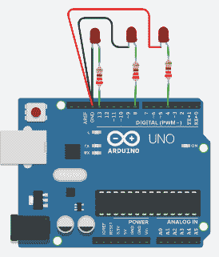

# 使用环路闪烁多个指示灯

> 原文：<https://www.javatpoint.com/arduino-blinking-multiple-leds-using-loop>

我们已经讨论了闪烁单个和两个发光二极管的方法。

在这个项目中，我们将讨论闪烁三个发光二极管用于环路的过程。三个指示灯将依次亮起。

让我们开始这个过程。

### 所需硬件

项目所需的组件如下所示:

*   3 个红色发光二极管
*   3 x 220 欧姆电阻器
*   烧了 R3 板
*   跳线

我们可以根据自己的选择使用任何颜色的发光二极管。

### 原则

我们将把三个发光二极管连接到 [Arduino](https://www.javatpoint.com/arduino) 板的引脚 13、8 和 4。电阻的极限值应该在 220 到 330 欧姆之间，以设置通过发光二极管的最佳电流。

所需的电阻足以点亮一个发光二极管，而不会损坏电路板和[发光二极管](https://www.javatpoint.com/led-full-form)。我们将单独打开/关闭指示灯。

### 项目结构

该结构清晰地显示了 [UNO 板](https://www.javatpoint.com/arduino-uno)的引出线，三个带电阻的 led 串联在板上。

如下所示:



### 程序

上述项目的联系讨论如下:

*   将 220 欧姆的电阻与三个发光二极管串联。现在将其连接到 Arduino 板的第 13、8 和 4 号引脚。
*   将三个指示灯的负极端子连接到 GND(接地)上。

### 素描

打开 Arduino IDE，从下面给出的编码开始:

```

/*
  This program blinks LED connection to the pin number 13, 8, and 4
*/
void setup()
{
  pinMode(13, OUTPUT);
  pinMode(8, OUTPUT);
  pinMode(4, OUTPUT);
}
void loop()
{
 // the first LED is made to blink one time
  digitalWrite(13, HIGH);
  delay(1000); // delay time in milliseconds
  digitalWrite(13, LOW);
  delay(1000);
  // the second LED will blink two times
  digitalWrite(8, HIGH);
  delay(500); // the duration is 0.5 seconds
  digitalWrite(8, LOW);
  delay(500);
  digitalWrite(8, HIGH);
  delay(500); 
  digitalWrite(8, LOW);
  delay(500);
   // the third LED will blink three times
  for( int i = 0; i < 3; i = i +1 )
  {
  digitalWrite(4, HIGH);
  delay(500); 
  digitalWrite(4, LOW);
  delay(500);
    // We can adjust the delay time accordingly
  }
}

```

### 接线图

我们将使用模拟器显示连接，因为连接变得更加清晰和精确。

我们可以使用硬件设备进行同样的连接。



* * *