# Arduino 模拟器

> 原文：<https://www.javatpoint.com/arduino-simulator>

阿尔杜伊诺模拟器是现实世界中阿尔杜伊诺电路的**虚拟写照。我们可以使用模拟器创建许多项目，而不需要任何硬件。**

模拟器帮助初学者和专业设计师学习、编程和创建他们的项目，而不会浪费时间收集硬件设备。

## 使用模拟器的优势

使用模拟器有各种优势，如下所示:

*   它省钱，因为不需要购买硬件设备来做项目。
*   创建和学习 Arduino 的任务对初学者来说很容易。
*   我们不需要担心电路板和相关设备的损坏。
*   不需要杂乱的电线结构。
*   它帮助学生使用模拟器消除他们的错误。
*   它支持逐行调试，有助于轻松找出错误。
*   我们可以通过计算机和互联网连接在任何地方学习代码和构建项目。
*   我们也可以和别人分享我们的设计。

## 模拟器的类型

有各种各样的模拟器可用。有些是免费的，而有些需要许可证才能访问模拟器。

下面列出了一些类型的模拟器:

*   autodesk tinkercad
*   模拟器 Arduino 模拟器
*   Autodesk Eagle(酒吧)
*   Proteus 模拟器
*   虚拟电子 Arduino 模拟器
*   ArduinoSim

Autodesk Eagle 是一款高级模拟器，用于设计 PCB 的 2D 和 3D 模型、模块化设计、多片原理图、实时同步等。

## 如何访问模拟器？

这里，我们使用的是**欧特克补锅匠模拟器**。

下面列出了访问修补程序的步骤:

1.打开补锅匠的官方网站。 **[网址](https://www.javatpoint.com/url-full-form):[https://www.tinkercad.com/](https://www.tinkercad.com/)T5】**

将出现一个窗口，如下所示:

2.点击右上角的三条水平线。

3.如果您在 Autodesk 有帐户，请点击“**登录**”选项。否则，如果您没有帐户，请点击**“立即加入”**选项，如下所示:

**登录**窗口将显示为:

我们可以选择任何登录方式。指定用户名和密码。

我们在 Autodesk 中已经有一个帐户，因此我们将使用用户名和密码直接登录。

**连接**窗口将显示为:

根据需求选择偏好，使用 Gmail 登录等。

4.现在，将出现一个窗口，如下所示:

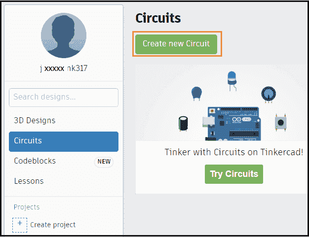

5.点击**新建电路**选项，开始设计 Arduino 电路，如上图所示。

“**电路**”选项也将显示用户创建的先前电路。设计选项用于创建三维设计，在[阿尔杜伊诺](https://www.javatpoint.com/arduino)中没有用。

6.我们现在准备从欧特克补锅匠开始。我们可以开始创建我们的项目。

## Autodesk 补锅匠模拟器

它也是一个用于设计虚拟电路的模拟器。

**补锅匠的特点**

修补程序的功能如下:

*   **点亮并移动电路组件。**表示我们可以根据项目需求使用一个电路的元器件。这里的发光表示发光二极管的发光。
*   **集成产品设计。**表示电路中使用的电子元件是真的。
*   **Arduino 编程。**我们可以直接在模拟器的编辑器中编写程序或者代码。
*   我们也可以考虑一些补锅匠提供的**现成的例子**来更好的理解。
*   **实时模拟。**我们可以在浏览器中设计原型，然后实时实现。

## 如何使用模拟器？

如上所述，在 Autodesk 修补程序上登录。现在，按照以下步骤操作:

*   点击**新建电路**选项，如下图:

*   将出现一个窗口。我们需要在项目屏幕中拖放所需的组件。如下所示:

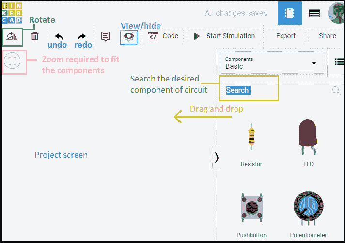

*   点击组件下拉列表，选择“**全部**”选项。

下拉列表将显示为:

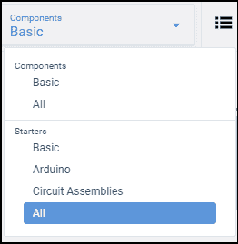

当我们向下滚动一点时，所选选项“**【全部】**”将显示所有组件和启动器示例，如下所示:

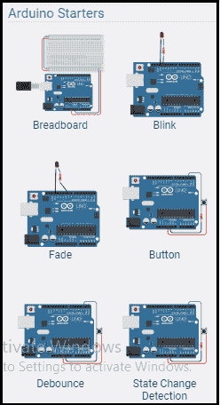

### 闪烁指示灯的代码示例

让我们用一个闪烁发光二极管的例子来理解。我们可以使用两种方法(在基本项目中闪烁发光二极管和下面指定的一种)来闪烁发光二极管。

步骤如下:

*   搜索 UNO R3 并在项目屏幕上拖放板。我们可以根据需要选择任何板。
*   搜索一个发光二极管和一个 220 欧姆的电阻，并将它们拖放到项目屏幕上。

选择电阻后，将出现一个设置电阻的框，如下所示:

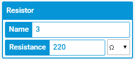

这里，我们为[发光二极管](https://www.javatpoint.com/led-full-form)选择了**红色**颜色。我们也可以选择其他颜色。

选择发光二极管后，将出现一个设置颜色的框，如下图所示:

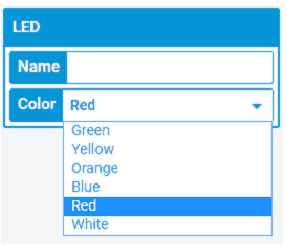

*   现在，连接电线。对于布线，只需选择电路板上元件端子的点。我们不需要在搜索框中搜索电线。
*   电路现在将显示为:

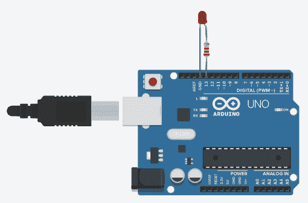

*   选择“**文本**”代替块视图，如下图所示:

*   点击代码按钮编写代码，如下图:

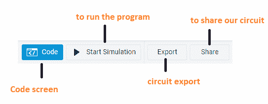

*   编码屏幕将显示为:

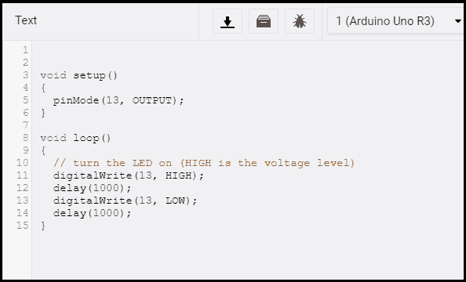

它还显示代码中的错误(如果有)。

*   点击**开始模拟**上传板上的代码。

指示灯将点亮 1 秒钟，变暗 1 秒钟。

发光二极管如下所示:

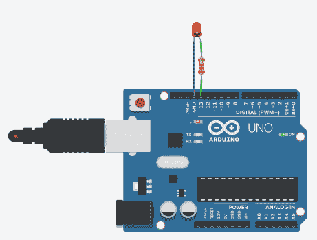

点击**停止模拟**，停止发光二极管的[闪烁，如下图:](https://www.javatpoint.com/arduino-blinking-an-led)

**串行监视器**

串行监视器位于编码屏幕的底部。

它看起来像下图:

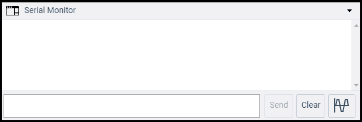

* * *