# Arduino 网页编辑器

> 原文：<https://www.javatpoint.com/arduino-web-editor>

Arduino 网络编辑器是集成开发环境的最新在线版本。我们可以在不安装软件的情况下在线创建我们的 Arduino 草图。它包括所有最新的 Arduino 板和贡献的库。

Arduino IDE 中没有提供的库可以手动添加到 Web 编辑器中，这些被称为**贡献库。**

只要我们有互联网连接，我们就可以用 Arduino 网络编辑器处理我们的项目。离线工作，需要根据系统需求下载最新的 [Arduino IDE](https://www.javatpoint.com/arduino-ide) 。

### Arduino 网页编辑器的特性

[Arduino](https://www.javatpoint.com/arduino) 网页编辑器的功能如下:

*   有了可靠的互联网连接，我们可以在任何地方工作。
*   它允许轻松分享我们的项目和草图。
*   它只与 Arduino 的官方主板兼容。
*   它有各种内置的库。
*   我们可以自动设计我们的代码，这样代码更容易阅读。
*   我们可以相应地最大化和最小化编码屏幕。

先从使用 **Arduino 网页编辑器**在线工作的过程说起。

你不需要在我们的电脑上安装任何东西。只需遵循以下步骤:

*   打开 Arduino 的官网。网址:[https://www.arduino.cc/](https://www.arduino.cc/)
*   点击**软件** - > **在线工具**，如下图:

*   将出现窗口，如下所示:

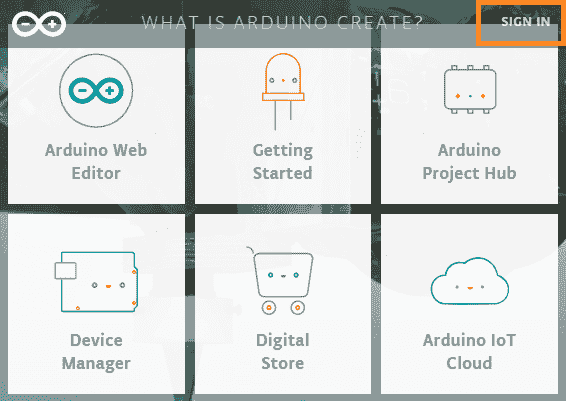

*   点击右上角的“**签到**选项，如上图所示。

使用您注册的电子邮件标识和密码登录，点击**登录**按钮，如下图:

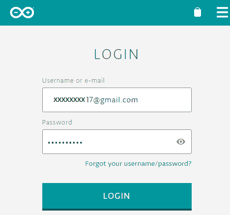

如果您是平台新手，请向下滚动，通过登录谷歌创建一个新帐户，如下所示:

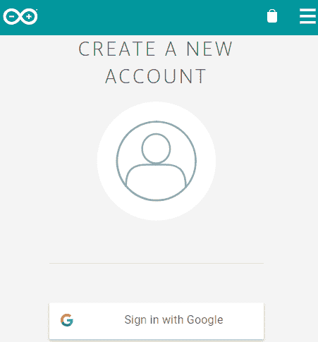

*   点击“ **Arduino 网页编辑器**”选项。
*   屏幕现在将显示为:

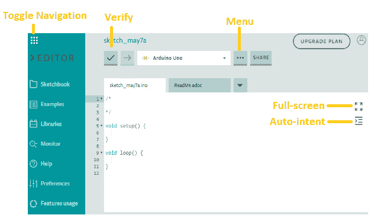

现在可以开始用 Arduino 网页编辑器编程了。

让我们理解网络编辑器屏幕上出现的每个选项。

### 素描本

它是网络编辑器上的在线速写本。我们可以在在线网页编辑器中导入草图。草图也可以从任何设备访问。

它将如下图所示:

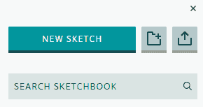

### 例子

它包括内建的自我练习的例子。示例类似于 Arduino IDE 中的示例。它也包括来自图书馆的例子。

它将显示为:

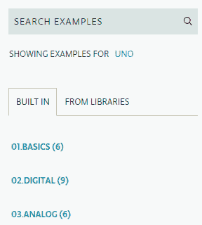

### 图书馆

它提供默认和自定义库。我们还可以将一些库标记为收藏夹，以便于访问。我们可以从“ **LIBRARY MANAGER** ”选项中管理和搜索不同的库，如下所示:

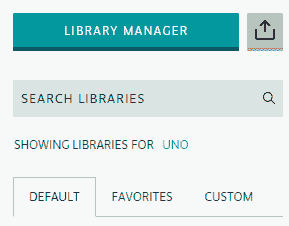

### 班长

它类似于 Arduino IDE 中的串行监视器。

### 帮助

它包括所有关于网页编辑器、一些教程和 Arduino 词汇表的信息。

### 偏好；喜好；优先；参数选择

它包含一些首选项，可以在继续编程之前进行相应的调整。

它将如下图所示:

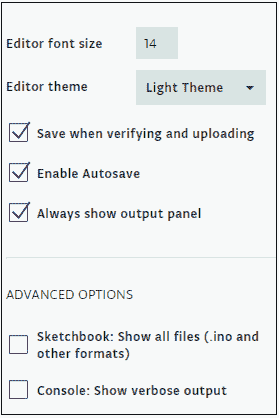

### 功能使用

它显示内存使用、编译和创建的草图。

### 菜单

类似于文件选项，包括**保存、另存为**等多种选项。如下所示:

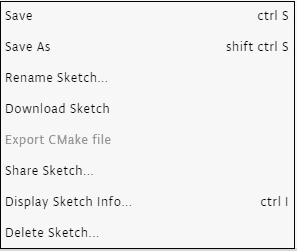

### 核实

验证选项用于在将草图上传到电路板之前验证草图。代码中的任何错误都将像 Arduino IDE 一样显示。

### 全屏幕

它放大了网页编辑器的编码屏幕。

### 自动意图

自动意图选项用于自动意图代码，以获得更好的可读性。

### 升级计划

这是高级专业用户的订阅计划。我们可以根据需要购买每月或每年的订阅。

如下所示:

### 船和港口

在开始编程之前，我们需要选择所需的电路板和端口。没有它，我们无法将程序上传到 Arduino 板。

它将显示为:

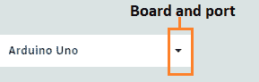

我们需要点击下拉列表来选择板和绘图。

### 示例代码

让我们写一个简单的代码来闪烁一个 LED。

编码屏幕如下所示:

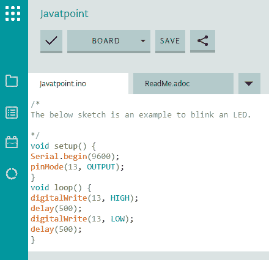

我们一选择板卡和端口，程序就会上传到板卡上， [LED](https://www.javatpoint.com/led-full-form) 会闪烁指定的时长(0.5 秒)。

* * *