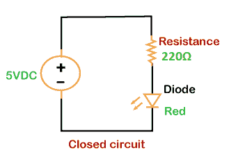
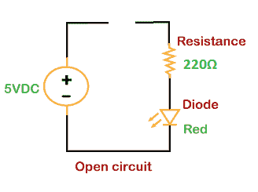
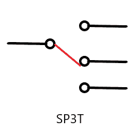
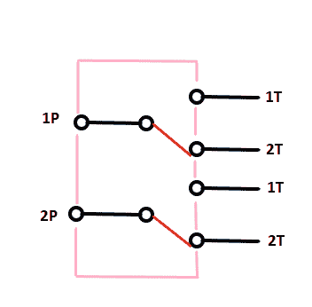
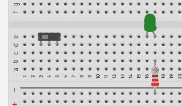
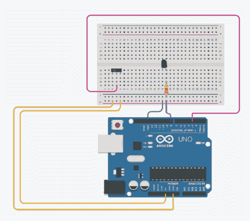

# Arduino 交换机

> 原文：<https://www.javatpoint.com/arduino-switch>

开关用于打开/关闭设备以及连接电路的不同部分。Arduino 中的滑动开关将开关的滑块从打开位置(开)移动到关闭位置(关)。

它允许电流在电路中流动，而不需要接合线。滑动开关广泛用于小型电路应用。

有两种类型的电路，如下所示:

*   **闭合电路**

闭路有闭环。电子很容易在闭合电路中流动，点亮[发光二极管](https://www.javatpoint.com/led-full-form)。



*   **开路**

开路有开路端，因此电子不能流过电路。



我们可以使用电子元件开关来打开和关闭电路，而不需要一次又一次地用手断开电线。

### 开关的类型

[Arduino](https://www.javatpoint.com/arduino) 中主要有四种类型的开关，列举如下:

*   **SPST (** 单刀单掷**开关**

它是一个有一个输入和一个输出的开关。当开关闭合时，电路接通，反之亦然。


*   **SPDT (** 单刀双掷**开关**

它是一个三端开关。它只有一个输入，可以在两个输出之间切换。


*   **SP3T (** 单刀三掷**开关**

它是一个具有一个输入和三个输出的开关，其中每个输入对应于电路中的任何输出。



*   **DPDT (** 双刀双掷**开关**

它是一个具有两个输入和四个输出的开关。 [Arduino](https://www.javatpoint.com/arduino) 中开关的每个输入都可以连接到两个输出中的任何一个。



哪里，

**极点**:表示开关可以控制的电路数量。

**投**:表示开关每极可以连接的位置数。

## 代码示例

让我们讨论一个使用开关点亮发光二极管的示例。这里，我们将使用 SPDT(单刀双掷)开关。

如果我们离开开关的一侧，它可以作为 SPST(单刀单掷)开关。

**所需组件**

所需组件如下所示:

*   Arduino UNO 董事会。在这里，我们使用了 UNO R3。
*   1 x 220 欧姆电阻
*   跳线
*   1 个滑动开关
*   1 个绿色发光二极管(我们可以选择任何颜色的发光二极管)
*   1 个面包板

下面列出了此类示例的步骤:

1.将绿色指示灯连接到试验板上。

2.将一个电阻与发光二极管串联。

3.将滑动开关安装在试验板上，如下所示:



4.将发光二极管的负极引脚接地。

5.将与电阻器串联的发光二极管的正极端子连接到引脚 8。

6.将公共端子或中间端子连接至针脚 3。这是因为中间端子是输入端子。

7.将滑动开关的一端接地，另一端连接到 5V。

电路如下所示:



现在，我们需要在编码屏幕上写代码。

代码如下:

```

const int pinOFswitch = 3;
const int LED = 8;
void setup( ) {
  pinMode(pinOFswitch, INPUT);
  pinMode(LED, OUTPUT);
}
void loop( ) 
{
  int ValueOFswitch;
  ValueOFswitch = digitalRead(pinOFswitch);
  if (ValueOFswitch == HIGH) 
  {
    digitalWrite(LED, HIGH);
    delay(500);
  }

  else 
  {
    digitalWrite(LED, LOW);
    delay(500);
  }
}

```

* * *