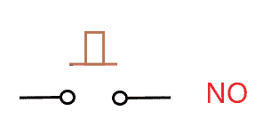
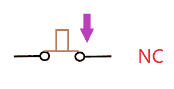
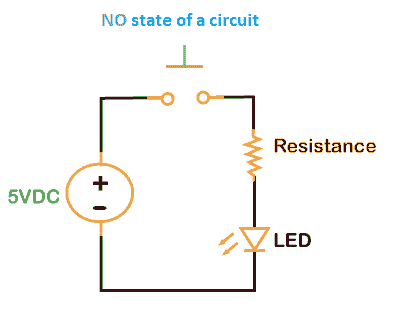
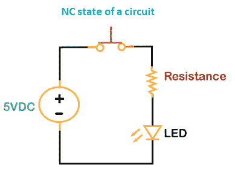
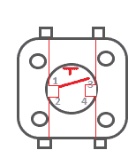
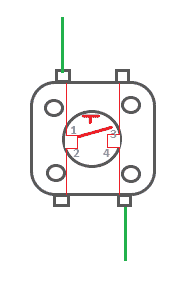
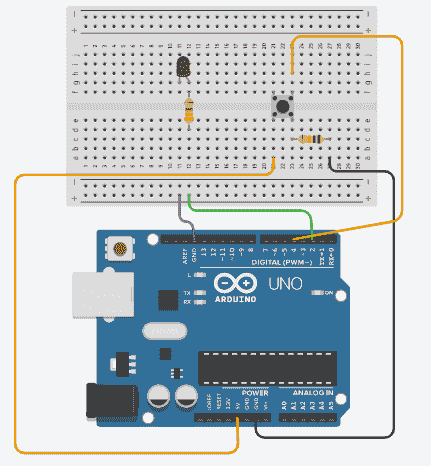
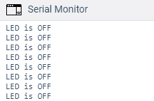
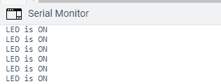

# Arduino 按钮

> 原文：<https://www.javatpoint.com/arduino-button>

按钮类似于在电路中建立和断开电连接的开关。该按钮在开和关状态之间切换。一次按压打开状态，而另一次按压关闭状态。这意味着当我们按下按钮时，按钮会连接电路中的两个点。

下面列出了两种类型的按钮:

*   **否(常开)**

我们大多使用 NO 类型的按钮。在这种类型中，按钮处于静止状态。这意味着处于这种情况的终端没有连接。

如下所示:



当我们按下按钮时，端子就电连接了。

*   **数控(常闭)**

它被定义为按钮的工作状态。它连接电路的端子，允许电流流过负载。

如下所示:



数控和无也被定义为瞬时类型的开关。

让我们借助一个电路来理解 NO 和 NC。

电路的“否”状态如下所示:



由于电路两端开路，电流无法流过。电路处于静止状态。

电路的数控状态如下所示:



由于电路两端相连，电流很容易流过电路。 [LED](https://www.javatpoint.com/led-full-form) 将一直亮着，直到我们再次按下按钮。

另一种按钮是按钮，广泛应用于工程和电路中。

### 按钮结构

让我们了解一下按钮的结构。

按钮是一个方形按钮，有四个端子，如下所示:



这两个引脚在一侧相邻，另一侧相邻。相互交叉的引脚相连。只有当我们按下按钮时，相邻的引脚才能连接。

我们还可以连接按钮的两个相对端子，如下所示:



让我们用一个例子来理解按钮。

## 代码示例

在这里，我们将按下按钮点亮一个发光二极管。当我们按下按钮时，它会打开连接到 [Arduino UNO 板上](https://www.javatpoint.com/arduino-uno)PIN 13 的 LED。

**所需组件**

所需组件如下所示:

*   Arduino UNO 董事会。这里我们用的是 **UNO R3** 。
*   1 x 220 欧姆电阻
*   1 x 10 Kohm 电阻
*   跳线
*   1 个按钮
*   1 个红色发光二极管(我们可以选择任何颜色的发光二极管)
*   1 个面包板

下面列出了此类示例的步骤:

1.  将红色发光二极管连接到电路板上。
2.  将一个电阻与发光二极管串联，并将其连接到试验板的引脚 2。
3.  将发光二极管的负极端子连接到 GND 引脚。
4.  将按钮安装在试验板上。
5.  在按钮右下角串联一个 10 千欧的电阻，并将其连接到 GND 引脚。
6.  将按钮的右上角连接到针脚 4。
7.  将按钮左下角连接到 5V。

电路如下所示:



### 密码

上部电路的代码如下所示:

```

const int ledpin = 2; // initializing pin number 2 to the LED
const int buttonpin = 4; // initializing pin number 4 to the button
int buttonState = 0;
void setup()
{
  Serial.begin(9600);
  pinMode(buttonpin, INPUT);
  pinMode(ledpin, OUTPUT);
}
void loop()
{
  // read the state of the pushbutton value
  buttonState = digitalRead(buttonpin);
  // check if pushbutton is pressed.  if it is, the
  // buttonState is HIGH
  if (buttonState == HIGH) {
    // turn LED on
    digitalWrite(ledpin, HIGH);
    Serial.println("LED is ON");
    //When we press the button, it will print LED is ON.
delay ( 500);
  } 
  else 
  {
    // turn LED off
    digitalWrite(ledpin, LOW);
    Serial.println("LED is OFF"); // When we press the button, it will print LED is OFF.
  }
delay ( 500);
}

```

**输出**

在初始状态下，指示灯将熄灭。

当我们连续按下按钮时，发光二极管就会发光。每 500 毫秒后，串行监视器上会显示消息“**指示灯亮起**”。

让我们看看串行监视器的输出。

当指示灯熄灭时，输出显示为:



当指示灯亮起时，输出显示为:



* * *