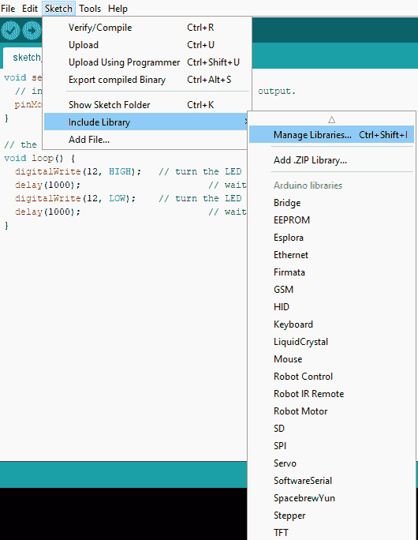
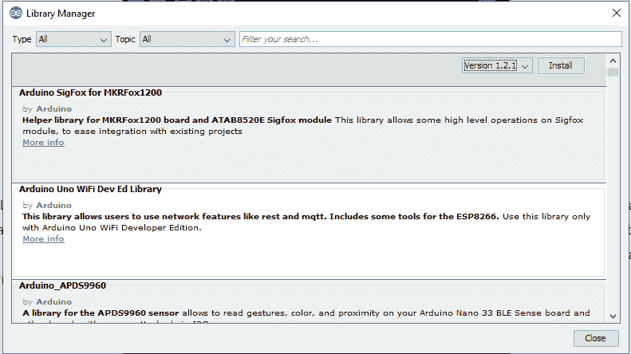
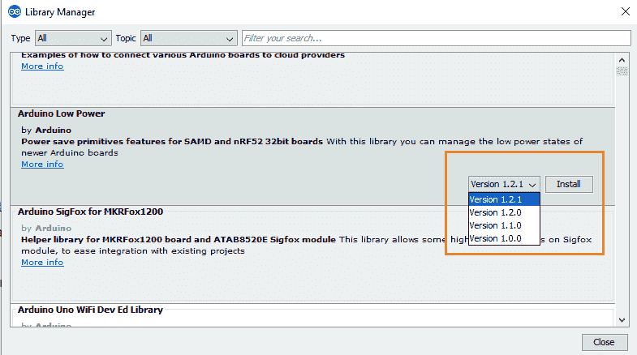
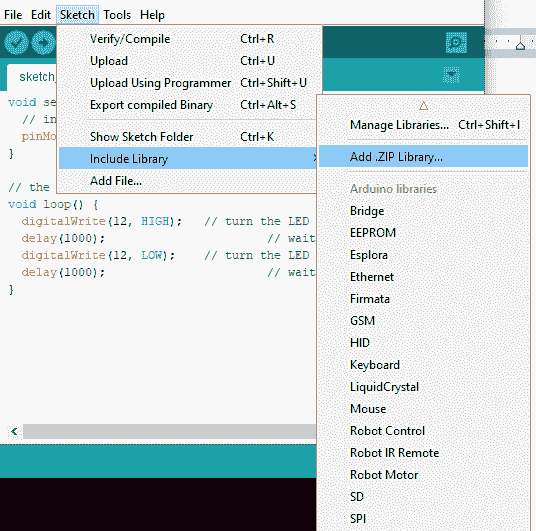

# 阿尔杜伊诺图书馆

> 原文：<https://www.javatpoint.com/arduino-library>

该库被认为是高级功能，它扩展了 Arduino IDE 的功能。这意味着这些库为 Arduino 的编程平台提供了额外的功能。

Arduino 中的库是用 [C](https://www.javatpoint.com/c-programming-language-tutorial) 或者 [C++](https://www.javatpoint.com/cpp-tutorial) (。cpp)。这些库允许我们操作数据和使用硬件。

要在 [Arduino IDE](https://www.javatpoint.com/arduino-ide) 中实现任何库，请转到**草图- >导入库**。

有几个库可供下载。我们也可以创建自己的图书馆。

让我们讨论一些图书馆。

## 标准图书馆

标准库如下所示:

### 电可擦可编程只读存储器

代表**电子可擦除可编程只读存储器**。EEPROM 与自动电压调节器或 [Arduino 板](https://www.javatpoint.com/arduino-boards)上的微控制器相关联。当主板断电时，EEPROM 库允许我们读取存储在内存中的字节。

EEPROM 的大小因板而异，例如 ATmega328P 上的 1KB 或 1024 字节。在微控制器 ATmega2560 等上也可以是 4KB 或 4096 字节。

该库声明为:

```

#include <EEPROM.h>

```

例如，EEPROM 读取、EEPROM 清除、EEPROM 写入、EEPROM 获取、EEPROM 更新、EEPROM 放入、EEPROM 迭代等。

### 以太网库

以太网库与 Arduino 以太网屏蔽和其他相关设备一起工作。以太网库允许我们将 Arduino 板连接到互联网。

SPI 总线充当电路板和屏蔽之间的中间体。

关联的库是:

```

#include <Ethernet.h>
#include <SPI.h>

```

例如 **TelnetClient、WebServer、WebClientRepeating、WebClient、ChatServer、DnsWebClient、UdpNtpClient、UdpSendReceiveString、**等。

### 库签名

对于编程环境，我们可以创建自定义固件，而无需生成自己的对象和协议。

它用于实现固件协议，与主机上的软件进行通信。

关联的库是:

```

#include <Firmata.h>

```

### 全球移动通信图书馆

GSM 库存在于 IDE 1 . 0 . 4 及更高版本上。

GSM 库允许我们在 Arduino 板上执行类似于 GSM 电话的操作，例如互联网连接、发送和接收消息，以及拨打语音电话。

该库声明为:

```

#include <GSM.h>

```

### 液晶库

这是一个允许 [Arduino](https://www.javatpoint.com/arduino) 与液晶显示器通信的库，液晶显示器基于一个名为日立 HD44780 的兼容芯片组。这种芯片组可以在大多数基于文本的液晶显示器上找到。它可以在 8 位模式或 4 位模式下工作。这里，除使能、rs 和 rw 控制线外，位模式还表示数据线(可选)。

该库声明为:

```

#include <LiquidCrystal.h>

```

例子有**你好世界、光标、眨眼、**等。

### 标准图书馆

它允许读写 SD 卡。比如 Arduino 以太网盾。文件名包括由正斜杠分隔的路径，这些路径被传递到 SD 库。但是，串行接口用于 SD 卡和 Arduino 之间的通信。

该库声明为:

```

#include <SPI.h>
#include <SD.h>

```

例如转储文件、列表文件、读写等。

### 伺服库

伺服库允许 Arduino 使用伺服电机。它允许控制集成轴和齿轮。我们还可以将轴定位在 0 到 180 度之间的不同角度。Arduino 板上的伺服库最多可支持 12 个电机，而 [Arduino Mega 板](https://www.javatpoint.com/arduino-mega)上的伺服库最多可支持 48 个电机。

该库声明为:

```

#include <Servo.h>

```

### SPI 库

SPI ( **串行外设接口**)是一种串行数据协议。[微控制器](https://www.javatpoint.com/microcontroller)使用串行协议与一个或多个外围设备进行短距离快速通信。

SPI 所需的连接是全双工的，允许设备同时发送和接收数据。

该库声明为:

```

#include <SPI.h>

```

例如转储文件、列表文件、读写等。

### 步进图书馆

Arduino 的步进库允许控制双极或单极步进电机。

该库声明为:

```

#include <Stepper.h>

```

步进机包括步进速度控制、步进一周等。

### 软件串行库

软件串行库允许通过数字输入/输出引脚进行串行通信。Arduino 内置 0 和 1 引脚，用于串行接口。我们可以在代码中包含多个串行端口，其运行速度高达 115200 bps(每秒位数)。

该库声明为:

```

#include <SoftwareSerial.h>

```

### 薄膜晶体管液晶库

集成开发环境 1.0.5 及更高版本中包含了薄膜晶体管[液晶显示器](https://www.javatpoint.com/lcd-full-form)库。它允许阿尔杜伊诺与[薄膜晶体管](https://www.javatpoint.com/tft-full-form)液晶显示屏通信。它还有助于在屏幕上绘制图像、形状、线条和文本。

板载屏幕上的 SD 卡插槽可以通过实现 SD 库来使用。

用于通信的薄膜晶体管库取决于带有 SD 卡和屏幕的 SPI 库。

该库声明为:

```

#include <SPI.h>
#include <TFT.h>

```

### 无线图书馆

WiFi 库允许 Arduino 与互联网建立连接。它可以是接收传入连接的服务器，也可以是执行传出连接的客户端。

[WiFi](https://www.javatpoint.com/wifi-full-form) 库支持的个人加密是 WPA2 和 WEP，WPA2 企业除外。Arduino 使用 SPI 总线与 WiFi 屏蔽进行通信。

该库声明为:

```

#include <WiFi.h>

```

例子包括无线网络客户端、无线网络服务器等。

### 音频库

音频库仅与 [Arduino Due 板](https://www.javatpoint.com/arduino-due)兼容。它使电路板能够回放。来自特定存储设备(如 SD 卡)的 wav 文件。

它通过使用 DAC0 和 DAC1 引脚播放声音。

该库声明为:

```

#include <Audio.h>

```

这个例子是一个简单的音频播放器。

### 音频零库

它使电路板(Arduino Zero、MKR1000 和 MKRZero)能够回放。存储设备(如 SD 卡)中的 wav 文件。

Arduino Zero 和 MKR1000 板通过使用 DAC0 引脚播放声音。

该库声明为:

```

#include <AudioZero.h>

```

例子是简单音频播放器零。

### Arduino 声音库

Arduino 声音库允许电路板分析和播放音频数据，这些数据由 Arduino 使用 I2S 总线在基于 SAMD21 的电路板上提供。基于 SAMD21 的主板有 Arduino Zero、MKR1000、MKRZero 或 Genuino Zero。

该库声明为:

```

#include <AudioSound.h>

```

例子包括波形回放、ClapDetector、WhistleDetector 等。

现在，让我们讨论在 Arduino 中安装库的过程。

## 如何在 Arduino 安装一个库？

步骤如下:

### Arduino 库管理器

*   我们需要打开库管理器在 Arduino 安装一个新库。点击**草图- >包含库- >管理库**，如下图:



*   将出现一个包含各种库的对话框，如下所示:



*   将出现一个准备安装的库列表。我们需要选择具体的库->选择**版本** - >点击**安装**按钮，如下图:



有时只有一个版本可供下载。在这种情况下，版本的收存箱将不会出现。因此，这很正常。

我们需要等待图书馆下载。下载将取决于连接速度。

“INSTALLED”标记将出现在已经安装在我们计算机上的库的前面。

### 导入. zip 库

如果我们想添加自己的库，我们可以从计算机中选择所需的文件夹。包含库的特定 zip 文件可以在 Arduino 中导入。

如下所示:



我们也可以从选项**草图- >包含库**中重新检查，查看添加的库是否在列表中。

我们不需要解压缩下载的库。文件将保留在。zip 格式。

我们可以从 Arduino IDE 1 . 0 . 5 版开始下载第三方库。

* * *