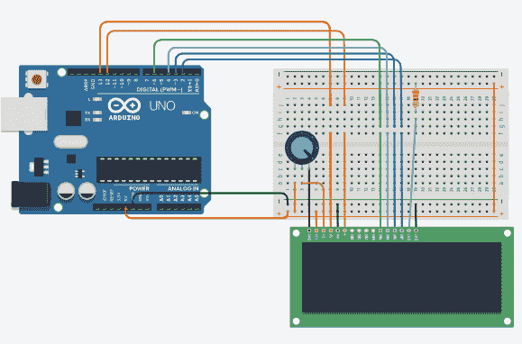

# Arduino LCD 显示器

> 原文：<https://www.javatpoint.com/arduino-lcd-display>

液晶显示器(**液晶显示器**)是一种使用液晶进行操作的显示器。

这里我们接受电脑的串行输入，将草图上传到 [Arduino](https://www.javatpoint.com/arduino) 。字符将显示在液晶屏上。

允许我们控制[液晶](https://www.javatpoint.com/lcd-full-form)显示的库叫做**液晶库**，下面讨论:

该库声明为:

```

#include <LiquidCrystal.h>

```

该库基于名为**日立 HD44780** 的兼容芯片组。它存在于大多数基于文本的液晶显示器上。它可以在 8 位模式或 4 位模式下工作。这里，除使能、rs 和 rw 控制线外，位模式还表示数据线(可选)。

### 液晶显示器结构

液晶显示器有一个 16 针接口。

液晶显示器的结构如下所示:


液晶显示器有一个并行接口。这意味着微控制器一次操作几个引脚来控制液晶显示器。

液晶屏上显示的 16 针如下所述:

*   **RS**

**寄存器选择(RS)** 引脚控制我们写入数据的液晶显示器的存储器。我们可以选择**数据寄存器**或**指令寄存器**。液晶屏查找指令寄存器中的下一条指令。

*   **拆装**

读/写引脚选择读或写模式。

*   **E**

**使能** (E)模式用于使能对寄存器的写入。当模式为高电平时，它将数据发送到数据引脚。

*   **D0 至 D7**

这是编号为 D0、D1、D3、D3、D4、D5、D6 和 D7 的八个数据引脚。我们可以将数据引脚的状态设置为高或低。

液晶显示器的引脚 1 为**接地**引脚，引脚 2 为 **Vcc** 或电压源引脚。

液晶屏的针脚 3 是 **VEE** 或**对比针脚**。例如，我们可以将电位计的输出连接到 VEE，并可以调整液晶显示器的对比度。

A 和 K 引脚也称为**背光引脚** (Bklt+和 Bklt-)。

### 液晶显示器的原理

该过程包括将数据(显示在液晶显示屏上)放入数据寄存器。寄存器选择中的指令保存在指令寄存器中。液晶库简化了在液晶显示器上显示字符的过程。

液晶显示器可以在 4 位或 8 位模式下控制，这需要特定 Arduino 板的 7 和 11 个输入/输出引脚。

让我们讨论一个在液晶显示器上显示文本的项目。

### 所需硬件

项目所需的组件如下所示:

*   液晶屏(日立 HD44780 兼容驱动程序显示屏)
*   1 x 220 欧姆电阻器
*   1 个 10K 欧姆电阻器
*   arduino uno 板或真品板
*   跳线
*   焊接液晶显示器引脚所需的引脚头
*   擀面板

### 项目结构

项目结构如下所示:


### 程序

这种联系解释如下:

我们需要首先将液晶显示器的数据引脚连接到数字引脚。

*   将液晶屏的 RS 引脚连接到 Arduino 板的引脚 13。
*   将液晶屏的使能引脚连接到 Arduino 板的引脚 12。
*   将液晶屏的 D4 引脚连接到 Arduino 板的引脚 6。
*   将液晶屏的 D5 引脚连接到 Arduino 板的引脚 4。
*   将液晶屏的 D6 引脚连接到 Arduino 板的引脚 3。
*   将液晶显示器的 D7 引脚连接到 Arduino 板的引脚 2。
*   将电位计的中间端子连接到 VEE(对比引脚)。
*   将电位计的两端连接到地和 5V。
*   将电阻器的一端连接到液晶显示器的 A 和 K，另一端连接到 5V。

### 素描

在液晶显示器上显示指定信息的代码如下:

```

// here, we will include the liquid crystal library:
#include <LiquidCrystal.h>
// initialize the library with the pins on the Arduino board
LiquidCrystal lcd(13, 12, 6, 4, 3, 2);
void setup() {
  // Here, 16 and 2 are the columns and rows of the LCD
  lcd.begin(16, 2);
  // It prints the message on the LCD. 
  lcd.print("hello Arduino");
  // We can modify the message as per our choice.
}
void loop() {
  // It sets the cursor to column 0, line 1
  // Since counting begins with 0, line 1 is the second row
  lcd.setCursor(0, 1);
  // print the number of seconds
  lcd.print(millis() / 1000);
  // Here, millis() is the return type of the timer in milliseconds
}

```

### 接线图

我们将使用模拟器显示连接，以便连接变得更加清晰和精确。

我们可以使用硬件设备进行同样的连接。



**输出**

液晶显示屏上将显示“你好，阿尔杜伊诺”信息，如下图所示:


* * *