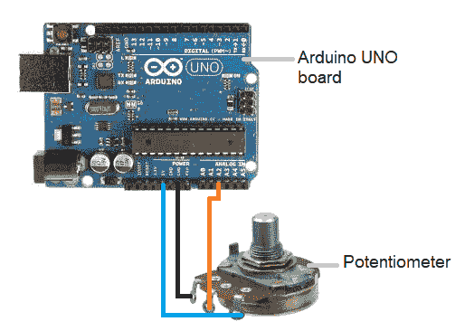
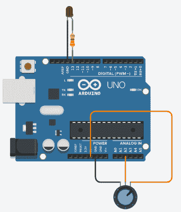

# Arduino 电位计

> 原文：<https://www.javatpoint.com/arduino-potentiometer>

电位计是用来测量电压或电势的装置。当装置的轴转动时，它提供可变的阻力。

这里，我们将电阻测量值作为电位计产生的模拟值。我们将电位计连接到 [Arduino UNO 板](https://www.javatpoint.com/arduino-uno)并将测量电位计的状态。所需的代码将从我们的计算机上传到 Arduino 板。

电位计测量的可变电阻可以很容易地作为模拟值读入 Arduino 板。

### 什么是电位计？

电位计是一个三端器件。它有一个旋转触点，充当可调分压器。

电位计结构由滑动触点(称为游标)、电阻元件、电气端子和外壳组成。

滑动触点沿着电阻元件移动，而外壳由电刷和电阻元件组成。

**工作**:固定的输入电压施加在电位器的两端端子上，电位器进一步在游标或滑块处产生可调的输出电压。

当滑块从一端移动到另一端时，分压器可以将输出电压从最大值改变到地。

电位器与 [Arduino 板](https://www.javatpoint.com/arduino-boards)的连接如下图:



电位计的中间端子连接到模拟引脚以读取模拟数据。

## **带发光二极管的电位器**

在本例中，我们将使用一个电位计来控制发光二极管闪烁的值。

**所需硬件**

所需组件如下所示:

*   1 个红色发光二极管
*   烧了 R3 板
*   10K 欧姆电位计
*   跳线
*   220 欧姆电阻器

**连接**

*   电位器的一个外引脚接地( **GND** )，另一个外引脚连接到 Arduino 板的 **5V** 。
*   电位计的中间引脚连接到电路板的模拟输入引脚 A2。
*   发光二极管的正极端子与 220 欧姆电阻串联连接到电路板的第 13 号引脚，负极端子连接到 GND。

**程序**

模拟输入将打开和关闭[发光二极管](https://www.javatpoint.com/led-full-form)，该发光二极管连接到 Arduino UNO 板的 13 号引脚。发光二极管开/关的时间(延迟时间)取决于模拟读数获得的值()。

我们已将电位计连接至 [Arduino](https://www.javatpoint.com/arduino) UNO 板的模拟引脚 2。

当轴转动时，电位计两侧的电阻变化。连接到 5V 的引脚和 GND 之间的距离提供模拟输入。当轴向一个方向转动时，我们读取输入 0，而当轴向另一个方向转动时，我们读取输入 1023。

在 0 和 1023 之间的转弯输入之间，我们得到了由 analogRead()返回的期望值。它与施加在引脚上的电压成正比。

**代码**

我们现在将代码上传到董事会。

代码如下:

```

int potentiometerPIN = 2;    
// It select the input pin connected to the middle terminal of the potentiometer
int LEDpin = 13;   // It selects the LED pin
int value = 0;       // value initialized to store the coming value from the sensor
void setup() 
{
  pinMode(LEDpin, OUTPUT);  // The LED pin is declared as the output pin
}
void loop() 
{
  value = analogRead(potentiometerPIN);    // It reads the value from the sensor
  digitalWrite(LEDpin, HIGH);  // turn the LEDpin ON
  delay(value);                  // delay time in milliseconds
  digitalWrite(LEDpin, LOW);   // turn the LEDpin OFF
  delay(value);                 
  // the delay time depends on the value stored from the sensor
}

```

**接线图**

连接图如下所示:



* * *