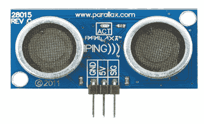
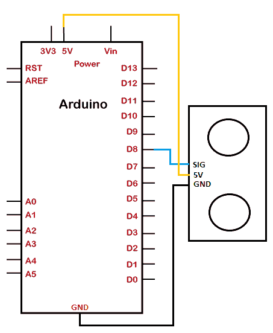
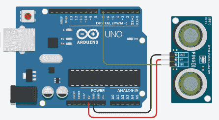
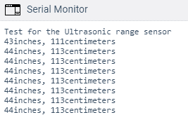

# Arduino 超声波测距仪

> 原文：<https://www.javatpoint.com/arduino-ultrasonic-range-finder>

在 [Arduino 超声波距离传感器](arduino-ultrasonic-distance-sensor)的前一个主题中，我们使用了一个四端超声波传感器。

这里，我们将使用三端超声波传感器，如下所示:



它有三个端子 GND(接地)、5V 和 SIG(信号)。该传感器的过程和功能类似于超声波距离传感器。

频率波在空气中传播，并在其路径上撞击物体。波从物体上反弹回来，到达模块。

超声波测距传感器用超声波探测障碍物或物体。

检测范围从 **3 厘米**或**4 米**或 400 厘米。

这种传感器的例子是:

```
SEN136B5B

```

这是一个来自 SeedStudio 的传感器。我们需要在高和低之间切换状态来注意输出。

让我们开始这个项目。

### 所需硬件

创建项目所需的组件如下所示:

*   Arduino UNO R3 板(我们也可以使用任何 Arduino 板)
*   跳线
*   超声波传感器
*   面包板

### 项目结构

项目结构如下所示:



## 程序

将超声波传感器连接到电路板的步骤如下:

*   将传感器的 5V 引脚连接到 Arduino 板的 5V。
*   将传感器的 GND 引脚连接到 Arduino 板的 GND。
*   将传感器的 SIG 引脚连接到 Arduino 板的引脚 8。

### 素描

考虑下面的代码:

```

const int pinTOping = 7;
void setup() {

  Serial.begin(9600); //Serial communication at 9600 bps rate
  Serial.println("Test for the Ultrasonic range sensor");
}
void loop() 
{
  // initialzing the variables using long data type
  long TIMEduration, in, cm;
  // The PING))) is triggered by a HIGH pulse valu2 of 2 or more microseconds.
  // We have specified short time to clean HIGH pulse:
  pinMode(pinTOping, OUTPUT);
  digitalWrite(pinTOping, LOW);
  delayMicroseconds(4);
  digitalWrite(pinTOping, HIGH);
  delayMicroseconds(8);
  digitalWrite(pinTOping, LOW);
  // We have used the same pin to read the signal from the PING)), which is a HIGH pulse
  // the time is measured in microseconds
  pinMode(pinTOping, INPUT);
  TIMEduration = pulseIn(pinTOping, HIGH);
  // convert the time into a distance
  in = microsecondsToIn(TIMEduration);
  cm = microsecondsToCm(TIMEduration);
  Serial.print(in);
  Serial.print("inches, ");
  Serial.print(cm);
  Serial.print("centimeters");
  Serial.println();
  delay(200); //time delay of 200 microseconds
}
long microsecondsToIn(long microseconds) {
  //  there are 73.746 microseconds per inch according to PING datasheet 
  // we need to divide the distance by 2
  //It is because the ping travels forward and bounces backward
  return microseconds / 74 / 2;
}
long microsecondsToCm(long microseconds) {
  // The speed of sound is 340 m/s 
  return microseconds / 29 / 2;
}

```

### 将代码上载到项目的步骤

步骤如下:

*   打开 Arduino IDE。
*   从工具->电路板-> Arduino UNO 中选择电路板类型。
*   从工具->端口->通讯中选择端口。
*   将草图上传到连接图。

## 接线图

连接图如下所示:



**输出**

串行监视器上的输出将显示为:



* * *