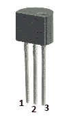
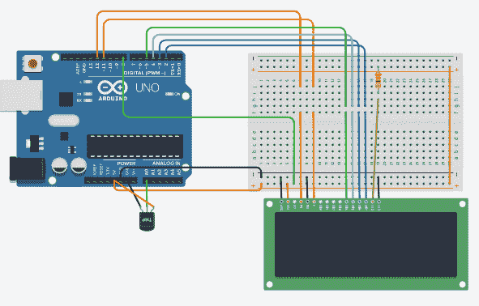
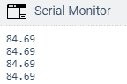

# Arduino 温度传感器

> 原文：<https://www.javatpoint.com/arduino-temperature-sensor>

Arduino 中的温度传感器将周围的温度转换为电压。它进一步将电压转换为摄氏度，摄氏度转换为华氏度，并在[液晶](https://www.javatpoint.com/lcd-full-form)屏幕上打印华氏温度。

我们将使用低电压的温度传感器(TMP 36)。这种传感器在处理大容性负载时也很稳定。它也适合汽车应用。

温度传感器 TMP 35、TMP 36 和 TMP 37 是具有相同特征的传感器。

TMP 36 传感器的工作电压范围为 2.7V 至 5.5V。

传感器如下图所示:



它有三个终端，如下所示:

*   **引脚 1: DC 电压**

这里，我们将 DC 电压引脚连接到 Arduino UNO 板上的 5V。

*   **引脚 2:模拟电压输出**

我们将模拟电压输出引脚视为输出。

*   **Pin 3: GND**

我们将在 [Arduino UNO 板上](https://www.javatpoint.com/arduino-uno)将 GND 引脚连接到地。

让我们开始这个项目。

### 所需硬件

项目所需的组件如下所示:

*   1 个 TMP 36 传感器(温度传感器)
*   1 个液晶显示屏
*   Arduino UNO R3 板(我们可以拿任何 Arduino 板)。
*   跳线

### 原则

我们将液晶显示器和 TMP 36 温度传感器与 [Arduino](https://www.javatpoint.com/arduino) UNO R3 板连接。传感器检测周围的温度，并将其转换为伏特、摄氏度和华氏温度，并在液晶显示屏上显示华氏温度。

我们需要打开网址: [Arduino 液晶显示器](arduino-lcd-display)了解液晶显示器的详细信息。

### 关系

下面列出了建立连接的步骤:

*   将液晶屏的 RS 引脚连接到 Arduino 板的引脚 13。
*   将液晶屏的使能引脚连接到 Arduino 板的引脚 12。
*   将液晶屏的 D4 引脚连接到 Arduino 板的引脚 6。
*   将液晶屏的 D5 引脚连接到 Arduino 板的引脚 4。
*   将液晶屏的 D6 引脚连接到 Arduino 板的引脚 3。
*   将液晶显示器的 D7 引脚连接到 Arduino 板的引脚 2。
*   将液晶屏的 Vo 引脚连接到 Arduino 板的引脚 8。
*   将传感器的中间端子连接到 A0(模拟引脚)。
*   将传感器的一端连接到 GND，另一端连接到 5V。
*   将电阻器的一端连接到液晶显示器的 A 和 K，另一端连接到 5V。

**草图**

考虑下面的代码:

```

#include <LiquidCrystal.h>
// initialize the library with the pins on the Arduino board
LiquidCrystal lcd(13, 12, 6, 4, 3, 2);
const int temperature = A0; //A0 is the analog pin
const int D = 8; // Vo of LCD is connected to pin 8 of the Arduino
void setup()
{
  lcd.begin(16, 2);
  Serial.begin(9600);
  pinMode(D, OUTPUT);
}
void loop() 
{
  digitalWrite(D,LOW);
  int Temp = analogRead(temperature);
  float volts = (Temp / 965.0) * 5;
  float celcius = (volts - 0.5) * 100;
  float fahrenheit = (celcius * 9 / 5 + 32);
  Serial.println(fahrenheit);
  lcd.setCursor(5, 0);
  lcd.print(fahrenheit);
  delay(2000);
  // time delay of 2000 microseconds or 2 seconds
}

```

我们将使用模拟器显示连接，因为连接变得更加清晰和精确。

我们可以使用硬件设备进行同样的连接。



**输出**

输出现在可以在液晶屏上看到。

为了更好地理解，让我们考虑串行监视器上的输出。



这是华氏温度。

* * *