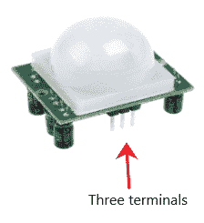
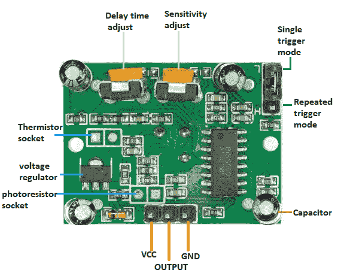
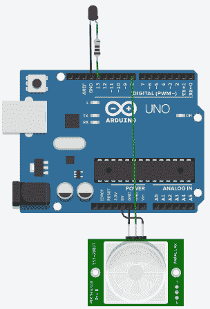

# Arduino 运动传感器

> 原文：<https://www.javatpoint.com/arduino-motion-sensor>

我们将在本项目中使用一个 *PIR 运动传感器*。所有物体(温度高于绝对零度)都从产生的热量中发出辐射。人眼无法探测到这些辐射。因此，诸如运动传感器等电子设备。用于探测这些辐射。

### 什么是 PIR 传感器？

被动红外传感器或 PIR 传感器检测检测红外辐射的物体(如人体)的运动或移动。因此，传感器的使用非常普遍。

使用 PIR 传感器的优势如下:

*   便宜的
*   可调模块
*   高效的
*   体积小
*   功耗更低
*   它既能探测光线，也能探测黑暗中的运动。

PIR 传感器如下所示:



PIR 传感器有三个端子，如下所示:

*   VCC
*   数字输出
*   GND(地面)

我们将传感器的 Vcc 端子连接到 [Arduino 板](https://www.javatpoint.com/arduino-boards)上的 5V。PIR 的传感器输出可以连接到 [Arduino](https://www.javatpoint.com/arduino) 板上的任何数字引脚。

PIR 传感器的应用包括自动化、安全系统等。这种传感器在检测一个人进入和离开某个区域时效果很好。

PIR 传感器的探测范围为 5m 至 12m。

### PIR 传感器的工作

红外传感器的工作完全基于探测红外辐射，这些辐射或者由物体发射，或者由物体反射。

红外辐射被传感器中心的晶体材料探测到。

想象一个人像墙一样从背景前面经过，等等。在传感器区域内，温度从室温变化到体温，反之亦然。到达红外辐射的变化被传感器转换成输出电压。它稍后检测人体或物体。

## 脉冲响应传感器的结构

一个圆形金属罐安装在中心，矩形晶体检测红外辐射。

一些传感器上有一个类似透镜的球，有助于提高视角。

传感器底部装有许多电路，如下图所示:



让我们从这个项目开始。

### 所需硬件

项目所需的组件如下所示:

*   1 个 PIR 运动传感器
*   Arduino UNO R3 板(我们可以拿任何 Arduino 板)。
*   跳线
*   1 个红色发光二极管(我们可以选择任何颜色的发光二极管)
*   1 x 220 欧姆电阻器

### 原则

每当检测到运动时，左侧传感器上跳线的移动将导致传感器状态的改变。这种情况被定义为单触发模式。

当传感器在每次检测到运动后重置计时器时，它被定义为重复触发模式。

传感器上的两个电位计称为**灵敏度**电位计和**时间**电位计。我们可以相应地调整两个参数(时间和灵敏度)。

为了在输出中正确校准，应在 PIR 传感器前至少限制 15 秒。15 秒后，传感器可以轻松检测到移动。

如果检测到任何移动，发光二极管将为高电平。如果没有这样的运动，输出将为低。

### 关系

下面列出了建立连接的步骤:

*   将 PIR 传感器的 Vcc 端子连接到 Arduino 板的 5V 引脚。
*   将 PIR 传感器的输出端连接到 Arduino 板的引脚 8。
*   将 PIR 传感器的 GND 端子连接到 Arduino 板的接地引脚。
*   用 220 欧姆电阻将发光二极管的正极引脚串联到 Arduino 板的引脚 13。
*   将发光二极管的负极连接到 Arduino 板的接地引脚。

### 素描

考虑下面的代码:

```

int LEDpin = 13;   // LED pin
int PIRpin = 8;    // The pin of Arduino connected to the PIR output
int PIRvalue = 0;  // It specifies the status of PIR sensor
void setup() {
 pinMode(LEDpin, OUTPUT);     
 pinMode(PIRpin, INPUT);
  // the output from the sensor is considered as input for Arduino
 Serial.begin(9600);
}
void loop()
{
 PIRvalue = digitalRead(PIRpin); 
 if (PIRvalue == HIGH) 
 {         
   digitalWrite(LEDpin, HIGH);  
   // turn ON LED if the motion is detected
   Serial.println("hello, I found you...heyyy..");
 } 
 else 
 {
   digitalWrite(LEDpin, LOW);
   // LED will turn OFF if we have no motion
   Serial.println("I cannot find you");
   delay(1000);
 }
} 

```

### 将代码上载到项目的步骤

步骤如下:

*   打开 Arduino IDE。
*   从工具->电路板-> Arduino UNO 中选择电路板类型。
*   从工具->端口->组件中选择端口..
*   将草图上传到连接图。

### 接线图

我们将使用模拟器显示连接，以便连接变得更加清晰和精确。

我们可以使用硬件设备进行同样的连接。



输出将基于检测结果。

* * *