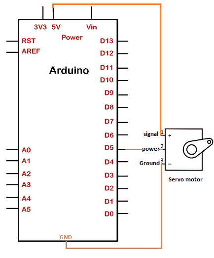
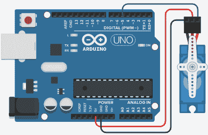

# Arduino 伺服电动机

> 原文：<https://www.javatpoint.com/arduino-servo-motor>

伺服电机的原理基于*脉宽调制*。这意味着施加到特定控制销的脉冲持续时间控制电机的旋转角度。

伺服电机的结构类似于 DC 电机。这意味着它有一个转子，定子和控制组件。它具有闭环反馈，用于控制扭矩和速度。

伺服电机的优点如下:

*   高效率
*   高输出功率
*   小尺寸
*   好动力
*   高精度
*   负载快速加速

伺服电机的应用有机械、自动化制造、机器人、无线电控制器飞机等。控制器被认为是伺服电机的重要组成部分。

伺服电机的运动由电信号决定，电信号可以是数字的，也可以是模拟的。

伺服库是允许 [Arduino](https://www.javatpoint.com/arduino) 与伺服电机一起工作的库。

### 什么是伺服库，为什么使用它？

伺服库允许控制集成轴和齿轮。我们还可以将轴定位在 0 到 180 度之间的不同角度。 [Arduino 板卡](https://www.javatpoint.com/arduino-boards)上的伺服库最多可以支持 12 个电机，而在 Arduino Mega 板卡上，最多可以支持 48 个电机。

这是因为伺服系统不会干扰 [Arduino Mega 板](https://www.javatpoint.com/arduino-mega)上的 PWM 引脚的功能。在其他 Arduino 板上，伺服库禁用脉宽调制引脚 9 和 10，即使伺服连接到这些引脚。

Mega 上电机的使用也受到限制。这意味着我们可以在 Arduino Mega 上使用 12 个电机。但是，在 Mega 板上使用 12 到 23 个电机可以禁用 11 号和 12 号引脚上的脉宽调制功能。

### 普通电机和伺服电机有什么区别？

普通电机和伺服电机的区别如下:

*   伺服电机的输出轴可以移动到特定的速度、位置和角度，而普通电机则不能。
*   伺服电机控制回路使用电机的反馈，帮助电机达到所需的速度和位置。

### 步进电机和伺服电机有什么区别？

步进电机和伺服电机的区别如下:

*   伺服电机需要控制回路反馈。控制回路用于监控当前距离和速度。正因为如此，它比步进电机更可靠。
*   伺服电机通常磁极数低，而步进电机磁极数高。
*   与步进电机相比，伺服电机的速度曲线更加灵活。
*   步进电机的速度和精度比伺服电机低。

## 项目

让我们从 Arduino 开始这个项目。

这里，伺服电机简单地连接到 Arduino。

### 所需硬件

项目所需的组件如下所示:

*   1 个微型伺服电机
*   Arduino UNO R3 板(我们可以拿任何 Arduino 板)。
*   跳线

**微型伺服电机:**它被定义为一个可以大约旋转 180 度的微型电机。它的工作原理类似于通常的伺服电机，但尺寸较小。

我们也可以使用任何伺服电机。连接和程序将是相同的。

### 原则

该项目允许我们将轴控制在 0 到 180 度之间的角度。我们也可以设定轴的不同转速。

伺服电机有三个端子:信号、电源和接地。信号端子通常通过导线连接到 Arduino 板的 5V 引脚。

地线、电源线和信号线由黑色、绿色和红色表示。

### 项目结构

连接或项目的结构如下所示:



### 关系

下面列出了建立连接的步骤:

*   将伺服电机的信号端子连接到 Arduino 板的 5V 引脚。
*   将伺服电机的电源端子连接到 Arduino 板的针脚 5。我们可以将电机的电源端连接到 Arduino 板上的任何数字 PWM 引脚。
*   将伺服电机的接地端子连接到 Arduino 板的 GND 引脚。

### 素描

考虑下面的代码:

```

#include <Servo.h>
int POSservo = 0;
Servo servo_5;
void setup()
{
  servo_5.attach(5); // power pin connected to pin 5 of Arduino board
// Here, the pin of the Arduino board connected to the servo should be a PWM pin 
}
void loop()
{
  // It will sweep the servo from 0 to 180 degrees
  for (POSservo = 0; POSservo <= 180; POSservo=POSservo+1) 
  {
    // tell servo to go to position in variable 'POSservo'
    servo_5.write(POSservo);
    // It will wait for the specified duration (20 milliseconds) to reach the position
    delay(20); // delay of 15 millisecond(s)
  }
  for (POSservo = 180; POSservo >= 0;POSservo= POSservo-1) 
  {
    // It will tell servo to go to position in the declared variable 'POSservo'
    servo_5.write(POSservo);
    delay(20);
    // we can modify the duration as per the requirements
  }
}

```

### 将代码上载到项目的步骤

步骤如下:

*   打开 Arduino IDE。
*   从工具->电路板-> Arduino UNO 中选择电路板类型。
*   从工具->端口->组件中选择端口..
*   将草图上传到连接图。

### 接线图

我们将使用模拟器显示连接，以便连接变得更加清晰和精确。

我们可以使用硬件设备进行同样的连接。



**输出**

轴将在每个方向旋转 90 度，即大约。180 度。

* * *