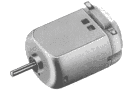
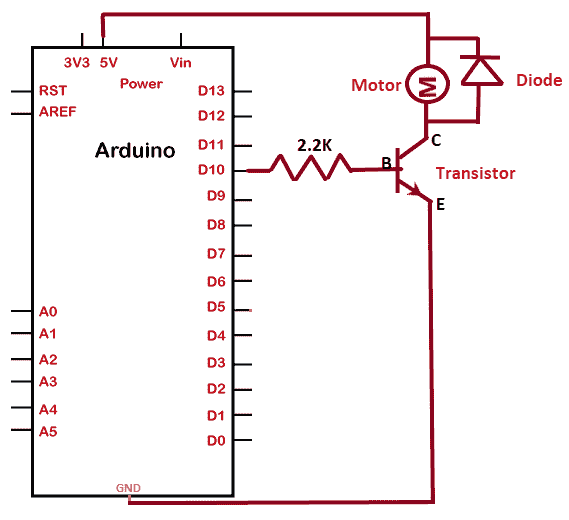
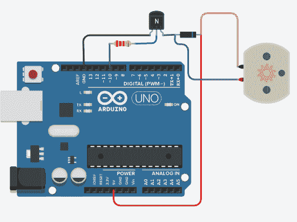
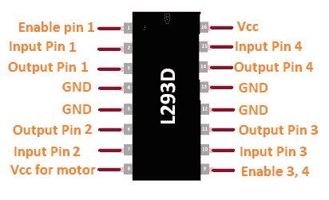
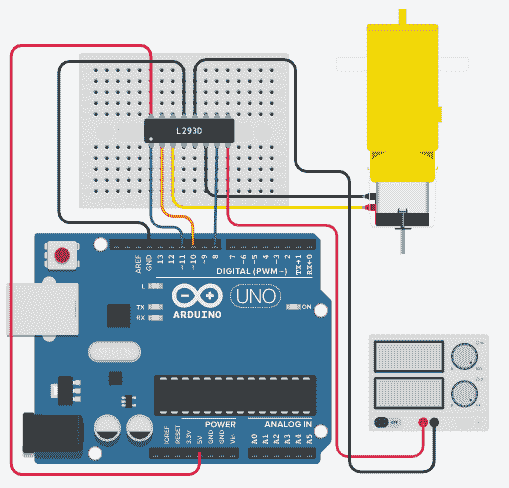

# Arduino 直流电动机

> 噻吩:t0]https://www . javatppoint . com/arduino-DC-motor

DC 马达被认为是最简单的马达，它有从家庭到工业的各种应用。例如汽车、电动车、电梯等中的**电动车窗。**

DC 电机的原理基于电磁感应。这意味着*电机的旋转取决于磁场*产生的力。它把电能转换成机械能。这种电动机可以由直流电供电。

让我们讨论一下 DC 汽车是如何工作的。

### DC 汽车的工作

DC 电机由**定子、转子、电枢和换向器**组成。换向器带有电刷。定子中有两个固定磁铁，负责产生磁场。

DC 电机中的电枢输送交流电。电能被电枢转换成扭矩形式的机械能。它进一步通过轴传递机械能。

换向器被定义为电气开关。它还可以反转外部电路和电机之间的电流方向。电刷充当外部电源和旋转线圈之间的中间体。

中心的铁芯被绝缘线包裹，当电流通过绝缘线时，绝缘线集中在磁场上。绝缘线的绕组绕着电机的铁芯有许多圈。

导线末端连接到换向器上。换向器进一步激励电枢线圈，并通过电刷连接电源和旋转线圈。

### DC 汽车的优势

使用 DC 电机的优势如下:

*   低成本
*   轻松控制电机速度
*   高可靠性
*   最低维护
*   高起动扭矩
*   快速启动
*   变速
*   无谐波

DC 汽车如下图所示:



让我们从这个项目开始。

我们将讨论 DC 汽车的两个项目。

## 项目 1:

在这里，我们将讨论使用二极管、晶体管和电阻将 DC 电机与 Arduino 电路板简单连接。

### 所需硬件

项目所需的组件如下:

*   烧了 R3 板
*   面包板
*   2.2K 欧姆的电阻器
*   晶体管
*   二极管
*   直流电动机
*   跳线

### 项目结构

项目结构如下所示:



### 素描

考虑下面的代码:

```

int PinOFmotor = 10; 
// PIN 10 of the Arduino is initialized to the variable
// the pin must be a PWM pin
void setup() 
{
 pinMode(PinOFmotor, OUTPUT);
}
void loop() 
{
 digitalWrite(PinOFmotor, HIGH);
 delay(1000); 
 digitalWrite(PinOFmotor, LOW);
 delay(1000);
}

```

### 将代码上传到电路板的步骤

步骤如下:

*   打开 Arduino IDE。
*   从工具->电路板-> Arduino UNO 中选择电路板类型。
*   从工具->端口->通讯中选择端口。
*   将以上草图上传至连接图。

### 关系

下面列出了建立连接的步骤:

*   将电阻的一端连接到 Arduino 板的引脚 10(脉宽调制)。
*   将电阻器的另一端连接到晶体管的中间引脚。
*   将晶体管的一端连接到 Arduino 的 GND 引脚，另一端连接到二极管。
*   将二极管面向带的端子连接到 Arduino 板的 5V 引脚。
*   将 DC 电机的一端连接到二极管的面向带端。
*   将 DC 电机的另一端连接到二极管的另一端。

### 接线图

我们将使用模拟器显示连接，以便连接变得更加清晰和精确。

我们可以使用硬件设备进行同样的连接。



连接后，电机将旋转。

## 项目 2:

这里，我们将讨论使用 L293D H 桥电机驱动器将 DC 齿轮电机与 [Arduino 板](https://www.javatpoint.com/arduino-boards)连接起来。

让我们讨论 DC 电机使用 L293D H 桥电机驱动器的必要性。

**L293** 定义为允许 DC 电机在任何方向驱动的电机驱动器 IC。它还可以同时控制两台 DC 电机。它是一个 16 针集成电路。

它接收来自 Arduino 板上的[微处理器](https://www.javatpoint.com/microprocessor-tutorial)的信号，并将该信号传输至电机。它有两个 VCC 或电压引脚，其中一个引脚为其工作汲取电流，另一个引脚用于向 DC 电机提供电压。

电机运行通常需要大电流。我们可以使用 [Arduino](https://www.javatpoint.com/arduino) 上的[微控制器](https://www.javatpoint.com/microcontroller)，但是高电流可能会损坏微控制器。为了克服这一点，使用了电机驱动器。

L293D 是用于驱动 DC 电机的最受欢迎的电机驱动器之一。它可以运行 DC 电机高达 1 安培电流负载。

L293D 驱动器上的四个输出也适合驱动 4 线步进电机。我们也可以使用 L293D 驱动器驱动伺服电机。

### L293D 引脚排列

L293D 的引脚排列如下所示:



### 所需硬件

项目所需的组件如下:

*   烧了 R3 板
*   面包板
*   DC 齿轮马达
*   可调 30V 电源
*   跳线
*   L293D H 桥电机驱动器

### 素描

考虑下面的代码:

```

#define MOTOR_1  11 
// PWM pin 11 
#define MOTOR_A     10
// PWM pin 10 
// we can also connect it to the other PWM pins of the Arduino
#define MOTOR_B     8
// digital I/O pin 

#define slow 64
#define normal 128
#define fast 255

int Speed; // initialization of speed variable

 // created functions
void Forward_Rev(void)
{
  analogWrite(MOTOR_1, Speed);
  digitalWrite(MOTOR_A, HIGH);
  digitalWrite(MOTOR_B, LOW);
}
void Backward_Rev(void)
{
  analogWrite(MOTOR_1, Speed);
  digitalWrite(MOTOR_A, LOW);
  digitalWrite(MOTOR_B, HIGH);
}

void Forward_ramp_up(void)
{
  digitalWrite(MOTOR_A, HIGH);
  digitalWrite(MOTOR_B, LOW);
  for (int i=0; i<255; i++) // loop started
    //value set from 0 to 255
  { 
    analogWrite(MOTOR_A, i); 
    delay(15); // delay time in milliseconds
  } 
} 
void Forward_ramp_down(void)
{ 
  digitalWrite(MOTOR_A, HIGH);
  digitalWrite(MOTOR_B, LOW); 

  for (int i=255; i>=0; i--) // loop set in reverse direction
   // value set from 255 to 0 (reverse)
  {
    analogWrite(MOTOR_A, i);
    delay(15);
  }
}
 // same statement but within different function
void Backward_ramp_up(void)
{
  digitalWrite(MOTOR_A, LOW);
  digitalWrite(MOTOR_B, HIGH);
  for (int i=0; i<255; i++) 
  { analogWrite(MOTOR_A, i); 
   delay(15); 
   // we can modify the delay time as per the requirements
  } 
} 
void Backward_ramp_down(void)
{ 
  digitalWrite(MOTOR_A, LOW);
  digitalWrite(MOTOR_B, HIGH); 

  for (int i=255; i>=0; i--) 
  {
    analogWrite(MOTOR_A, i);
    delay(15);
  }
}

void Brake(void)
{
  digitalWrite(MOTOR_A, HIGH);
  digitalWrite(MOTOR_B, HIGH);
}

void setup() 
{

  Serial.begin(9600); // bps rate of 9600
  Serial.println("DC motor test using L293D");

  pinMode(MOTOR_1, OUTPUT);
  pinMode(MOTOR_A, OUTPUT);
  pinMode(MOTOR_B, OUTPUT);
}

void loop() 
{

  Speed=slow; // Slow Speed
  // we can modify the value as fast, slow, and normal depending on the required speed
  //the motor will revolve according to the specified speed
  // for example, fast will cause it to move at fast speed
  // we can also add more parameters using #define

  Forward_Rev(); 
  delay(1000);
  Brake();
  delay(500);
  Backward_Rev(); 
  delay(1000);
  Brake();
  delay(500);
  Forward_ramp_up();
  Forward_ramp_down();
  Backward_ramp_up();
  Backward_ramp_down();
  // the statement inside the functions will run again and again
  // the motor will revolve in forward and backward direction
}

```

### 关系

下面列出了建立连接的步骤:

*   将电源的红色端子连接到 L293D 的 VCC。
*   将电源的黑色端子连接到 L293D 的 GND。
*   将电机的两端连接到 L293D 驱动器的输出引脚 1 和 2。
*   将 L293D 的输入引脚 2 连接到 Arduino 板的数字引脚 8。
*   将使能引脚 1 和输入 1 连接到 Arduino 板的脉宽调制引脚 10 和 11。
*   将 L293D 驱动器的 VCC 连接到 Arduino 板的 5V 引脚。
*   将 L293D 驱动程序的 GND 连接到 Arduino 板的 GND 引脚。

### 接线图

我们将使用模拟器显示连接，以便连接变得更加清晰和精确。

我们可以使用硬件设备进行同样的连接。



“慢速”速度模式将导致电机低速旋转。我们还可以将模式更改为快速或正常，如代码中所述。

我们也可以根据我们的要求在代码中添加更多的速度参数。

* * *