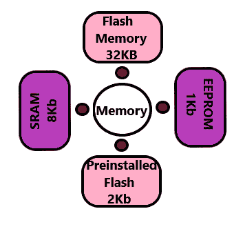

# 纳米 Arduino

> 原文：<https://www.javatpoint.com/arduino-nano>

**Arduino Nano** 是基于 **ATmega328P** 或 ATmega628 微控制器的小型 Arduino 板。连接与 [Arduino UNO 板](https://www.javatpoint.com/arduino-uno)相同。

Nano 板被定义为可持续、小型、一致和灵活的[微控制器](https://www.javatpoint.com/microcontroller)板。与 UNO 板相比，它的尺寸较小。Arduino Nano 是使用 Arduino (IDE)组织的，可以在各种平台上运行。这里，IDE 代表集成开发环境。

使用 Arduino Nano 板启动我们项目所需的设备有 [Arduino IDE](https://www.javatpoint.com/arduino-ide) 和 mini [USB](https://www.javatpoint.com/arduino-uno) 。Arduino IDE 软件必须安装在我们尊敬的笔记本电脑或台式机上。迷你 USB 将代码从电脑传输到 Arduino Nano 板上。

**缺点:**Nano 中没有 DC 电源插孔。因此，我们不能使用电池来提供任何外部电源。

[Arduino](https://www.javatpoint.com/arduino) Nano 如下图所示:

### 为什么用 Arduino Nano？

利用恒定电压，Arduino Nano 用于**产生精确频率的时钟。**

### Arduino UNO 和 Nano 板有什么区别？

*   与 Arduino UNO 相比，Arduino Nano 具有紧凑的尺寸和迷你 USB 电缆。我们可以用 Nano 代替 UNO，因为两者都在 ATmega328p 微控制器上运行。
*   Arduino UNO 也比 Nano 更容易获得。它被认为是市场上可用的标准板，对于初学者来说很容易使用。
*   Nano 在 PDIP 上市(塑料双列直插式封装)，而 Arduino UNO 在 TQFP 上市(塑料方形扁平封装)。
*   Arduino UNO 包括 **6 个模拟引脚输入、14 个数字引脚、一个 USB 连接器、一个电源插孔和一个 ICSP(在线串行编程)头**。Arduino Nano 包括一组由 14 个数字引脚和 8 个模拟引脚组成的输入/输出引脚。它还包括 6 个电源引脚和 2 个复位引脚。

### 记忆

Arduino Nano 中的内存如下图所示:

预装的闪存有一个引导加载器，占用 2Kb 的内存。

### 技术条件

Arduino 纳米板的技术规格为:

*   Nano 板的工作电压从 5V 到 12V 不等。
*   Nano 中的总引脚数为 22 个输入/输出引脚。
*   有 14 个数字引脚和 8 个模拟引脚。
*   14 个数字引脚中有 6 个脉宽调制引脚。Arduino Nano 中的 6 个脉宽调制引脚用于将数字信号转换为模拟信号。转换通过改变脉冲宽度来进行。
*   Arduino Nano 中的晶体振荡器频率为 16 兆赫。
*   Arduino Nano 用于各种应用，如**机器人、控制系统、仪器仪表、自动化和嵌入式系统。**
*   使用 Arduino Nano 创建的项目有**二维码扫描仪、DIY Arduino 计步器等。**
*   我们还可以将 Arduino Nano 连接到 Wifi。
*   Nano 的功能类似于 Arduino UNO。
*   Nano 的灵活性和生态友好性使其成为创建紧凑尺寸电子设备和项目的独特选择。

## Arduino Nano 如何入门？

我们可以使用 Arduino IDE 对 Arduino Nano 进行编程。

我们还可以使用 Arduino Web Editor，它允许我们上传草图，并将代码从我们的 Web 浏览器(谷歌 Chrome 推荐)写入任何 Arduino 板。它是一个在线平台。

Arduino Nano 的入门步骤如下:

1.  打开用 Arduino 软件写的代码或草图。
2.  选择端口和电路板类型。
    Arduino Nano 采用 ATmega328p 微控制器。因此，我们将选择处理器作为 ATmega328p。
    点击**【工具】**选择**处理器**，如下图:
    
3.  现在，**上传****运行**写好的代码或者草图。

要上传并运行，请单击 Arduino 显示屏顶部面板上的按钮，如下所示:

在编译和运行代码或草图后的几秒钟内，Arduino 板上的 RX 和 TX 指示灯将闪烁。

成功上传代码后，将出现“**上传完成**”消息。该消息将在状态栏中可见。

* * *