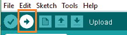

# 微型 Arduino

> 原文：<https://www.javatpoint.com/arduino-micro>

Arduino Micro(Arduino 板的一种)基于 **ATmega32U4** 微控制器。它带有内置的 USB 接口。当连接到计算机时，微型计算机还可以充当鼠标或键盘。它使用微型 USB 电缆。

我们需要使用微型 USB 电缆来建立微型板和计算机之间的连接，以开始编程。通用串行总线端口内置在 ATmega32U4 微控制器中，无需使用辅助处理器。

Arduino 微板如下所示:

### Arduino Micro 和 Arduino UNO 有什么区别？

*   Arduino Micro 由 20 组引脚组成。该组中的 7 个引脚是脉宽调制(脉宽调制)引脚，而 12 个引脚是模拟输入引脚。船上的其他部件有**复位按钮、16 兆赫晶体振荡器、ICSP 头和一个微型 USB 接口。**而 Arduino UNO 由 **6 个模拟引脚输入、14 个数字引脚、一个 USB 连接器、一个电源插孔和一个 ICSP(在线串行编程)头**组成。
*   Arduino Micro 比 Arduino UNO 耗电更少。
*   Arduino Micro 与 UNO 相比体积较小。
*   Arduino UNO 基于 **ATmeg328p** ，而 Arduino Micro 基于 **ATmega32U4** 微控制器。

### Arduino Micro 和 Arduino Pro Mini 的主要区别是什么？

*   Arduino Pro Mini 的振荡器频率为 **8MHz** ，而 Arduino Micro 的振荡器频率为 **16 MHz** 。
*   与 Arduino Micro 相比，Arduino Pro Mini 的尺寸较小。
*   Arduino Micro 基于 **ATmega32U4** 微控制器，而 Arduino Pro Mini 基于 **ATmega328P**

### Arduino Micro 和 Arduino Nano 有什么区别？

*   Arduino Micro 基于 ATmega32U4 微控制器，Arduino Nano 基于 ATmega328 微控制器。
*   Arduino Nano 有 2KB 的 SRAM，Micro 有 2.5KB 的 SRAM。这里，静态随机存取存储器代表静态随机存取存储器。

## 阿尔杜伊诺微技术规范

Arduino Micro 的技术规格如下:

*   它由 12 个模拟引脚组成。
*   这组数字引脚中的 7 个引脚是脉宽调制引脚。这些引脚用于将数字信号转换为模拟信号。当 Arduino 板上没有内置数模转换器(数模转换器)时，通常使用它。
*   微控制器在 ICSP(在线串行编程)头的帮助下接收具有高级功能的程序或固件。
*   推荐的输入电压在 7V 至 12V 之间。
*   Arduino Micro 的工作电压为 5V。
*   使用的微控制器是 ATmega32U4。它是一个低功耗微控制器。

## Arduino Micro 入门

我们可以使用 Arduino IDE 对 Arduino Micro 进行编程。

我们还可以使用 Arduino Web Editor，它允许我们上传草图，并将代码从我们的 Web 浏览器(谷歌 Chrome 推荐)写入任何 Arduino 板。它是一个在线平台。

Arduino Micro 的入门步骤如下:

*   安装 Arduino 微板的**驱动程序**。

当我们使用通用串行总线将主板插入计算机时，驱动程序将自动安装。但是在一些 Windows (Vista、10 和 7)中，我们需要使用选项**启动** - > **控制面板** - > **硬件** - > **手动安装驱动程序选择合适的板卡** - > **右键** - > **选择更新驱动程序**。

*   打开用 Arduino 软件写的代码或草图。
*   选择端口和电路板类型。
    。
    在这里，我们将选择 Arduino Micro。当主板成功连接到我们的计算机时，端口将可见。

例如，让我们使用选项**文件** - > **打开按钮示例** - > **数字** - > **按钮**。如下所示:

将打开按钮草图的示例。

所选板如下所示:

*   现在，**上传****运行**写好的代码或者草图。

要上传并运行，请单击 Arduino 显示屏顶部面板上的按钮，如下所示:

在编译和运行代码或草图后的几秒钟内，Arduino 板上的 RX 和 TX 指示灯将闪烁。

成功上传代码后，将出现“**上传完成**”消息。该消息将在状态栏中可见。

* * *