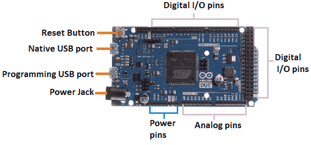
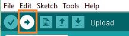

# arduino 号

> 原文：<https://www.javatpoint.com/arduino-due>

Arduino Due 基于 32 位 ARM 内核。这是第一块基于 ARM 微控制器开发的 Arduino 板。它有两个端口，分别命名为本机 USB 端口和编程端口。

它由 54 个数字输入/输出引脚和 12 个模拟引脚组成。主板上的[微控制器](https://www.javatpoint.com/microcontroller)是 Atmel SAM3X8E ARM Cortex-M3[CPU](https://www.javatpoint.com/cpu-full-form)。Arduino Due 也是使用 [Arduino (IDE)](https://www.javatpoint.com/arduino-ide) 组织的，可以在各种平台上运行。这里，IDE 代表集成开发环境。

Arduino 到期板如下所示:

**串口:**原生 USB 端口和编程 USB 端口是 Arduino Due 板上的两个端口。

**原生 USB 端口:**原生端口直接连接到 SAM3X MCU。它使用串行 [USB](https://www.javatpoint.com/usb-full-form) 对象来支持 CDC(通信设备类)串行通信。

**编程 USB 端口:**编程端口连接到高性能 8 位微控制器(ATMEL 16U2)，该微控制器也充当 USB 到串行转换器。

**复位按钮:**用于给连接增加一个复位按钮。要重置微控制器，我们需要按住重置按钮。

**电源插座:**可以将适配器插入电源插座，将其连接到 [Arduino](https://www.javatpoint.com/arduino) 主板。

**模拟引脚:**编号为 **Ao、A1、A2、A3、A4、A5、A6、A7、A8、A9、A10、**和 **A11** 的引脚为模拟引脚。模拟引脚的功能是读取连接中使用的模拟传感器。这些引脚也可以充当 GPIO(通用输入输出)引脚。

**数字输入输出引脚:**共有 54 个数字输入输出引脚。数字引脚的值为高或低。

### Arduino Due 和 Arduino UNO 有什么区别？

Arduino Due 与 [Arduino UNO](https://www.javatpoint.com/arduino-uno) 的区别如下:

*   Arduino Due 由 54 个数字输入/输出引脚和 12 个模拟引脚组成，而 Arduino UNO 由 6 个模拟引脚输入和 14 个数字引脚组成。
*   Arduino Due 基于 ARM 微控制器，而 Arduino UNO 基于 ATmega328 微控制器。
*   Arduino Due 使用 3.3V 的系统电压，而 Arduino UNO 使用 5V 的系统电压。

### Arduino Due 和 Arduino Mega 有什么区别？

Arduino Due 与 [Arduino Mega](https://www.javatpoint.com/arduino-mega) 的区别如下:

*   Arduino Due 比 Arduino Mega 有更多的内存和更好的处理能力。
*   Arduino Due 基于 ARM 微控制器，而 Arduino Mega 基于 ATmega2560 微控制器。
*   与 Arduino Due 相比，该库和屏蔽更兼容 ATmega2560 微控制器。
*   Arduino Due 由 54 个数字输入/输出引脚和 12 个模拟引脚组成，而 Arduino Mega 由 14 个模拟引脚输入和 54 个数字引脚组成。

### 阿尔杜伊诺到期的技术规格

Arduino Due 的技术规格如下:

*   ARM 微控制器是 32 位的。
*   这组数字引脚中的 12 个引脚是脉宽调制引脚。
*   Arduino Due 的工作电压为 3.3V
*   它由两个串行端口组成。
*   有 4 个通用异步收发器串行模块。
*   这组引脚中的 12 个引脚是从 A0 到 A11 标记的模拟引脚。
*   Arduino Due 的输入电压从 7V 到 12V 不等。
*   它由 512 千字节闪存和 96 千字节静态随机存取存储器组成。
*   静态随机存取存储器由两个存储体组成，分别为 32KB 和 64KB。
*   时钟的中央处理器频率为 84 兆赫。

### 开始阿尔杜伊诺到期

我们可以使用 Arduino IDE 对 Arduino Due 进行编程。Arduino IDE 是一个集成开发程序，对所有的板都是通用的。

我们还可以使用 Arduino Web Editor，它允许我们上传草图，并将代码从我们的 Web 浏览器(谷歌 Chrome 推荐)写入任何 [Arduino Board](https://www.javatpoint.com/arduino-boards) 。它是一个在线平台。

Arduino Due 的入门步骤如下:

*   安装板的**驱动器**。

我们不需要在 OSX 安装驱动程序。但是我们可能会得到一个对话框来打开电脑上的“网络首选项”。点击**网络首选项** - >点击**应用**->T4】退出系统首选项。

到期将工作，但显示“**未配置**”

但是，对于 Windows **XP** 和 Windows **7** ，请遵循以下步骤:

1.  下载 **Arduino 软件** - >解压文件- >仅通过编程端口使用 **USB** 将主板连接到我们的电脑- >驱动程序安装将启动。
2.  点击**启动** - > **控制面板** - > **系统和安全**。
3.  点击**系统** - > **设备管理器** - > **端口(COM & LPT)** - >打开端口” **Arduino 到期程序。港口。”**
4.  右键单击“ **Arduino 到期程序。端口“** - > **更新驱动软件** - > **在我的电脑上浏览驱动软件。**
5.  导航到 Arduino 下载的文件夹。
6.  在主 Arduino 文件夹中，选择并定位“**驱动程序**。”
7.  继续，点击**确定** - > **下一步**。
8.  点击按钮“**继续**”
9.  安装完成。我们现在可以在设备管理器中看到我们的端口。

**Linux :** 对于 [Linux](https://www.javatpoint.com/linux-tutorial) ，我们不需要安装任何驱动程序。

*   选择板和端口的类型。

我们应该使用与电源插座相邻的编程端口来上传草图。

我们需要遵循一些步骤通过编程端口上传草图，如下所示:

1.  将通用串行总线电缆插入编程端口。
2.  点击**工具** - >选择**串口**。
3.  点击“**工具”** - >点击**板- >** 选择 **Arduino Due(编程端口)**如下图:

*   打开**文件- >示例**中的任意草图。我们也可以自己创作草图。
*   现在，**上传****运行**写好的代码或者草图。

要上传并运行，请单击 Arduino 显示屏顶部面板上的按钮，如下所示:

在编译和运行代码或草图后的几秒钟内，Arduino 板上的 RX 和 TX 指示灯将闪烁。

一旦成功上传代码，将出现“**上传完成**”消息。该消息将显示在状态栏中。

* * *