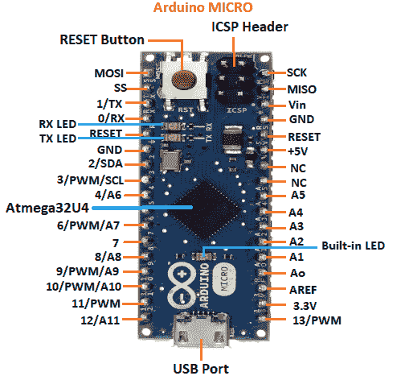
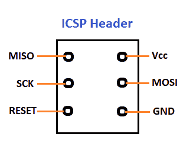

# arduino micro pinout 公司

> 噻:[https://www . javatppoint . com/arduino-micro pinot](https://www.javatpoint.com/arduino-micro-pinout)

Arduino Micro 基于内置 USB 的 **ATmega32U4** 微控制器。当连接到计算机时，微型计算机也可以显示为鼠标或键盘。它使用微型 USB B 线。

Arduino Micro 的引脚排列如下所示:

让我们详细讨论每个引脚。

*   **Atmega32U4 微控制器**

它是一款低功耗 8 位微控制器，配有 2.5KB 静态随机存取存储器、32KB 闪存和 1KB EEPROM。工作电压介于 2.7 和 5.5V 之间。它是一个 12 通道 10 位模数转换器。微控制器使用 16Mhz 时钟振荡器来实现 16 MIPS(每秒百万条指令)的吞吐量。

*   **SS**

代表**从机选择**。它是从机选择线，由主机使用。它充当使能线。

*   **GND -** 接地引脚

接地引脚用于将我们的电路接地。

*   **SDA**

编号为 2 的引脚是 SDA 引脚。是数据线。我们需要在连接 SDA 引脚时使用上拉电阻。

*   aref

模拟参考(AREF)引脚用于从外部电源向 Arduino Micro 板提供参考电压。

*   SCL

编号为 3 的引脚是 SCL 引脚。这是时钟线。连接 SCL 引脚时，我们需要使用上拉电阻。

*   **MISO**

它代表主输入/从输出。MISO 中的从线用于向主机发送数据。

*   **MOSI**

它代表主输出/从输入。MOSI 的从线用于向其外围设备发送数据。

*   **SCK**

SCK 代表**串行时钟**。在从机中，它作为时钟发生器的输入。在 master 中，它充当输出时钟。主机生成的数据由 SCK 同步。

*   **脉宽调制引脚**

脉宽调制引脚用于将数字信号转换为模拟信号。当 Arduino 板上没有内置数模转换器(数模转换器)时，通常使用它。

编号为 3、6、9、10、11 和 13 的引脚是脉宽调制引脚。

*   USB 端口

它允许电路板连接到计算机。这对 Arduino 微板的编程至关重要。

*   **ICSP 表头**

微控制器在 ICSP(在线串行编程)头的帮助下接收具有高级功能的程序或固件。

ICSP 集管由 6 个引脚组成。

ICSP 报头的结构如下所示:

这是 ICSP 头球的俯视图。

*   **模拟引脚**

模拟引脚的功能是读取连接中使用的模拟传感器。它还可以充当 GPIO(通用输入输出)引脚。

有 12 个模拟引脚标记为 A0、A1、A2、A3、A4、A5、A6、A7、A8、A9、A10、A11。

*   **数字引脚**

编号为 4、6、8、9、10 和 12 的引脚是数字输入/输出引脚。数字引脚的值为高或低。

*   重置

它用于向连接添加重置按钮。要重置微控制器，我们需要按住重置按钮。

*   **TX 和 RX**

发射和接收发光二极管的点亮代表了数据的成功流动。串行 1(发送)和串行 0(接收)用于使用 Arduino ATmega32U4 硬件的串行功能发送和接收 TTL 串行数据。

*   酒

输入电压(Vin)作为输入电压从外部电源施加到 Arduino 板上。我们还可以通过此引脚获取电源插孔电压。

*   **Vcc**

Vcc 是提供给机载 ATmega32U4 的电压。这也取决于所用电路板的版本。

* * *