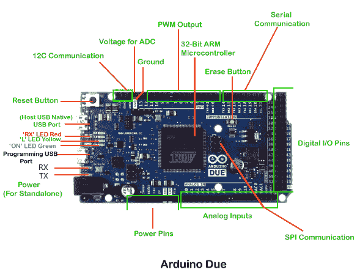

# Arduino 两个皮诺曹

> 噻:[https://www . javatppoint . com/arduino-dos-pinot](https://www.javatpoint.com/arduino-due-pinout)

Arduino Due 基于 32 位 ARM 内核。这是第一块基于 ARM 微控制器开发的 Arduino 板。它有两个端口，分别命名为**原生 USB 端口**和**编程端口。**

Arduino Due 的引脚排列如下所示:

让我们详细讨论一下:

**接收和发送**

发射和接收发光二极管的点亮代表了数据的成功流动。**电源引脚**

电源引脚由 GND(地)、5V、3V3、Vin 和 IOREF 引脚组成。

**GND:** 这些是接地引脚，用于将我们的电路接地。

**5V:**5V 引脚作为 5V 的输出调节电压工作。 [Arduino Due 板](https://www.javatpoint.com/arduino-due)5V 的电源是 USB 接口、DC 电源插孔、Vin。可以从上述任一电源向电路板供电。

**3V3:**3V3 引脚作为 3.3V 的输出调节电压工作，可以为 SAM3X 微控制器供电。

**Vin:** 定义为输入电压，当使用外部电源时，施加到 [Arduino 板](https://www.javatpoint.com/arduino-boards)上。

**IOREF:** 代表**输入输出电压参考**。它允许屏蔽检查电路板的工作电压(3.3V 或 5V)。防护罩连接到 [Arduino](https://www.javatpoint.com/arduino) 板上。

微控制器以 IOREF 提供的参考电压工作。

**模拟引脚**

编号为**A0、A1、A2、A3、A4、A5、A6、A7、A8、A9、A10、**和 **A11** 的引脚为模拟引脚。模拟引脚的功能是读取连接中使用的模拟传感器。它还可以充当 GPIO(通用输入输出)引脚。

**数字引脚**

有 54 个数字输入/输出引脚。数字引脚的值为高或低。标记为 0 到 53 的引脚是数字引脚。

**SPI 通信**

SPI 代表**串行外设接口**，被认为是串行通信的系统。它使用导线进行数据接收、数据发送、同步和设备选择(用于通信)。

它可以在短距离内快速通信。它也用于两个微控制器之间的通信。

**I2C 通信**

I2C(内部集成电路)是一种串行通信协议，使用 SCL(串行时钟)和 SDA(串行数据)在两个设备之间接收和发送数据。

**模数转换器的电压**

模数转换器用于将电压值映射为整数值。从 0 到 5 的电压被映射成从 0 到 1023 的整数值。Arduino Due 中的 ADC 是一个 10 位的 6 通道转换器。

**擦除按钮**

板载擦除按钮允许擦除 SAM3X 的闪存。要擦除，我们需要打开主板的电源，按住擦除按钮几秒钟。

它将移除或擦除加载在微控制器中的当前草图。

**复位按钮**

它用于向连接添加重置按钮。要复位[微控制器](https://www.javatpoint.com/microcontroller)，我们需要按住复位按钮。

USB 端口

它允许电路板连接到计算机。这对 Arduino Due 板的编程至关重要。

我们通常将 USB 电缆插入编程端口，将草图加载到板上。

**编程 USB 端口**

编程端口连接到高性能 8 位微控制器(ATMEL 16U2)，它也充当通用串行总线到串行转换器。

**原生 USB 端口**

本机端口直接连接到 SAM3X 微控制器。它使用串行 USB 对象来支持 CDC(通信设备类)串行通信。

**电源插座**

适配器可以插入电源插孔，将其连接到 Arduino Due 板。

**32 位 ARM 控制器**

32 位 ARM 控制器的使用使该板适用于大型项目。交流到 DC 适配器安装在它上面，它充当电路板的电源。它只与工作在 3.3V 电压下的屏蔽一致。它基于 Atmel SAM3X8E ARM Cortex-M3[CPU](https://www.javatpoint.com/cpu-full-form)。

**脉宽调制输出**

脉宽调制引脚用于将数字信号转换为模拟信号。标记为 2 至 13 的引脚可用作脉宽调制输出引脚。

**串行通信**

串行端口也称为 UART 端口。它使用 USB 端口与计算机通信。它还用于在称为发射和接收的发射发光二极管上进行通信。

* * *