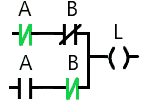
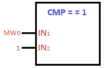
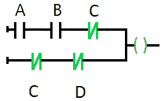

# PLC 教程

> 原文：<https://www.javatpoint.com/plc>


PLC 是自动化工业的计算机控制系统。它是一台没有键盘、硬盘等的专用电脑。PLC 是电气行业要求很高的技能之一。大多数组织都要求候选人具备 PLC 知识。在这里，我们将讨论**自动化、应用、类型、编程、流程、架构**等。

在本教程中，我们将涵盖以下主题:

*   [什么是 PLC](#Whatis)
*   [为什么是 PLC](#Why)
*   [可编程控制器的类型](#Types)
*   [可编程控制器如何工作](#Works)
*   [可编程控制器的架构](#Architecture)
*   [SMPS 如何转换电压？](#SMPSconverts)
*   [编程装置](#Programmingdevice)
*   [PLC 循环](#Cycle)
*   [什么是安全 PLC？](#safety)
*   [什么是自动化？](#Automation)
*   [自动化类型](#AutomationTypes)
*   [可编程控制器的应用](#Applications)
*   [选择 PLC 的标准](#Criteria)
*   [西门子 PLC](#Siemens)
*   [PLC 协议](#Protocols)
*   [可编程控制器制造商](#Manufacturers)
*   [可编程控制器编程](#Programming)
*   [编程中使用的符号](#Symbols)
*   [PLC 中的内存映射](#MemoryMapping)
*   [记忆区](#MemoryAreas)
*   [编程中使用的其他组件](#OtherComponents)
*   [计数器](#Counters)
*   [比较器](#Comparators)
*   [示例](#Examples)
*   [自动化工具](#AutomationTools)
*   [PLC 对监控和数据采集系统](#PLCvsSCADA)

* * *

## 什么是 PLC？

PLC 是一种数字计算机控制系统，适用于控制机器人设备和其他制造过程。它涉及对**微控制器、数字电路和设计技能**的基础研究。

它提供简单、灵活、高可靠性的可编程控制器，适用于简单和恶劣的环境。它**监控输入设备的状态，做出决策，并控制输出设备。**应用包括机器人、充水箱等。

PLC 的范围从输入/输出很少的小设备到输入/输出数千的大设备。

因此，PLC 是关于:


* * *

## 为什么是 PLC？

PLC 最初是在美国创建的，用于替代继电器系统。

继电器的缺点使其不适合汽车工业，列举如下:

*   使用继电器逻辑的机器操作非常具有挑战性和耗时。机器逻辑的改变使过程变得复杂。
*   与计算机组件相比，继电器故障也很快。
*   它需要更多的运行停机时间。
*   继电器也消耗大量的电力，更多的空间和热量。

因此，为了克服这些缺点，PLC 被创造出来。

PLC 模型外观简单。PLC 的基本组成部分是**输入/输出(I/O)模块、协处理器模块、CPU、**和**外围设备**。[中央处理器](https://www.javatpoint.com/central-processing-unit)(控制处理单元)与输入/输出通信。输入/输出模块可能在靠近或远离[中央处理器](https://www.javatpoint.com/cpu-full-form)的地方。因此，PLC 并不限于一栋建筑。它包括编程中的计算，用于计算不同的参数，如 SPC ( **统计过程控制**)。

但是对于它的操作，我们需要对 PLC 进行编程。大多数 PLC 使用台式机/笔记本电脑上的应用程序进行控制。这些应用程序使用通信介质(如以太网或专有通信总线)与 PLC 通信。通信介质的选择取决于制造商。大多数制造商也依赖于 [USB](https://www.javatpoint.com/usb-full-form) 。

每个程序员做同一件事的技术不同，具体的逻辑也不同。

* * *

## 可编程控制器的类型

PLC 有三种类型，如下所示:


### 模块化 PLC

在模块化可编程控制器中，模块化意味着添加模块。它允许我们扩展 PLC 的结构。当有大量输入和输出时，它很有用。我们可以通过增加 PLC 中的模块来增加更多的输入和输出。

它还有更多的内存和存储信息的能力。

该示例包括制造业中的控制加工生产线。

让我们来看看模块化可编程控制器。


### 机架可编程控制器

机架式可编程控制器中的模块按行排列。架子放在柜子里。机架 PLC 中的插槽通过标准网络或总线相互通信。

让我们来看看机架式可编程控制器。


### 紧凑型 PLC

紧凑型 PLC 中的输入/输出模块由该 PLC 的制造商决定。这意味着输入输出是固定的。但是，紧凑型 PLC 用于小规模应用。

我们来看看紧凑型 PLC。


* * *

## PLC 是如何工作的

简单来说，PLC 从输入设备获取输入，根据 CPU 中的逻辑进行处理，并根据该逻辑控制输出设备。

PLC 重量轻，无需任何电气过滤或空调即可运行。

让我们详细讨论一下。

按钮、传感器等设备作为输入设备连接，可以检测 PLC 中输入信号的变化。输入信号通过将电压转换为低电压(如 5V)的屏障。中央处理器监控输入的状态。基于指定的逻辑，中央处理器处理并产生输出信号。输出端的屏障防止 PLC 受到外部噪声的影响，并将低电压转换为高电压以驱动输出设备。输出信号控制输出设备，如电机、控制器、指示灯等。

* * *

## 可编程控制器的体系结构

PLC 硬件设置或架构包含用于执行控制功能的硬件和软件。

让我们来看看 PLC 的体系结构。


PLC 的组件如下:

### 附言（同 postscript）；警官（police sergeant）

PS 代表**电源**。电源充当 PLC 系统的电源。它将高电压转换成低电压或 DC 电压，如 120 伏交流电转换成 24 伏 DC 电压。

线性电源没有其他电源模式复杂。

### 开关式电源(switched - mode power supply)

代表**开关模式电源**。 [SMPS](https://www.javatpoint.com/smps-full-form) 是电源转换和高频电源转换装置。它将电压电平转换为特定要求的电压。SMPS 使用固态开关将交流电源转换为平滑的 DC 电源。

SMPS 通常用于从交流电到 DC 的高功率转换。它也比 PS 效率高。

我们来讨论一下 PS 和 SMPS 的一些区别。考虑下表。

| 种类 | 电源 | SMPS(开关模式电源) |
| **重量** | 庞大的 | 重量轻 |
| **效率** | 效率低，在 20 %到 25%之间 | 60 %到 65%之间的高效率 |
| **复杂性** | 不太复杂 | 更复杂 |
| **回应** | 更快的响应 | 反应较慢 |
| **用途** | 射频应用 | 移动充电器、DC 电机等。 |

**SMPS 如何转换电压？**

让我们考虑 224 伏的交流电压。该过程将把 224 伏交流电转换成 24 伏 DC。

考虑下面给出的框图:


它清楚地解释了将高电压转换为低 DC 电压的过程。

### 中央处理器

中央处理器或**中央处理器**位于 PLC 的中央机架中。数据总线用作在 PLC 中不同元件之间发送数据的介质。它控制所有功能，例如存储在 PLC 存储器中的编程指令。它还控制 PLC 中的逻辑、通信和监控。PLC 的单元包含一个[微控制器](https://www.javatpoint.com/microcontroller)或[微处理器](https://www.javatpoint.com/microprocessor-tutorial)。

当在运行模式下运行时，中央处理器执行程序。

### 即时信息

IM 或**接口模块**被定义为一个精确的、位置感应的和绝对的设备。它通常与传感器一起使用，以降低恶劣环境中的噪声。

### 程序设计装置

我们需要在处理器的内存中指定所需的程序。该程序最初是在编程设备中开发的。之后，程序被传送到 PLC 的存储单元。

### 大脑性麻痹

CP 代表**沟通过程**。PLC 中的通信过程包括一个**接线系统**和一个**共享协议**。布线系统用于连接 PLC 中的不同组件，而共享协议允许任何设备理解通信过程中的位和字节。

### 微型断路器

[MCB](https://www.javatpoint.com/mcb-full-form) 或**微型断路器**作为 PLC 的安全装置。如果出现过载或故障情况，它会自动关闭电路。MCB 常用于代替低压电网的熔断器 I。

### 输入模块

PLC 的输入模块检测输入设备的状态，如传感器、开关、按钮等。

### 输出模块

PLC 的输出模块控制输出设备，如电机、继电器、灯等。

### 行李架

机架通常作为 PLC 的保持装置。这意味着它把一切都联系在一起。我们可以在 PLC 中添加机架来容纳更多模块。机架也有不同的尺寸。

### 存储单元

存储单元是在 PLC 中存储程序、数据和信息的单元。

PLC 有两种类型的存储单元，如下所示:

**数据存储器:**数据存储器由来自 PLC 输入/输出模块的存储数据组成。

**程序存储器:**程序存储器由 PLC 中的逻辑程序或梯形图逻辑程序组成。

* * *

## PLC 循环

PLC 系统通常很昂贵。不正确的 PLC 编程或设计会导致生产率的损失。为了节省设计 PLC 控制应用的时间，建议使用像 PLCLogix 这样的仿真软件。这种软件节省了时间，也提高了与 PLC 设备相关的安全性。

PLC 循环如下所示:


**了解你的过程:**我们应该知道我们正在开始的过程。

**电路设计:**设计是任何项目的第一部分。没有设计就无法创建项目或模型。

**使用的设备:**了解项目中使用的设备至关重要。

**编程:**是必不可少的部分。创建的模型是为实现而编程的。

**测试或模拟:**在最后阶段，对模型进行测试。测试和模拟花费了大量时间。

以上步骤是了解可编程控制器操作所必需的。

### 可编程控制器的扫描周期

PLC 连续扫描过程，因为输入是随机的(可以随时改变)。扫描周期分为三个部分，分别为**输入扫描、**输出扫描和**程序执行**。

**扫描时间:**定义为一个周期通过程序所花费的时间。一个周期的持续时间最小，即 1/1000 秒。它可能因程序而异。

扫描时间越短，PLC 就越好，越贵。

扫描周期如下所示:


**输入扫描:**PLC 根据指定的输入求解逻辑。输入的开/关状态提前保存在数据表中，避免输入突然变化。这也使过程更快。

**程序执行:**控制逻辑保存梯形逻辑程序的内存副本。它一次只使用该副本执行一条指令。

**输出扫描:**扫描过程完成后更新输出。程序的值是临时的。基于这些值，更新输出。之后，它会自我检查是否有任何故障，并重新启动进程。

* * *

## 什么是安全 PLC？

安全 PLC 类似于普通 PLC，具有一些额外的安全功能，如冗余。安全 PLC 还可以执行额外的现场设备检查，如窥探。

PLC 是与电气工程相关的自动化系统的一部分。安全可编程控制器是任何自动化工业过程的重要组成部分之一。**传感器、PLC(逻辑解算器)**和**控制系统**被认为是安全仪表系统的三个部分。安全信息系统被称为安全关闭系统。

安全信息系统监控过程，并在出现任何不安全或风险情况时做出关闭反应。安全 PLC 的作用是防止项目/工厂出现故障，从而保护环境免受恶劣风险的影响。在任何危险的情况下，安全的地方将把工厂置于安全的状态。

* * *

## 什么是自动化？

自动化被定义为将人的努力减少到最低限度的过程、系统和程序。它是一种机械装置，无需连续输入即可自动操作和运行。这些设备是电子制造的。

像机器学习和人工智能等其他技术一样，自动化的范围正在扩大。例如**飞机、锅炉、热处理炉、自动化机械**等。

让我们讨论自动化的一些特性。

*   自动化不仅减少了人力，而且还利用机器来完成重复性任务。
*   工业自动化提高了生产率、安全性、资源利用率、生产率和产量。
*   它增加了一致性。
*   节省时间的程序。
*   更好的可靠性
*   降低运营成本。
*   更多的安全和工作保障。
*   PLC 已经取代了定序器和定时器。
*   输入输出扫描

自动化分为工业自动化和非工业自动化。


### 自动化的类型

让我们快速了解一下自动化的类型。

自动化有四种类型，如下所示:

*   固定自动化
*   灵活自动化
*   可编程自动化
*   综合自动化

**固定自动化**

固定自动化有一个开放的和基于逻辑的编程系统。但是，它具有高生产率和高初始投资。

**柔性自动化**

灵活的自动化在处理有设计变化的产品时非常灵活。

**可编程自动化**

这是一个以人为基础的系统。在这里，新的程序被准备好，并进入新的设备来创造新产品。

**综合自动化**

它是以上三种自动化(固定、灵活和可编程)的结合。它是一个工业控制系统，扩展了工程领域的技术服务。

* * *

## 可编程控制器的应用

我们通常使用台式机或笔记本电脑进行编程。

PLC 的一些应用如下:

*   控制电梯
*   控制交通信号
*   洗衣机
*   游乐设施
*   机械控制
*   装瓶系统
*   水箱液位控制

### 选择 PLC 的标准

选择最佳的可编程控制器至关重要。

让我们讨论选择 PLC 的标准。我们应该根据以下参数选择任何 PLC:

### 系统需求

所需的 PLC 应该与我们的计算机或笔记本电脑的系统要求兼容。

我们应该经常检查 PLC 型号。

### 扫描时间

这也是选择任何 PLC 必不可少的一部分。PLC 将更少的扫描时间视为最好的 PLC，但成本很高。扫描时间的变化取决于 PLC 的输入数量。

### 沟通

通信意味着与其他设备共享信息。硬件电缆可以是双绞线电缆、无线电调制解调器等。

### 操作速度

它定义了 PLC 控制系统的运行速度。

### 应用要求

它决定了 PLC 系统的输入和输出要求。

### 电气要求

电气要求包括输入电压、控制系统功率、输出电流和输出电压等参数。

### I/o

应根据所需的项目需求选择输入/输出模块。如果我们想控制步进电机，我们可以选择机架式可编程控制器。

### 记忆

我们首先需要检查所需的内存量和大小。可编程控制器的内存与输入/输出的数量、控制程序的安装等有关。

### 软件需求

软件要求包括兼容的中央处理器、通信和输入输出端口、通用串行总线端口、以太网端口、用户指定端口等。

### 身体条件

我们应该始终考虑 PLC 控制系统的位置。在恶劣的环境中，我们应该将可编程控制器控制系统置于 IP 等级的封闭中。在选择任何 PLC 之前，还应记住其他参数，如维护、可访问性和故障排除。

* * *

## 西门子可编程控制器

如上所述，西门子 PLC 是所有行业中最常见的 PLC。


西门子 PLC 分为三代，如下所示:

1 <sup>st</sup> 代- **微**

2 <sup>第二代</sup>-**迷你**

3 <sup>第三代</sup>-**纳米**或**机架 PLC**

西门子 PLC 系列如下:

*   S7200
*   S7300
*   S7400
*   S7400H
*   S7400F
*   S71200
*   S71500

S7400F PLC 还具有容错功能。我们可以根据需要选择产品。S7200 是目前市面上最便宜的西门子 PLC。用 S7-200 可编程控制器很容易开始编程。

### 模拟步骤 7

Simatic step 7 是功能强大的自动化软件工具，其中包括西门子 PLC 的编程环境。Simatic Step 7 工程软件可用于编程和配置人机界面基本面板。

STEP 7 软件中支持的编程语言有阶梯编程、功能框图和结构化文本编程语言。

如今，自动化的智能选择是 **SIMATIC S7-1200** 控制器。

让我们了解 S7-1200 控制器的优势，如下所示:

*   这些 PLC 有故障保护和标准版本。
*   它具有扩展的通信功能和改进的数据传输。
*   它允许传输敏感的机器数据。
*   它支持预测性维护。
*   它还支持与其他控制器的数据传输。
*   它支持数据存储。

* * *

## PLC 协议

PLC 使用协议进行通信。与 PLC 相关的协议如下:

**1。PPI**

**PPI** 或**点对点接口**协议是专门为 S7-200 可编程控制器设计的通信协议。但是，不是西门子直接开的。

**2。MPI**

**MPI** 或**多点接口**协议是西门子公司的接口。MPI 用于连接设备，如个人计算机等。MPI 的速度范围从 187.5 kBd(千波特)到 12 兆波特。

**3。Profibus**

**过程现场总线**或**现场总线**使用多点单电缆，用于连接设备。它经常与 Profinet 混淆。很容易发现单根电缆的故障。Profibus 电缆的安装成本也很低。

4 . ProFi net

西门子也像 Profibus 一样使用**过程现场网络**或 Profinet。Profinet 的响应时间更快，提供更高的数据采集。

**5。光纤电缆**

**光纤**电缆支持长距离高带宽水平和高传输容量。

**6。以太网电缆**

以太网电缆充当设备之间的有线传输媒介。以太网电缆被考虑用于在 PLC 中布线模拟输入和输出。以太网连接比无线连接提供更快的安全性和可靠性。

**7。局域网电缆**

[局域网](https://www.javatpoint.com/wireless-lan-introduction)电缆提供从主机到可编程控制器的下载和上传能力，反之亦然。常见的局域网应用包括分布式控制等。

**8。第 5 类、第 6 类和第 7 类**

这里，猫代表**类**。这些是常见的以太网标准，广泛用于减少干扰的传输。

Cat5 的速度高达 100Mbps。

Cat6 的速度高达 10Gbps。

Cat7 的速度高达 100Gbps。这是最新的电缆，是屏蔽的。

**双绞线**

它是一种布线系统，其中单个电路的两对导体绞合在一起，以提高电路的电磁能力。

* * *

## PLC 制造商

制造 PLC 的行业如下:

*   **西门子**
    是生产 PLC 的德国跨国公司。它是世界上众所周知和使用最多的可编程控制器。
*   **罗克韦尔自动化**
    它是一家美国公司，也接手了艾伦·布拉德利品牌。它是最大的 PLC 制造商，在美国很有名。
*   **ABB**
    ABB 是一家瑞士跨国公司，在广泛的行业和应用中提供 PLC。
*   **欧姆龙**
    它是一家总部位于日本的电子公司。
*   **通用弹性**
    是一家总部位于美国的 PLC 公司。
*   **德尔塔**
    它处理所有类型的自动化机器。它是一家台湾的 PLC 制造商。
*   **施耐德**T2】施耐德是一家总部位于法国的 PLC 制造商。
*   [**三菱**](https://en.wikipedia.org/wiki/Mitsubishi)
    是一家生产 PLC 的日本跨国公司集团。
*   **高洋电子股份有限公司**
    其制造的是 DirectLogic PLC 品牌。这是一个以日本为基础的产业。

* * *

## 可编程控制器编程

PLC 编程是根据用户要求实现和设计控制应用的关键任务。它是一组可以是图形或文本形式的指令。

在这里，我们将讨论最常用的方法，称为梯形图，这是一种图形方法。一旦进入运行模式，PLC 就按照指定的程序工作。

编程在可编程控制器软件中进行。在这里，我们讨论了西门子 PLC 常用的软件 SIMATIC STEP 7。我们可以从任何浏览器轻松下载。编程中的功能块包括**按钮、计数器、定时器、比较器、**等。

### 类型

我们已经讨论过控制逻辑建立 PLC 的输入和输出。PLC 的控制逻辑可以使用不同的编程语言进行编程。

在所有的编程语言中，梯形图是 PLC 最常用的编程语言。所以，我们将详细讨论梯形编程。

IEC 标准 61131-3 的初始版本支持五种基本编程语言，称为 FBD、ST、IL、SFC 和梯形。对 PLC 进行编程的基于标准的编程语言称为梯形图。ST 和 IL 是文本编程语言，而梯形、FBD 和 SFC 是图形编程语言。

。让我们讨论六种编程语言，如下所示:

**FBD(功能框图)**

FBD 图中的函数被描述为一组基本块。功能框图中的变量(输入和输出)通过线连接到块。

**ST(结构化文本)**

结构化文本是一种基于帕斯卡的块结构语言。它是一种高级语言。它也是一种基于文本的语言。

**IL(指令清单)**

指令列表是一种基于文本的低级语言。

**SFC(顺序流程图)**

顺序流程图由序列中图表的功能定义。如果这个过程可以分成几个步骤，我们就可以使用它。

示例程序:


### 梯形逻辑

它被定义为一种图形编程语言，使用符号符号来表示逻辑操作。我们可以使用梯形逻辑在任何软件上对 PLC 进行编程。

在开始编程之前，让我们讨论一些基本概念。

### 按钮

按钮是控制机器或过程的简单按钮。我们需要按下按钮，将其电气状态从开变为关，反之亦然。

按钮进一步分为**否(常开)**和**数控(常闭)**，如下图:


**NC:** 常闭是与电路电接触的电路的默认状态。这意味着电路处于接通状态。

**否:**常开是电路不与电路电接触的状态。这意味着电路处于关闭状态。它打开电路的终端以中断流动的电流。

我们将使用按钮在 PLC 中编程。

### 编程中使用的符号

各种符号用于创建 PLC 编程的梯形电路。让我们考虑一些基本的符号。符号如下所示:


我们先来讨论 NO 和 NC 的概念。我们还将讨论当输入为 0 或 1 时，NO 和 NC 按钮的输出。

**否**

当按下“否”按钮时，它将转到“数控”。意思是输入为 1 时，NO 转 NC。意味着电流可以通过。

请考虑下图:


它清楚地表明，当输入为 0 时，否保持否。当输入为 1 时，它变成数控。

NC

当输入为 0 时，数控按钮保持不变。当输入为 1 时，变为否。

请考虑下图:


我们可以根据需要安排 NO 和 NC 并联或串联。

现在，我们将讨论逻辑门及其梯形图。在梯形图中使用 NO 和 NC 的概念将有助于我们构建 PLC 的电路。逻辑门的梯形图讨论如下:

### 逻辑门

我们将使用“否”和“数控”按钮讨论逻辑门及其电路。

**基本门**

基本门是**和，或，**和**不是**。

“或”和“与”门的真值表如下:

| A | B | 运筹学 | 和 |
| Zero | Zero | Zero | Zero |
| Zero | one | one | Zero |
| one | Zero | one | Zero |
| one | one | one | one |

非门真值表如下:

| A | 不 |
| Zero | one |
| one | Zero |

**与门梯形图**

与门的梯形图如下:


这里**A****B**为**输入**，而 **L** 为**灯**。当电流流过电路并到达灯时，灯会发光。否则，灯不会发光。

当 A = 0 和 B = 1 时，电路将显示为:


由于启动按钮关闭，灯将不亮。电流不会流动。

但是，如果 A = 1 和 B = 1，电路将显示为:


在这里，灯会亮。因此，“与”门的条件得到满足。

同样，我们将使用相同的逻辑为所有的门创建一个梯形图，如上所述。

**或门梯形图**

“或”门的梯形图如下:


当 A = 0 和 B = 1 时，电路将显示为:


当 A = 1 和 B = 1 时，电路将显示为:


**非门梯形图**

非门梯形图是一个简单的数控程序。

如果输入为 0，它将给出输出 1，反之亦然。


如果输入为 0，电路将显示为:


如果输入为 1，电路将显示为:


灯不亮是因为 NC 会变成 NO。

**通用门**

通用门是**与非门**和**或非门**。

与非门和或非门的真值表如下:

| A | B | 也不 | “与非” |
| Zero | Zero | one | one |
| Zero | one | Zero | one |
| one | Zero | Zero | one |
| one | one | Zero | Zero |

**与非门梯形图**

与非门的梯形图如下:


当 A = 1 和 B = 0 时，电路将显示为:


在这里，灯会亮。

如果 A = 1，B = 1，灯就不亮了，因为两个 NC 都会变成 NO。

因此，条件得到满足。

**或非门梯形图**

或非门的梯形图如下:


当 A = 1 和 B = 0 时，电路将显示为:


这里灯不亮是因为第一个 NC 会变成 NO。

如果 A = 0 和 B = 0，灯将点亮，因为两个 NC 将保持不变。

因此，条件得到满足。

**专用门**

排他门是**异或**和 **XNOR** 。

异或门和或非门的真值表如下:

| A | B | 异或 | xnor！x or |
| Zero | Zero | Zero | one |
| Zero | one | one | Zero |
| one | Zero | one | Zero |
| one | one | Zero | one |

**为异或**

```

Y= (A⨁B)
Y= (A' B+AB')

```

**代表 XNOR**

```

Y= (A⨁B)'
Y= ((AB)'+AB)

```

**异或门梯形图**

异或门的梯形图如下:


当 A = 0 和 B = 1 时，电路将显示为:


在这里，灯会亮。

但是，如果 A = 1 和 B = 1，电路将显示为:


这里灯不亮是因为电路的两个 NC 都变成 NO。

因此，条件得到满足。

**XNOR 门梯形图**

XNOR 门的梯形图如下:


当 A = 0 和 B = 1 时，电路将显示为:



灯不亮了。电路不完整，电流无法流动。

但是，如果 A = 1 和 B = 1，电路将显示为:


在这里，灯会亮。

因此，条件得到满足。

### 可编程控制器中的内存映射

PLC 中的内存映射讨论如下:

1 字节= 8 位。

1 位= 0 或 1

2 字节= 2 x 8 = 16 位= 1 个字

4 位=半字节

2 个字= 32 位= 4 个字节= 8 个半字节= 1 个双字

存储器分为程序、字和离散寄存器。

**程序:**使用功能块和符号创建程序。如上所述，可以使用五种编程语言对功能块、功能和模块进行编程。

**字:** 1 字= 16 位。

**离散寄存器:**可用作输入的 1 位寄存器被视为离散寄存器。可以用作输入的 16 位寄存器被视为输入寄存器。

考虑 PLC 的部分内存映射，如下表所示:

| 文件号 | 文件类型 | 寻址范围 |
| Zero | 输出图像 | 0 点到 30 点 |
| one | 投入 | 图像 1:0 到 1:30 |
| Two | 状态 | S:0 到 S:n |
| three | 二进制的 | B3:0 比 B3:255 |
| four | 倍 | T4:0 比 T4:255 |
| five | 计数器 | C5:0 至 C5:255 |
| six | 控制 | R6:0 比 R6:255 |
| seven | 整数 | N7:0 至 N7:255 |
| eight | 浮点 | F8:0 比 F8:255 |

### 记忆区域

PLC 中的内存区域分为加载内存、工作内存和保持内存。


**加载内存**

它是一种非易失性存储器。它包含内存和数据块、代码块以及硬件配置。

**工作记忆**

它是一种易失性存储器。它包含内存和数据块。工作内存只用于 CPU 操作，不能扩展。

**保持记忆**

它是一种非易失性存储器。万一停电，它可以保存有限的数据。但是，某些操作，如**内存重置**和**出厂设置重置**会导致保留内存的内存对象被删除。

### 编程中使用的其他组件

编程中使用的其他组件如下所示:

**定时器**

PLC 中的定时器像电子继电器一样提供开和关时间延迟。例如，梯形电路中放置了一个 5s 定时器。持续 5 秒后，输出将关闭/打开。

定时器分为开定时器、关定时器和脉冲定时器。

**开启定时器**

在指定的延迟后，接通定时器的输出接通。它是最常用的延时定时器。

开启计时器如下图所示:


我们可以用两种方式来表示时间，称为秒和毫秒。

例如，

1.  T # 5S_200MS
2.  T#3S

哪里，

s 表示秒，MS 表示毫秒

接通定时器中的参数如下:

**定时器编号:**文件名

**时间基数:**时间显示为基数。这里，它以秒为单位显示

**预设值:**指定延迟时间

**累计值:**定时器复位时，值变为 0。它从 0 开始计时。

当累计时间等于预设时间时，梯形图输出打开。

**ON 定时器是如何工作的？**

当条件或逻辑图变为真时，定时器开始计数。它会一直计数到指定的延迟时间。例如，如果延迟时间为 10 秒，计时器将计数到 10 秒。计数出现在累计值部分。一旦累计部分的值等于预设值(指定值)，逻辑运行(真)并打开输出。

考虑下图:


**关闭定时器**

在指定的延迟后，关闭定时器的输出关闭。如下图所示:


关闭定时器中的参数与开启定时器中的参数相似。

当累计时间等于预设时间时，梯形图输出关闭。

**OFF 定时器是如何工作的？**

当条件或逻辑图变为真时，计时器开始累计。它会一直计数，直到累计值等于指定的现值。一旦累计部分的值等于预设值(指定值)，输出变为假并关闭输出。

考虑下图:


**秒脉冲定时器**

脉冲计时器用于产生脉冲。它产生特定长度的脉冲。

脉冲计时器如下所示:


秒脉冲定时器的参数讨论如下:

**S:** 表示 **SET** 。它被定义为定时器的触发信号。

**TV:** 表示定时器中存储的定时器值。时间值表示为 **S5T#TV** ，其中 TV 为指定时间值。

让我们考虑一个例子:

**S5T#10S**

在这里，

10s 是以秒为单位指定的时间。

**R:** 表示**复位**。它被定义为定时器的复位信号。

**Q:** 是脉冲定时器的**输出**。

**BI:** 表示二进制码中的当前时间。

**BCD:** 以二进制编码十进制表示当前时间。

时间以 **S5T#5s** 的形式规定。

哪里，

5s 是以秒为单位的指定时间。

设置时间为 10 秒，我们会声明为 **S5T#10s** 。

**脉冲计时器是如何工作的？**

定时器的设定输入( **S** )在接收到正脉冲时变为有效。只要输入为“1”，定时器就处于运行状态。当输入从 0 变为 1 时，输出使能。计时器一直运行，直到累加器值达到预设值。我们可以读取脉冲定时器的 BI 和 BCD 输出端的累加器值。

考虑下图:


s _ ODT

这里，ODT 代表**开启延时定时器**。只要信号的输入状态为正，定时器就会运行。

ODT 计时器如下所示:


ODT 计时器的参数与脉冲计时器相似。

【t0-s-ODS】t1

这里，ODTR 代表开启延迟计时器。这是一种保持开启延迟定时器。

当定时器的置位状态为正时，定时器启动。当状态从 0 变为 1 时，计时器重新启动。

ODTS 计时器如下所示:


让我们考虑 S_PULSE、S_ODT 和 S_ODTS 计时器的图表，如下所示:


这里，电视代表指定的定时器值。

### 计数器

计数器分为升压、降压和升压-降压。

**升压计数器**

计数器是用来计数的。

上行计数器的功能块如下图所示:


功能块的参数讨论如下:

**CU:** 决定计数器的输入状态。

**R:** 表示**复位**。它被定义为计数器的复位信号。

**PV:** 定义为计数器的极限。

**Q:** 表示输出。

**CV:** 定义为当前计数器值。

计数器中的计数值表示为 **C # 10** 。计数器将连续计数直到 10 个脉冲。

**它是如何工作的？**

计数器输入端的每个脉冲都会将其电流值增加 1。当当前计数器值等于或大于计数器限值时，输出(Q)进入设置状态。

复位脉冲将复位计数器的状态。这意味着计数器的当前计数器值将变为 0。

**降压计数器**

倒计时器是用来倒计时的。

计数器的功能块如下图所示:


该模块的参数讨论如下:

**CD:** 决定递减计数器的输入状态。

**LD:** 称为负载输入。

**PV:** PV 表示计数器的极限。

**Q:** 表示输出。

**CV:** 定义为当前计数器值。

**它是如何工作的？**

递减计数器输入端的每个脉冲都会将其电流值减少 1。这意味着计数器值将递减 1。当当前计数器值等于或小于 0 时，输出(Q)进入设置状态。

负载输入端的脉冲决定了计数器的极限值。计数器极限值进一步分配给 CV(当前计数器值)。

**升降计数器**

升降计数器可用于两种方式的计数。我们可以使用升降计数器来设置同一个数字的上下限值。

升降计数器的功能块如下图所示:


该模块的参数讨论如下:

**CU:** 确定上行计数器的输入状态。

**CD:** 决定递减计数器的输入状态。

**R:** 表示**复位**。它被定义为计数器的复位信号。

**LD:** 称为递减计数器的负载输入。

**PV:** 定义为计数器的极限。

**QU:** 表示上行计数器的输出。

**QD:** 表示向下计数器的输出。

**CV:** 定义为当前计数器值。

**它是如何工作的？**

上行计数器输入端的每个脉冲都会将其电流值增加 1。递减计数器输入端的每个脉冲都会将其当前值减少 1。

当当前计数器值大于或等于计数器极限值时，输出进入设置状态。当当前计数器值等于或小于 0 时，输出(QD)进入设置状态。

复位脉冲将复位计数器的状态。这意味着计数器的当前计数器值将变为 0。

负载输入端的脉冲决定了计数器的极限值。计数器极限值进一步分配给 CV(当前计数器值)。

### 比较仪

比较器用于比较两个值。我们还可以比较压力、温度等物理量。使用比较器。

可以使用比较器比较的值的类型有相等、大于、小于、不相等，请检查有效性，并检查无效性。

比较器中的值表示为:

**相等比较器:CMP = = 1**

这里，一个是被比较的值。它用于确定第一个值是否等于第二个值。同样，不相等用于确定第一个值是否不等于第二个值。

相等比较器如下图所示:



**大于或等于比较器:CMP > = 1**

它用于确定第一个值是否大于或等于第二个值。

**小于等于比较器:CMP < = 1**

它用于确定第一个值是否小于或等于第二个值。

**小于比较值:CMP < 1**

它用于确定第一个值是否小于第二个值。

**大于比较器:CMP > 1**

它用于确定第一个值是否小于第二个值。

现在，我们已经讨论了定时器、比较器、计数器和按钮。

让我们在梯形图中实现这些。这将有助于清楚地理解梯形图的概念和其中使用的组件。

考虑下面的例子。

* * *

## 例子

### 例 1:我们有三个按钮。如果按下 A、B 和 C，红色指示灯将亮起。如果按下 A 和 B，绿色指示灯将亮起。这意味着一次只有一个指示灯亮起。

解决方案:

**给定:**这里有两个 led:绿色和红色。一次一个 LED 灯。它可以是绿色的，也可以是红色的。

按钮:甲、乙、丙

我们将基于上述逻辑创建一个梯形图。

梯形图如下所示:


这里，我们在梯形图中插入了同一按钮“C”的“否”和“数控”。当我们按下“否”按钮时，它会变成数控。当我们按下数控按钮时，它变成否。

当我们按下 C 按钮时，我们同时按下了 C 按钮的 NO 和 NC。

我们开始吧。

**情况 1:** 一起按下所有 A、B、C 按钮。

电路现在将显示为:


在这里，红色 LED 将点亮，如上图所示。

#### 注意:以上符号是彩色的，只是为了更好的理解。

**情况 2:** 只按 A 和 B 按钮。

数控总是允许电流通过电路。只有当我们按下它时，它才会变成“否”。

电路现在将显示为:


在这里，绿色发光二极管将点亮。因为 C 键是数控的，所以它也允许电流通过。

### 例 2:我们有四个按钮。当按下 A、B 和 C 时，输出继续。当按下 C 和 D 时，相同的输出继续。

解决方案:

**给定:**这里有四个按钮:A、B、C、d

但是在这里，我们只有一个输出。

我们将基于上述逻辑创建一个梯形图。

梯形图如下所示:


这里，我们对所有四个按钮都使用了 NO(常开)。如果我们愿意，我们也可以为 D 按钮添加 NC，与三个(A、B、C)按钮串联。输出不会有任何变化。

我们开始吧。

**情况 1:** 按 A、B、C 按钮。

电路现在将显示为:


**情况 2:** 按 C、D 键。

电路现在将显示为:



由于 A 和 B 按钮是关闭的，从 C 和 D 按钮的下部系列开始输出。

### 示例 3:我们有四个输入。输入 1 打开输出“A”。输入 1、2、3 和 4 打开输出“B”，而输入 1 和 2 打开输出“C”。

解决方案:

**给定:**这里有四个输入(1、2、3 和 4)和三个输出(A、B 和 C)。

我们将基于上述逻辑创建一个梯形图。

梯形图如下所示:


我们开始吧。

**情况 1:** 按输入 1。

电路现在将显示为:


这里，输出 A 开启。

**情况 2:** 按下所有输入。

电路现在将显示为:


我们已经按下了所有四个输入(1、2、3 和 4)。这里，输出 B 打开。

因为第一行的输入 2 和第三行的输入 3 是 NC。所以，按下它们会阻断电流。

**情况 3:** 按输入 1 和 2。

电路现在将显示为:


输入 3 是数控。因此，它允许电流到达输出端。输出 C 接通。

### 例 4:我们有三个输入和三个发光二极管作为输出。

### 当我们按下按钮 A 和 B 时，红色发光二极管打开。当我们按下按钮甲、乙和丙时，绿色发光二极管打开。当我们按下按钮 B 和 C 时，黄色发光二极管打开。

解决方案:

**给定:**这里有三个输入(A、B 和 C)和三个输出(红色、绿色和黄色)。

我们将基于上述逻辑创建一个梯形图。

梯形图如下所示:


我们开始吧。

**情况 1:** 按下按钮 A 和 b

电路现在将显示为:


在这里，红色发光二极管将点亮。

**情况 2:** 按下所有按钮。

电路现在将显示为:


a 是第三行的数控按钮，按下时会阻止电流。因此，绿色发光二极管将点亮。

我们也可以插入 B 按钮的 NC，而不是第三行的 A 按钮。根据问题，我们可以根据自己的选择设置 NO 和 NC。但是，它应该不会对产量产生任何不利影响。

**情况 3:** 按下按钮 B 和 c

电路现在将显示为:


现在，我们将讨论一些计时器和计数器的例子。

### 例 4:有两个电机(1 和 2)。按下启动按钮，电机 1 接通。但是，当按下停止按钮时，它变为关闭状态，电机 2 打开 10 秒钟。

解决方案:

**给定:**这里有两个电机。还有就是使用时长以秒为单位。因此，将使用计时器。

我们将基于上述逻辑创建一个梯形图。使用定时器的电路实现等。比普通电路要困难得多。

这里，我们将使用脉冲计时器。

我们将绘制三个梯形图。

以上过程一步一步解释。

我们开始吧。

**第一步:第一梯形图**

第一个梯形图如下所示:


在这里，

**‘Q 0.0’**为第一阶梯的输出。与“I 0.1”按钮并联的输出“Q 0.0”作为电路的**缓冲器**。

**‘I 0.1’**是**启动**按钮。

电路的输出被视为电机 1 的输出。

**工作:**当我们按下启动按钮时，电机 1 接通。

按下启动按钮后，电路将如下图所示:


**第二步:第二梯形图**

第二个梯形图如下所示:


哪里，

**‘I 0.2’**是**停止**按钮。

**工作:**当我们按下**【I 0.2】**按钮时，它会打开输出 **I 0.0** ，这是第一个梯形图的 NC。NC**‘I 0.0’**是按下的按钮，会在第一个梯形图中阻断电流。它将进一步关闭**电机 1** 。

按下停止按钮后，电路将显示为:


第一个梯形图显示为:


**第三步:第三梯形图**

第三个梯形图如下所示:


q 0.1:**电机 2** 的输出。

**工作:**当我们按下**【I 0.2】**按钮时，会开启脉冲定时器。定时器将在输出 0.1 时开启。输出将在指定的持续时间 **10 秒**内保持开启。当累加器中的计数等于预设值(10)时，计时器停止。

因此，根据问题，所有条件都满足。同样，我们也可以为其他问题创建逻辑图。

**第四步:全回路**

具有三个梯形图的完整电路如下所示:


#### 注意:如果我们想在 10 秒后打开任何设备，我们必须使用 ODT 计时器。

### 自动化工具

自动化工具有 **ANN** (人工神经网络) **DCS** (分布式控制系统) **HMI** (人机界面) **SCADA** (监控与数据采集)。)，以及 **PLC** (PLC)。

我们来讨论一下 PLC 和 SCADA 的主要区别。

## 监控和数据采集（supervisory control and data acquisition 的缩写）

**监控和数据采集**或**监控和数据采集**是用于控制和监控由可编程控制器完成的工业过程的软件。它通常用于高级过程管理系统和分析实时数据。

监控系统大多与可编程控制器和其他设备结合使用。SCADA 的功能是控制整个系统，而 PLC 的作用是作为特定资产的控制点。监控和数据采集系统包括几个组件，因此它比 PLC 具有更大的能力。

PLC 和 SCADA 应用于自动化行业，如油气、能源、垃圾控制、交通、水控制等。

### PLC 与监控和数据采集系统

可编程控制器和监控和数据采集系统之间的区别如下:

| PLC(Programmable Logic Controller) | 监控和数据采集（supervisory control and data acquisition 的缩写） |
| 它代表 PLC。 | 它代表监控和数据采集。 |
| 它包括中央处理器、输入输出模块和外围设备。 | 它由计算机、图形用户界面和网络数据通信组成。 |
| 是**硬件**。 | 是**软件**。 |
| 这是一个控制电机和复杂机器的系统。 | 这是一个运行和监控工厂流程的系统。 |
| 它是一种硬件设备，可以根据需要有各种类型。 | 它由几个增强其功能的组件组成。 |

* * *