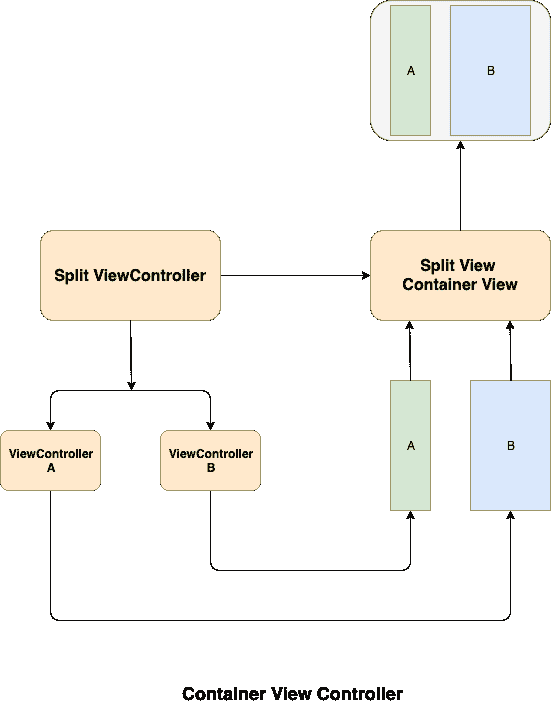
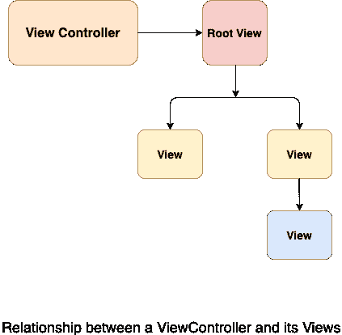
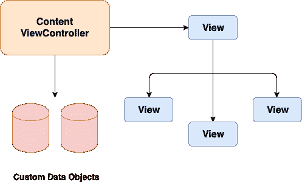

# 视图和视图控制器

> 原文：<https://www.javatpoint.com/ios-views-and-view-controllers>

在 iOS 开发中，视图控制器是应用程序内部结构的基础。视图控制器是故事板上所有视图的父视图。每个应用程序至少有一个视图控制器。它促进了用户界面不同部分之间的转换。

UIViewController 是所有视图控制器的父类。它定义了管理视图的所有方法和属性。这个类还管理事件以及从一个视图控制器到另一个视图控制器的转换。它还协调应用程序的不同部分。

## 视图控制器的类型

视图控制器有两种类型:

1.  **内容视图控制器:**内容视图控制器是我们创建的视图控制器的主要类型。内容视图控制器保存应用程序屏幕的内容。换句话说，我们可以说内容视图控制器管理应用程序内容的离散部分。内容视图控制器管理所有视图本身。
2.  **容器视图控制器:**容器视图控制器不同于内容视图控制器，它充当父视图控制器，从子视图控制器收集信息。容器视图控制器的任务是呈现收集的信息，以便于导航到子视图控制器。容器视图控制器只管理根视图，根视图包含一个或多个子视图控制器。

大多数 iOS 应用程序都是内容视图控制器和容器视图控制器的混合体。

## 视图管理

在 iOS 开发中，视图控制器管理视图的层次结构。如下图所示，每个视图控制器包含一个根视图，它包含视图控制器的所有内容。维护 iOS 应用程序所需的所有自定义视图都被添加到根视图中，以显示内容。下图显示了视图控制器、根视图及其子视图之间的关系。每个子视图由一个超级视图引用，该视图包含一系列视图，其中根视图充当视图控制器中所有视图的父视图。

## 数据封送

在 iOS 开发中，视图控制器负责在屏幕上显示我们的 iOS 应用程序的数据。它充当其视图(由开发人员创建)和应用程序数据之间的接口。故事板中的每个视图控制器都被分配了一个类，该类继承了 UIViewController 类。

在 UIViewController 中定义的所有属性和方法都存在于我们分配给 ViewController 的类中。然而，为了开发我们的应用程序，我们需要在视图控制器类中定义我们的属性和方法。它帮助我们管理应用程序的可视化表示。

* * *