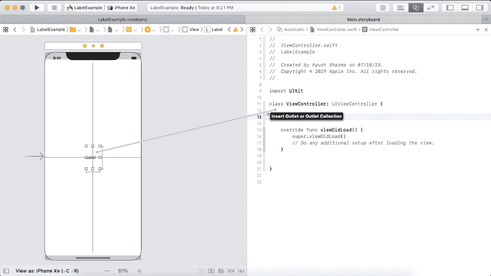
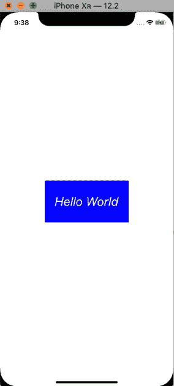
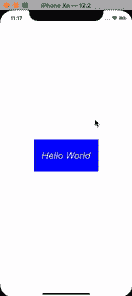

# 标签

> 原文：<https://www.javatpoint.com/ios-label>

UILabel 继承了 UIView 类。它表示一类显示一行或多行只读文本的视图。在 iOS 应用程序中，标签用于与 UIControls 关联，以满足应用程序要求。

UILabel 类的语法如下。

```

class UILabel : UIView

```

可以配置标签的外观。我们可以自定义标签中的子字符串。标签也可以显示属性字符串。我们可以通过编程或使用故事板向界面添加标签。以下步骤用于将标签添加到界面。

1.  在对象库中搜索标签，并将结果拖到故事板中，或者在视图控制器类中创建一个 UILabel 类的对象。
2.  使用属性检查器配置标签的外观。
3.  设置自动布局规则以定义标签在界面中的大小和位置。

## 构建标签的接口构建器属性

| 塞内加尔 | 属性 | 描述 |
| one | 文本 | 这个属性可以用来设置标签的内容。为了定义标签的外观，我们可以为标签分配两种模式，即普通模式和属性模式。普通模式以统一的外观显示标签的内容，而属性化模式在字符串中应用样式属性。在属性化模式下，我们可以使用“更多”菜单来显示附加的外观属性。该值可以在运行时通过文本和属性文本属性来访问。 |
| Two | 颜色 | 用于设置标签的字体颜色。在普通模式下，为整个内容设置颜色，而在属性模式下，我们可以为内容的特定部分定义颜色。 |
| three | 字体 | 这用于改变标签内容的字体。它包括字体系列、大小和内容的不透明度。我们可以为标签定义系统或自定义字体。在自定义字体中，我们可以设置标签内容的字体系列和样式。 |
| four | 对齐 | 它用于设置框架内标签内容的对齐方式。我们可以在框架内放置标签内容，左对齐、居中、右对齐、对齐或自然对齐。在普通模式下，为整个标签内容设置对齐方式，而在属性化模式下，我们可以为标签的特定段落保持特定的对齐方式。 |
| five | 线 | 它表示标签用于呈现内容的最大行数。我们可以将其设置为 0，使标签呈现无限的线条。可以通过在标签对象上使用 numberOfLines 属性在运行时访问该值。 |
| six | 行为 | 该属性用于控制标签的行为。“已启用”和高亮显示控制标签的外观。可以在运行时分别使用 isEnabled 和 isHighlighted 属性来访问这些值。 |
| seven | 基线 | 这是一个间距属性，用于控制启用自动收缩时标签的垂直对齐方式。使用基线调整属性可以访问该值。 |
| eight | 换行 | 它指定当内容太大而无法在标签范围内调整时标签的行为。它可以设置为自动换行或字符换行，以便按单词或字符将内容分成多行。可以使用标签对象上的 lineBreakMode 属性来访问此属性。 |
| nine | 自动收缩 | 该属性用于在进行截断之前改变标签内容的字体大小。它可以设置为最小字体比例或最大字体大小。我们可以选择最小字体比例，并设置值以允许标签减小字体大小以适合文本。 |
| Ten | 突出的 | 选中突出显示的属性时，颜色将应用于标签中的文本。 |
| Eleven | 阴影 | 该属性的默认值是透明的，这意味着文本下方不会出现阴影。然而，我们可以提到标签文本下面呈现的阴影颜色。这个值可以在运行时通过使用 shadowColor 属性来访问。 |
| Twelve | 阴影偏移 | 此属性保持阴影偏移。可以在运行时使用 shadowOffset 属性访问该值。 |

### 例子

在本例中，我们将使用接口生成器向视图控制器添加一个标签，并通过在视图控制器类中创建标签出口来定制运行时的标签外观。

要创建插座，请在用户界面中选择要为其创建插座的控件，按住 control 键并从该控件拖动到关联的类，如下图所示。



在视图控制器类中，我们将为标签设置一些属性，以便在运行时自定义其外观。

**ViewController.swift**

```

import UIKit

class ViewController: UIViewController {

    @IBOutlet weak var textLbl: UILabel!

    override func viewDidLoad() {
        super.viewDidLoad()
        // Do any additional setup after loading the view.
        textLbl.text = "Hello World"
        textLbl.font = .italicSystemFont(ofSize: 30)
        textLbl.backgroundColor = UIColor.blue
        textLbl.textAlignment = .center
        textLbl.textColor = UIColor.white
        textLbl.shadowColor = UIColor.black
        textLbl.isHighlighted = true
    }
}

```

**输出:**



### 例 2

**使标签可敲击**

以下示例将使示例 1 中创建的标签可点击。为此，我们将创建一个类 UITapGestureRecognizer 的对象。

```

import UIKit

class ViewController: UIViewController {

    @IBOutlet weak var textLbl: UILabel!
    var didTap = true

    override func viewDidLoad() {
        super.viewDidLoad()
        // Do any additional setup after loading the view.
        textLbl.text = "Hello World"
        textLbl.font = .italicSystemFont(ofSize: 30)
        textLbl.backgroundColor = UIColor.blue
        textLbl.textAlignment = .center
        textLbl.textColor = UIColor.white
        textLbl.shadowColor = UIColor.black
        textLbl.isHighlighted = true
        let tap = UITapGestureRecognizer(target: self, action: #selector(didTextLabelTap(sender:)))
        textLbl.isUserInteractionEnabled = true
        textLbl.addGestureRecognizer(tap)
    }

    @objc func didTextLabelTap(sender: UITapGestureRecognizer){
        if(didTap){
        textLbl.backgroundColor = UIColor.brown
        didTap = false
        }
        else{
            textLbl.backgroundColor = UIColor.blue
            didTap = true
        }

    }
}

```

**输出:**



## 建筑标签属性

UILabel 对象包含以下属性，这些属性可用于自定义标签的运行时行为。

| 塞内加尔 | 财产 | 类型 | 描述 |
| one | 文本 | 线 | 它表示当前标签文本。 |
| Two | 设置标签属性文本 | 非分配字符串 | 它表示当前样式的标签文本。 |
| three | 字体 | 他们在做什么 | 它表示颜色的字体。 |
| four | 文本颜色 | UIColor | 它是标签文本颜色。 |
| five | 文本对齐 | NSTextAlignment | 它是标签框架内文本的对齐方式。 |
| six | 换行模式 | NSLineBreakMode | 它是用于换行和截断多行文本的技术 |
| seven | isensenabled(伊塞瓦底省) | 弯曲件 | 绘制标签文本时使用的启用状态。 |
| eight | adjustFontSizeToFitWidth | 弯曲件 | 它是一个布尔值，设置后，标签字体大小会缩小以适合标题字符串。 |
| nine | allowsDefaultTighteningForTruncation 阳Ionic | 弯曲件 | 它是一个布尔值，指示标签是否在截断前收紧文本。 |
| Ten | 基线调整 | uibaseline 调整 | 它控制当文本缩小以适合标签框架时调整基线的方式。 |
| Eleven | 最小比例因子 | CGFloat 函数 | 这是标签文本的最小比例因子。 |
| Twelve | 行数 | （同 Internationalorganizations）国际组织 | 它表示标签文本可以包含的最大行数。将其设置为 0 可使其无限制。 |
| Thirteen | highlighttextcolor | UIColor | 它表示应用于标签的高亮文本颜色。 |
| Fourteen | isHighlighted | 弯曲件 | 它表示一个布尔值，指示标签文本是否高亮显示。 |
| Fifteen | 阴影颜色 | UIColor | 它表示标签文本的阴影颜色。 |
| Sixteen | 阴影偏移 | 断续器 | 它表示标签文本的阴影偏移量。 |
| Seventeen | preferredMaxLayoutWidth | CGFloat 函数 | 这是多行标签的首选最大宽度。 |
| Eighteen | isusserinteractionenabled | 弯曲件 | 这是一个布尔类型的属性。当设置为 true 时，它使用户能够与标签文本进行交互。 |

* * *