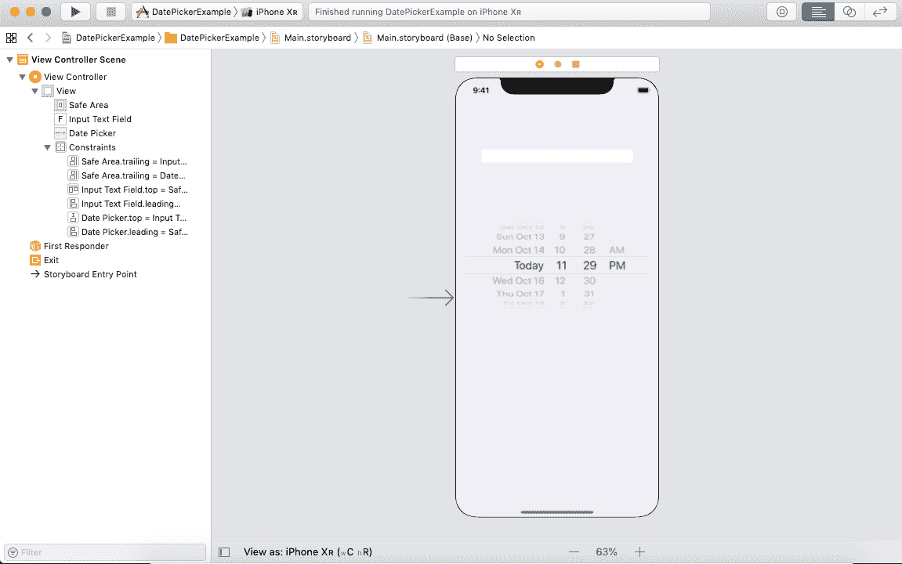
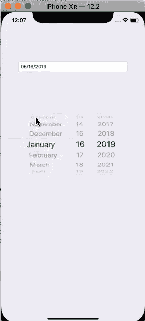

# 日期选择器

> 原文： [https://www.javatpoint.com/ios-datepicker](https://www.javatpoint.com/ios-datepicker)

DatePicker 是 iOS 应用程序中使用的一个控件，用于从用户那里获取日期和时间值。我们可以允许用户输入时间点或时间间隔。

```

class UIDatePicker : UIControl

```

使用以下步骤将日期选择器添加到界面。

1.  设置 UIView，即(标签、文本字段、按钮等。)从用户那里获取日期和时间。
2.  在对象库中搜索日期选择器，并将结果拖到故事板。
3.  设置日期选择器模式
4.  如果需要，提供额外的配置选项，如最小和最大日期。
5.  为日期选择器创建一个操作出口。
6.  为 datepicker 设置自动布局规则，以在不同设备上设置位置。

日期选择器仅用于从列表中选择日期和时间。

## 例子

在本例中，我们将创建一个文本字段，允许用户通过从日期选择器中选择任意日期来输入日期。

要将日期选择器添加到故事板，我们将在对象库中搜索日期选择器，并将结果拖到故事板中。

### 界面构建器

下图显示了界面生成器；我们在示例中创建了。我们已经在 ViewController.swift 文件中为文本字段和日期选择器创建了出口。



**ViewController.swift**

在 ViewController.swift 中，我们刚刚将输入文本字段的 inputView 属性分配给了 datepicker，每次 datepicker 的值发生变化时都会触发 datepicker 的动作连接，这将文本字段文本设置为 datepicker 日期。在本例中，我们将日期选择器模式设置为 date 但是，我们可以将其设置为日期和时间，或者时间，以获得适当的日期时间或时间值。

```

import UIKit

class ViewController: UIViewController {

    @IBOutlet weak var inputTextField: UITextField!

    @IBOutlet weak var datePicker: UIDatePicker!

    let dateFormatter = DateFormatter()

    override func viewDidLoad() {
        super.viewDidLoad()
        // Do any additional setup after loading the view.
        dateFormatter.dateFormat = "MM/dd/yyyy"
        inputTextField.inputView = datePicker
        datePicker.datePickerMode = .date
        inputTextField.text = dateFormatter.string(from: datePicker.date)

    }

    @IBAction func datePickerValueChanged(_ sender: UIDatePicker) {

        inputTextField.text = dateFormatter.string(from: sender.date)
        view.endEditing(true)
    }
}

```

**输出:**



### 界面构建器属性

**核心属性**

| 塞内加尔 | 属性 | 描述 |
| one | 方式 | 它代表日期选择器模式。它用于确定日期选择器是显示日期、时间、日期和时间，还是倒计时间隔。这可以在运行时使用 datePickerMode 属性来访问。 |
| Two | 现场 | 这表示与日期选择器关联的区域设置。此属性覆盖系统默认区域设置。这可以在运行时使用本地属性来访问。 |
| three | 间隔 | 它表示分钟微调器的粒度。默认值为 1，最大值为 30。该值必须是 60 的除数。它可以在运行时使用分钟间隔属性来访问。 |

**日期属性**

| 塞内加尔 | 属性 | 描述 |
| one | 日期 | 它表示日期选择器最初要显示的日期。我们可以在运行时设置这个属性。 |
| Two | 限制 | 它表示可以选择的日期范围。我们可以配置最小日期和最大日期属性来配置范围。 |
| three | 计时器 | 它是在倒计时模式下显示的日期选择器的初始值。 |

* * *