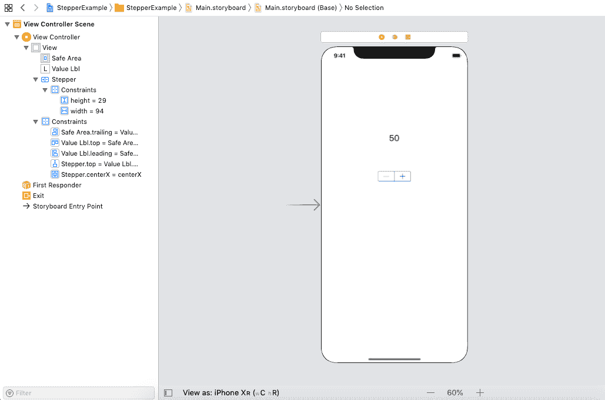
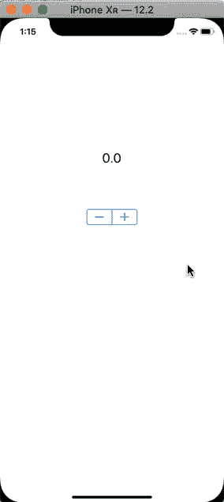

# 跳舞者

> 原文：<https://www.javatpoint.com/ios-stepper>

这是一种用于增加和减少价值的 UIControl。步进器由两个按钮组成。它与一次按住两个按钮反复增加或减少的值相关联。变化的速度取决于用户按下控件的持续时间。

```

class UIStepper : UIControl 

```

我们可以设置 UIStepper 的最大值和最小值；但是，最大值总是大于最小值。如果最大值小于最小值，则这两个值相等。

**将分档器添加到故事板的步骤**

1.  设置标签、文本栏或按钮，当改变步进值时，其文本将被改变。
2.  在对象库中搜索 UIStepper，并将结果拖到故事板。
3.  在 ViewController.swift 文件中创建步进器的出口和动作出口。
4.  在 ViewController.swift 文件中以编程方式配置步进器。
5.  为步进器设置自动布局规则，以控制步进器在不同屏幕尺寸上的位置和大小。

### 例子

在这个例子中，我们使用了一个标签和 UIStepper。这是一个简单的例子，其中标签的文本改变相当于步进值的改变。

### 界面构建器

我们使用标签和 UIStepper 创建了如下图所示的界面构建器。



**ViewController.swift**

```

import UIKit

class ViewController: UIViewController {

    @IBOutlet weak var valueLbl: UILabel!
    @IBOutlet weak var stepper: UIStepper!

    override func viewDidLoad() {
        super.viewDidLoad()
        // Do any additional setup after loading the view.
        stepper.autorepeat = true
        stepper.isContinuous = true
        valueLbl.text = stepper.value.description
        stepper.maximumValue = 20
        stepper.minimumValue = -20
    }

    @IBAction func stepperValueChanged(_ sender: UIStepper) {
        valueLbl.text = sender.value.description
    }
}

```

**输出:**



* * *