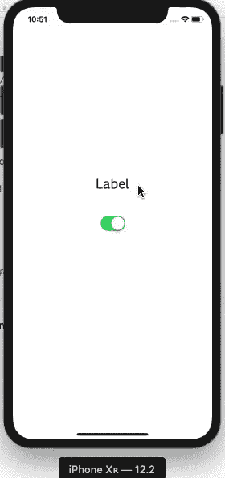

# 转换

> 原文：<https://www.javatpoint.com/ios-switch>

该开关可以定义为 UIControl，它为用户提供二进制选择，要么**开**要么**关**。开关的状态由 UISwitch 类中定义的属性和方法管理，ui switch 类是 UIControl 的子类。

UISwitch 类的声明如下。

```

class UISwitch : UIControl

```

一个开关一次只能有一种状态，即开或关。当用户试图更改交换机的状态时，会生成 valueChanged 事件，并向与 swift 关联的操作连接发送操作调用。

我们可以通过使用 UISwitch 类中定义的属性来自定义 swift 的外观。

可以使用以下步骤将交换机添加到接口。

1.  创建 UISwitch 类的对象或在对象库中搜索它，并将结果拖到故事板构建器。
2.  在视图控制器类中创建开关的出口，以便在运行时自定义其外观。
3.  在 ViewController 类中创建开关的操作连接方法，当为开关触发 valueChanged 事件时，可以在运行时调用该方法。

### 例子

在这里，我们将创建一个非常简单的示例，其中我们将维护交换机的状态，并创建一个函数，当交换机的状态发生变化时，该函数将接受回调。

### 界面构建器

在这个例子中，我们创建了一个非常简单的故事板，其中我们使用了开关和标签。在这里，我们将使用标签来显示开关的状态，无论是打开还是关闭。标签和开关连接到 ViewController.swift 文件中的插座。


**ViewController.swift**

```

import UIKit

class ViewController: UIViewController {

    @IBOutlet weak var msgLbl: UILabel!

    @IBOutlet weak var mySwitch : UISwitch!

    override func viewDidLoad() {
        super.viewDidLoad()
        // Do any additional setup after loading the view.
    }

    @IBAction func switchValueChanged(_ sender: UISwitch) {
        if(mySwitch.isOn){
            msgLbl.text = "Switch is On"
        }
        else {
            msgLbl.text = "Switch is Off"
        }
    }

}

```

**输出:**



* * *