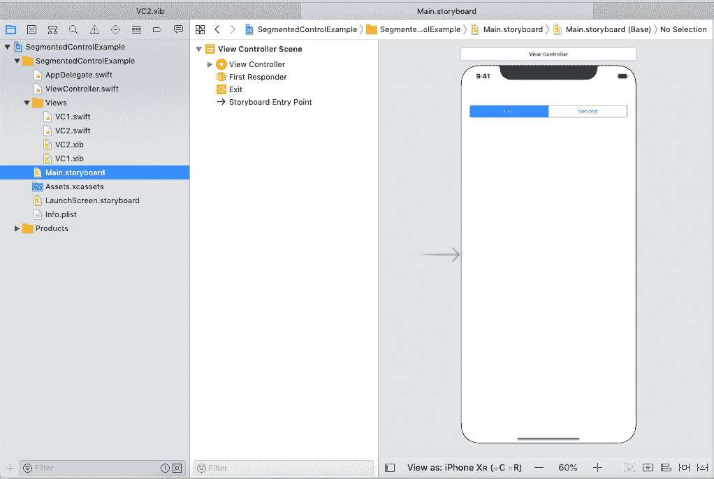
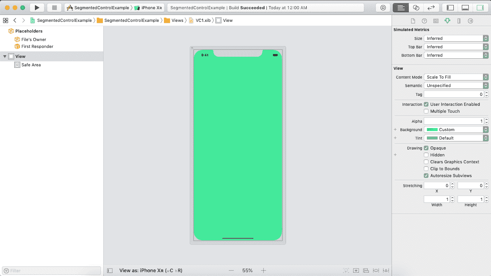
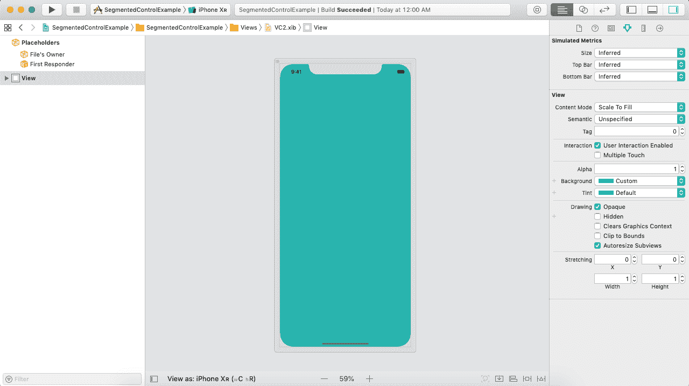
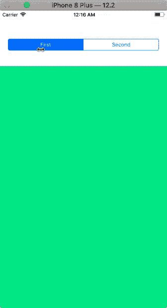

# 分段控制

> 原文：<https://www.javatpoint.com/ios-segment-control>

段控制可以定义为水平控制，它控制多个段，其中一个离散按钮控制每个段。段控件可用于在单个视图控制器中显示多个视图，其中每个视图可通过使用离散按钮来显示。

段控件声明如下。

```

class UISegmentControl : UIControl

```

除非设置了特定的宽度，否则 UISegmentedControl 会自动调整线段的大小，使其与其监管范围成比例。当您添加和删除片段时，您可以请求使用滑动和淡入淡出效果对动作进行动画处理。

将段控件添加到接口生成器中涉及以下步骤。

1.  在对象库中搜索 SegmentControl，并将结果拖到故事板中。
2.  创建分段控制的出口，以自定义分段控制的外观。
3.  创建 SegmentControl 的动作连接，为触发的值更改事件准备逻辑。
4.  为段控制设置自动布局规则，以控制段控制在不同大小的 iOS 设备上的大小和位置。

### 例子

在本例中，我们将把 segment 控件添加到我们的界面构建器中，我们将使用该控件分别显示我们创建的个人 XIB 文件。

### 界面构建器

In this example, we have used two XIBs to display the individual views on the event of horizontal segment control. The main storyboard contains segment control, which controls how the views are displayed accordingly. 

### 什么是 XIB 档案？

XIB 代表一个 XML 接口构建器。界面构建器允许我们在可可和碳的帮助下开发图形用户界面。XIB 文件在运行时加载，为应用程序提供用户界面。XIB 文件存储为代表 UIView 的 NIB 或 XIB 文件。

VC 1.xib

下图显示了 VC.xib 文件。



VC 2.xib

下图显示了 VC2.xib 文件。



**ViewController.swift**

在 ViewController.swift 文件中，我们将为段控件创建操作连接，每次为段控件触发 valueChanged 事件时都会通知该连接。

它在段控制的值改变事件上在 VC1.xib 和 VC2.xib 之间切换。

```

import UIKit

class ViewController: UIViewController {

    @IBOutlet weak var segmentedControl: UISegmentedControl!

    @IBOutlet weak var viewContainer: UIView!

    var views = Array()

    override func viewDidLoad() {
        super.viewDidLoad()
        // Do any additional setup after loading the view.
        views.append(VC1().view!)
        views.append(VC2().view!)
        for v in views{
            viewContainer.addSubview(v)
        }
        viewContainer.bringSubviewToFront(views[0])
    }

    @IBAction func switchViewAction(_ sender: UISegmentedControl) {
        viewContainer.bringSubviewToFront(views[sender.selectedSegmentIndex])
    }
} 
```

**输出:**



* * *