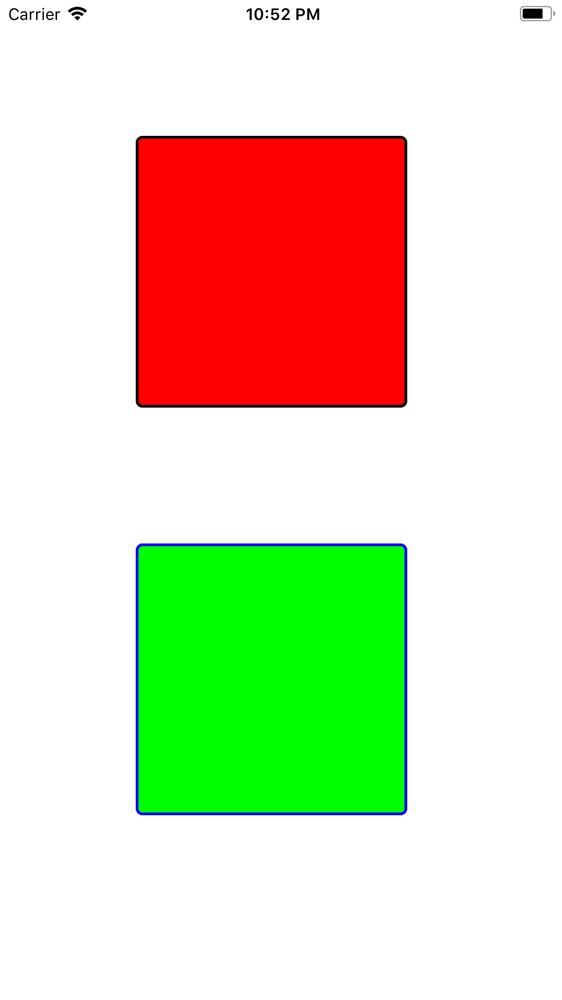
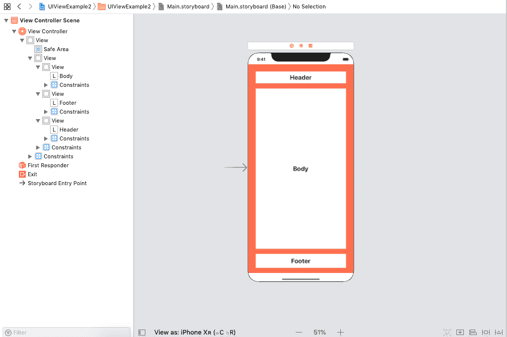
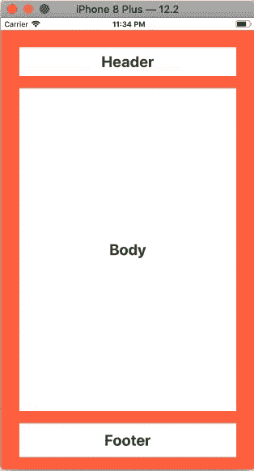

# 用户界面视图

> 哎哎哎:# t0]https://www . javatppoint . com/IOs-uiview

UIView 可以定义为一个对象，通过它我们可以创建和管理屏幕上的矩形区域。我们可以在一个视图中拥有任意数量的视图，以创建 ui view 的层次结构。

通过使用继承 UIKit 的 UIView 类中定义的方法和属性来管理 UIView。UIView 的声明如下。

类 UIView ： UIKit

视图是 iOS 应用程序开发的基础，这就是为什么 UIView 是对象库中使用最多的对象之一。视图是 iOS 应用程序的基本构建块，它在其边界矩形内呈现内容，并处理与内容的任何交互。

UIViews 是 iOS 应用程序与用户之间的基础和连接点。iOS 应用程序中的视图执行了几项活动。

*   绘画和动画
    *   通过使用视图，我们可以绘制到屏幕的矩形区域。
*   布局和子视图管理
    *   我们可以将一个或多个子视图嵌入到 UIView 中。可以通过管理超级视图的外观来管理子视图的外观。
    *   我们可以定义自动布局规则来控制不同 iOS 设备上视图层次结构的大小和位置。
*   事件处理
    *   一个视图可以对触摸和另一种事件做出响应，因为它是 UIResponder 的子类。
    *   我们可以为 uiview 添加手势识别器，比如 UITapGestureRecognizer。

## 正在创建 UIView

可以通过实例化 UIView 类以编程方式创建视图。我们可以在 UIView 构造函数中传递框架对象。在 iOS 应用程序开发中，有许多对象，如标签、文本字段等。它直接继承 UIView 类来使用公共属性和方法。

```

let rect = CGRect(x: 10, y: 10, width: 100, height: 100)
let myView = UIView(frame: rect)

```

**例 1**

在本例中，我们将以编程方式创建两个 UIViews，并同时设置它们的属性。

**ViewController.swift**

```

import UIKit

class ViewController: UIViewController {

    override func viewDidLoad() {
        super.viewDidLoad()
        // Do any additional setup after loading the view.
        let frame1 = CGRect(x: 100, y: 100, width: 200, height: 200)
        let myView1 = UIView(frame: frame1)
        myView1.layer.shadowColor = UIColor.black.cgColor
        myView1.layer.borderColor = UIColor.black.cgColor
        myView1.layer.borderWidth = 2
        myView1.layer.cornerRadius = 5
        myView1.layer.shadowRadius = 2

        let frame2 = CGRect(x:100, y:400, width: 200, height: 200)
        let myView2 = UIView(frame: frame2)
        myView2.layer.shadowColor = UIColor.blue.cgColor
        myView2.layer.borderColor = UIColor.blue.cgColor
        myView2.layer.borderWidth = 2
        myView2.layer.cornerRadius = 5
        myView2.layer.shadowRadius = 2

        myView2.backgroundColor = .green
        myView1.backgroundColor = .red
        view.addSubview(myView1)
        view.addSubview(myView2)
    }
}

```



**例 2**

在这个例子中，我们将在 iOS 应用程序上模拟网页的结构。在这种类型的 iOs 应用程序中，我们需要显示单独的定制，我们将在 iOS 应用程序中使用 UIViews。

**界面构建器**

下图显示了在项目中开发的界面构建器(main .故事板)。窗口的左窗格显示了项目中使用的视图和标签的层次结构。



**ViewController.swift**

在视图控制器文件中，我们将添加标签的行为，这样我们就可以更改与标签相关联的 UIView 的外观。

```

import UIKit

class ViewController: UIViewController {

    @IBOutlet weak var headerView: UIView!

    @IBOutlet weak var bodyView: UIView!

    @IBOutlet weak var footerView: UIView!

    @IBOutlet weak var headerLbl: UILabel!

    @IBOutlet weak var bodyLbl: UILabel!

    @IBOutlet weak var footerLbl: UILabel!

    override func viewDidLoad() {
        super.viewDidLoad()
        // Do any additional setup after loading the view.

        let headerTapGestureRecognizer = UITapGestureRecognizer(target: self, action: #selector(headerLblTapped))
        headerLbl.isUserInteractionEnabled = true
        headerLbl.addGestureRecognizer(headerTapGestureRecognizer)

        let bodyTapGestureRecognizer = UITapGestureRecognizer(target: self, action: #selector(bodyLblTapped))
        bodyLbl.isUserInteractionEnabled = true
        bodyLbl.addGestureRecognizer(bodyTapGestureRecognizer)

        let footerTapGestureRecognizer = UITapGestureRecognizer(target: self, action: #selector(footerLblTapped))
        footerLb
		l.isUserInteractionEnabled = true
        footerLbl.addGestureRecognizer(footerTapGestureRecognizer)
    }

    @objc func headerLblTapped(){
        headerView.backgroundColor = .orange
    }

    @objc func bodyLblTapped(){
        bodyView.backgroundColor = .green

    }

    @objc func footerLblTapped(){
        footerView.backgroundColor = .orange
    }
}

```

**输出**



* * *