# CollectionView

> 原文：<https://www.javatpoint.com/ios-collectionview>

CollectionView 是一个对象，它以可定制的布局呈现数据项的有序集合。它以网格布局的形式显示数据。collectionview 是 UICollectionView 类的一个实例，它继承了 UIScrollView，这将在本教程的后面介绍。

```

class UICollectionView : UIScrollView

```

当我们将 collectionview 添加到应用程序界面时，iOS 应用程序有责任管理与 collectionview 相关联的数据。CollectionView 对象的工作方式类似于 tableview，因为它从 DataSource 对象获取数据，这符合 UICollectionViewDataSource 协议。

与集合视图相关联的数据被视为单个项目，这些项目可以分组到要在 iPhone 屏幕上表示为网格布局的部分中。UICollectionView 用于大多数 iOS 应用程序，我们希望数据可以水平滚动。

**例如，**在像 Flipkart 这样的电商应用程序中，产品是使用 UICollectionVIew 显示的。可以使用 collectionview 开发的最基本的用户界面是一个计算器，其中单个按钮被视为单个 collectionview 项，可以使用 UICollectionViewDelegate 和 UICollectionViewDataSource 协议中定义的委托和数据源方法进行管理。

UICollectionView 在屏幕上显示数据，如下图所示。

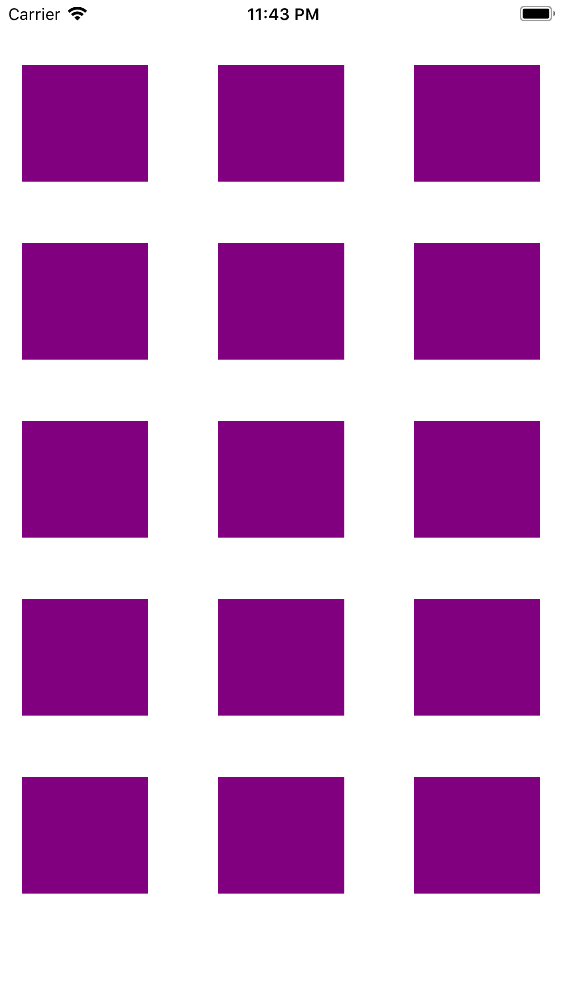

**将集合视图添加到界面构建器中**

1.在对象库中搜索 CollectionView，并将结果拖到故事板。

2.在视图控制器中创建 collectionview 的连接出口。

3.在视图控制器中实现 UICollectionViewDataSource 和 UICollectionViewDelegate 协议，并将委托和 DataSource 对象分配给自己。

```

collectionView.delegate = self
collectionView.dataSource = self

```

4.为集合视图定义委托和数据源方法，以绘制集合视图布局。

**uicollectionviewell**

它类似于 tableview 中的 UITableViewCell。CollectionView 以有序项目集合的形式呈现数据。项目是可以使用 UICollectionView 对象呈现的最小数据单元。CollectionView 使用单元格呈现该项，该单元格是 UICollectionViewCell 的实例。datasource 方法使用可重用的标识符配置 UICollectionView 单元格。单元格是使用 CollectionViewCell 配置的，如下所示。

```

func collectionView(_ collectionView: UICollectionView, cellForItemAt indexPath: IndexPath) -> UICollectionViewCell {
        let cell = collectionView.dequeueReusableCell(withReuseIdentifier: "cell", for: indexPath) as! MyCollectionviewCell
        cell.myView.backgroundColor = itemArr[indexPath.row]
        return cell
    }

```

**补充意见**

CollectionView 也可以使用补充视图呈现数据。补充视图是使用 UICollectionViewDelegate 方法配置的节页眉和页脚。集合视图布局对象可以定义对补充视图的支持。集合视图布局对象还定义了这些视图的位置。

**集合视图委托方法**

CollectionView 委托方法处理选择、取消选择和突出显示 collectionview 中的项目。该协议的所有方法都是可选的。下表包含最常用的 CollectionView 委托方法。

| 塞内加尔 | 方法 | 描述 |
| one | func collectionView（UICollectionView， shouldSelectItemAt： IndexPath） -> Bool | 此方法要求委托选择索引路径中的项。 |
| Two | func collection view(uicollectionview，diselectitem at:index th) | 此方法告诉委托选择索引路径上的项。当选择了 then collectionview 中索引路径处的项时，将执行此方法。 |
| three | func collection view(uicollectionview，sholddeselectt:index th)-(bool)函数集合视图 | 此方法要求委托取消选择索引路径中的项。 |
| four | func collection view(uicollectionview，dideselectionat:index path) | 当取消选择 collectionview 中 indexpath 处的项时，将执行此方法。 |
| five | func collectionView（UICollectionView， shouldBeginMultipleSelectionInteractionAt： IndexPath） -> Bool | 它询问代理是否可以在集合视图中使用两指平移手势选择多个项目。 |
| six | func collection view(uicollectionview，dibeginmultipleselectioninteracted:index path) | 当使用两指平移手势选择多个项目时，将执行此方法。 |
| seven | func collection view(uicollection view，sholdhighlightitem:index th)-(bool)函数集合视图 | 然后，它会询问委托人是否在跟踪过程中突出显示该项目。 |
| eight | func collection view(uicollectionview，dihighlightitem:index th) | 此方法在 collectionview 中某个索引路径处突出显示该项时执行。 |

**收集视图数据源方法**

集合视图数据源采用 UICollectionViewDatasource 协议。collection view datasource 对象负责提供 collection view 所需的数据。这就像 collectionview 应用程序的数据模型。它将数据传递给要显示的 collectionview。

下表包含在 UICollectionViewDataSource 协议中声明的方法。

| 塞内加尔 | 方法 | 描述 |
| one | func collection view(uicollection view，numerofitemsinsection:int)-(int) | 此方法返回一个整数，该整数表示要在 collectionview 中显示的节中的项数。它是与 collectionview 关联的数据数组的计数。 |
| Two | func number of sections(in:UICollectionView)-> Int | 此方法返回一个整数，表示 collectionview 中要显示的节数。 |
| three | func collectionView（UICollectionView， cellForItemAt： IndexPath） -> UICollectionViewCell | 此方法返回 UICollectionViewCell 的实例，该实例被配置为显示实际内容。此方法不是可选的，如果视图控制器符合 UICollectionViewDataSource 协议，则需要定义此方法。 |
| four | func collectionView(UICollectionView，viewporsupplementaryelementof kind:String，at:IndexPath)-> uicollectionuseableview | 此方法要求数据源对象提供一个补充视图来显示在集合视图中。 |
| five | func collection view(uicollection view，can moveitem at:index th)-(bool)函数集合视图 | 它询问 datasource 对象是否可以将指定的项移动到 collectionview 中的另一个位置。 |
| six | func collectionView（UICollectionView， moveItemAt： IndexPath， to： IndexPath） | 此方法将指定的项移动到指定的索引路径。 |
| seven | func indexTitles(for:UICollectionView)->[String]？ | 此方法返回包含索引标题的字符串数组。 |
| eight | func collectionView(UICollectionView，indexPathForIndexTitle: String，at: Int) -> IndexPath | 它要求数据源对象返回与其中一个索引项对应的集合视图项的索引路径。 |

### 例 1

在本例中，我们将使用集合视图在屏幕上呈现一个项目网格。

**界面构建器(主.故事板)**

若要将 collectionview 添加到项目的情节提要中，请在对象库中搜索 collectionview，然后将结果拖到界面生成器中。这将把 collectionview 添加到接口中。现在，为集合视图定义自动布局规则，以控制其在不同屏幕设备上的大小和位置。CollectionView 的实际内容由 collectionview 单元格显示。我们必须在 Xcode 的属性检查器中定义单元格的属性。在本例中，我们将标签添加到 collectionview 单元格，并在单元格对象的数据源方法中设置标签的文本。

下图显示了 collectionview 单元格的属性。

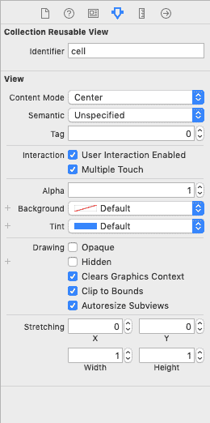

下图显示了集合视图的属性。

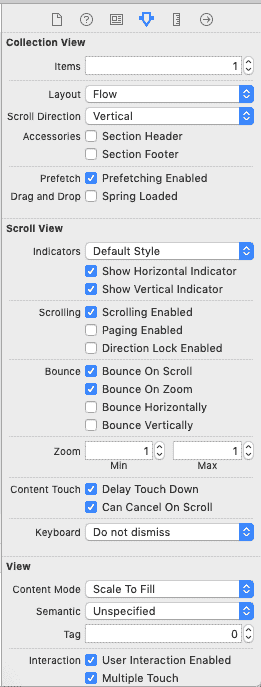

为项目创建的界面生成器如下所示。

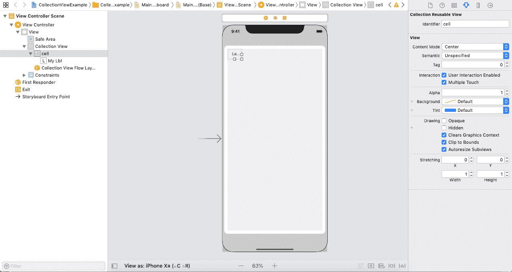

**ViewController.swift**

```

import UIKit

class ViewController: UIViewController {

    @IBOutlet weak var collectionView: UICollectionView!

    var itemArr = Array()

    override func viewDidLoad() {
        super.viewDidLoad()
        // Do any additional setup after loading the view.
        collectionView.delegate = self
        collectionView.dataSource = self
        for i in 1...60{
            itemArr.append(i.description)
        }
    }
}

extension ViewController : UICollectionViewDelegate{

}

extension ViewController : UICollectionViewDataSource{

    func collectionView(_ collectionView: UICollectionView, numberOfItemsInSection section: Int) -> Int {
        return itemArr.count
    }

    func collectionView(_ collectionView: UICollectionView, cellForItemAt indexPath: IndexPath) -> UICollectionViewCell {
        let cell = collectionView.dequeueReusableCell(withReuseIdentifier: "cell", for: indexPath) as! MyCollectionViewCell

        cell.myLbl.text = itemArr[indexPath.item]
        cell.myLbl.layer.borderColor = UIColor.blue.cgColor
        cell.myLbl.textAlignment = .center
        cell.myLbl.layer.cornerRadius = 10
        cell.myLbl.layer.borderWidth = 2

        return cell
    }
} 
```

**支原体观察细胞。swift**

```

import UIKit

class MyCollectionViewCell: UICollectionViewCell {

    @IBOutlet weak var myLbl: UILabel!

}

```

**输出:**

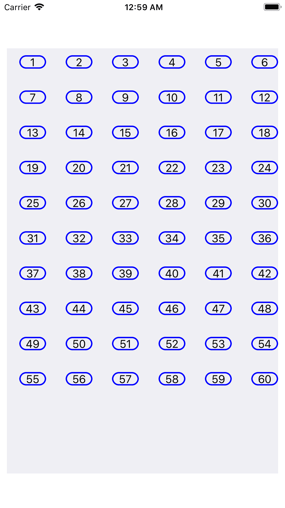

### 集合查看演示项目

这个项目展示了如何在 iOS 应用程序中使用集合视图。这个应用程序模拟了一个电子商务应用程序，它在一个视图控制器场景中显示多个产品。点击某个产品会将我们导航到另一个屏幕，该屏幕显示特定产品的详细视图。

在这个应用程序中，我们将使用两个视图控制器，并将视图控制器嵌入到导航控制器中，导航控制器通过视图控制器提供导航。我们建议您掌握导航控制器的基本知识，这些知识将在本教程中介绍。

**界面构建器(主.故事板)**

我们将在这个项目中使用 collectionview 来显示应用程序中类似网格的场景。要添加收藏视图，请在对象库中搜索它，并将结果拖到故事板。

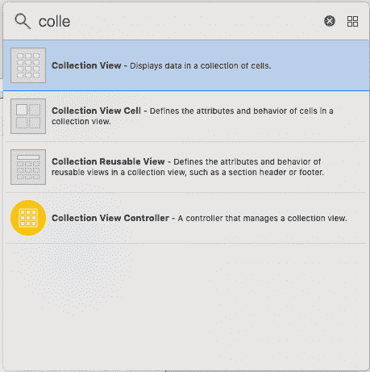

**配置单元格**

现在，我们需要配置原型单元，它将在屏幕上显示实际项目。原型单元格将包含显示产品图像的图像视图和显示图像名称的标签。将 imageview 和标签添加到 collectionview 单元格中，并将类 DemoCollectionViewCell.swift 分配给该单元格，分别创建 imageview 和标签的连接出口。

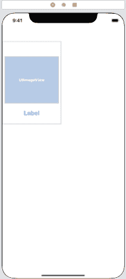

**添加导航控制器**

要将视图控制器嵌入到导航控制器中，我们将选择视图控制器并点击编辑器，然后选择选项**嵌入**，如下图所示。

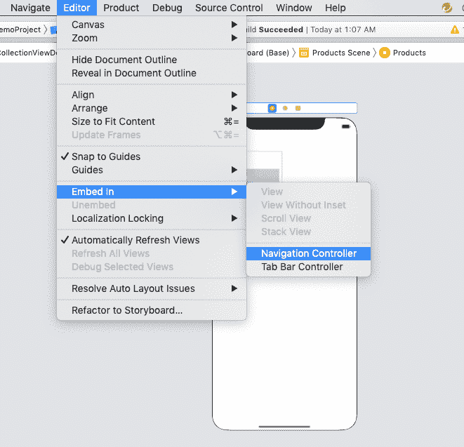

当我们将视图控制器嵌入导航控制器时，默认情况下，所有视图控制器上都将显示一个导航栏。我们可以设置导航栏标题。当我们在本教程中讨论导航界面时，我们将更多地研究导航控制器。下图显示了我们将导航栏标题设置为“产品”的导航控制器和视图控制器。

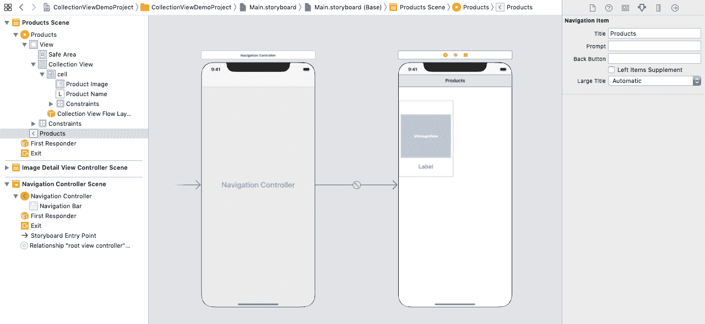

**添加图像细节视图控制器**

对于界面构建器，我们需要一个视图控制器，它可以显示产品的细节。为此，我们将把视图控制器添加到接口构建器中，并将类 ImageDetailViewController 分配给这个视图控制器。

我们将把图像视图和标签添加到视图控制器中。我们还会将此视图控制器嵌入到导航控制器中，并将导航栏标题设置为“产品详细信息”。

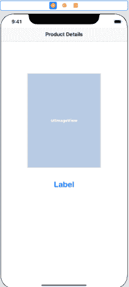

当在集合视图中选择一个项目时，将显示图像详细视图控制器。我们将在 collectionview 的 datasource 方法中编写以下代码，以导航到此视图控制器。

```

let imageDetailVC = self.storyboard?.instantiateViewController(withIdentifier: "ImageDetailViewController") as! ImageDetailViewController

        imageDetailVC.img = imgArr[indexPath.row]
        imageDetailVC.name = lblArr[indexPath.row]
        self.navigationController?.pushViewController(imageDetailVC, animated: true)

```

当导航控制器推送到故事板中的某个视图控制器时，该视图控制器上会启用一个后退按钮，该按钮在故事板中向后导航。

演示项目中内置的界面构建器如下图所示。

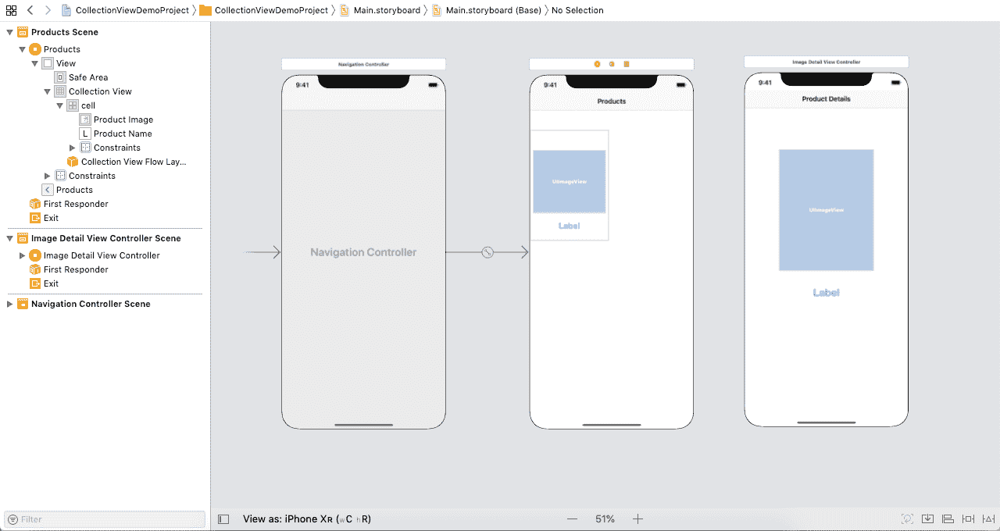

**ViewController.swift**

```

import UIKit

class ViewController: UIViewController {

    var imgArr = Array()
    var lblArr = Array<string>()

    @IBOutlet weak var collectionView: UICollectionView!

    override func viewDidLoad() {
        super.viewDidLoad()
        // Do any additional setup after loading the view.
        collectionView.delegate = self
        collectionView.dataSource = self
        for i in 1...10{
            lblArr.append("Watch"+i.description)
        }
        imgArr = [ imageLiteral(resourceName: "watch1"), imageLiteral(resourceName: "watch1"), imageLiteral(resourceName: "watch1"), imageLiteral(resourceName: "watch1"), imageLiteral(resourceName: "watch1"), imageLiteral(resourceName: "watch1"), imageLiteral(resourceName: "watch1"), imageLiteral(resourceName: "watch1"), imageLiteral(resourceName: "watch1"), imageLiteral(resourceName: "watch1")]
    }

}

extension ViewController:UICollectionViewDataSource{
    func collectionView(_ collectionView: UICollectionView, numberOfItemsInSection section: Int) -> Int {
        return lblArr.count
    }

    func collectionView(_ collectionView: UICollectionView, cellForItemAt indexPath: IndexPath) -> UICollectionViewCell {
        let cell = collectionView.dequeueReusableCell(withReuseIdentifier: "cell", for: indexPath) as! DemoCollectionViewCell
        cell.productImage.image = imgArr[indexPath.row]
        cell.productName.text = lblArr[indexPath.row]
        return cell
    }

    func collectionView(_ collectionView: UICollectionView, didSelectItemAt indexPath: IndexPath) {
        let imageDetailVC = self.storyboard?.instantiateViewController(withIdentifier: "ImageDetailViewController") as! ImageDetailViewController

        imageDetailVC.img = imgArr[indexPath.row]
        imageDetailVC.name = lblArr[indexPath.row]
        self.navigationController?.pushViewController(imageDetailVC, animated: true)
    }
}

extension ViewController:UICollectionViewDelegate{

}</string> 
```

**imagedetailviewcontroller**

```

import UIKit

class ImageDetailViewController: UIViewController {

    @IBOutlet weak var productImage: UIImageView!

    @IBOutlet weak var productName: UILabel!

    var img:UIImage!
    var name:String!

    override func viewDidLoad() {
        super.viewDidLoad()

        // Do any additional setup after loading the view.
        productName.text = name
        productImage.image = img
    }
}

```

**集合 ViewCell.swift**

```

import UIKit

class DemoCollectionViewCell: UICollectionViewCell {

    @IBOutlet weak var productImage: UIImageView!

    @IBOutlet weak var productName: UILabel!
}

```

**输出:**

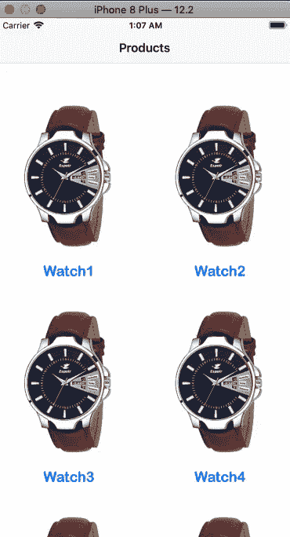[Click Here to Download Project](https://static.javatpoint.com/tutorial/ios/download/CollectionViewDemoProject.zip)

* * *