# 卷动检视

> 哎哎哎:# t0]https://www . javatppoint . com/IOs-scroll view

在 iOS 应用程序中，有时，我们可能需要显示不适合屏幕的内容。为了显示这种类型的内容，我们在应用程序中使用了 ScrollView。滚动视图允许用户拖动内容区域。它是 UIScrollView 类的一个实例，继承了 UIView。

```

class UIScrollView : UIView

```

滚动视图允许滚动和缩放其包含的视图。tableview 和 collectionview 是 UIScrollView 的子类，因此，这些类提供了一种显示比屏幕大的内容的好方法。在 iOS 应用程序中，我们使用 tableview 显示垂直可滚动的内容，使用 collectionview 显示水平可滚动的内容。

用户界面视图对象的原点可以在内容视图上调整。滚动视图跟踪手指的移动，并相应地调整其原点。

**向界面添加滚动视图**

与其他对象相比，将 ScrollView 添加到界面构建器有点复杂。我们需要定义自动布局规则来指导滚动视图在不同屏幕设备上的布局和位置。

按照以下步骤，使用界面生成器(main .故事板)将 scrollview 添加到界面。

*   在主故事板上搜索滚动视图，并将结果拖动到视图控制器。

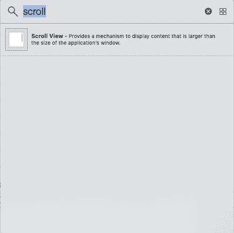

*   为滚动视图定义自动布局规则(约束)，如下图所示。

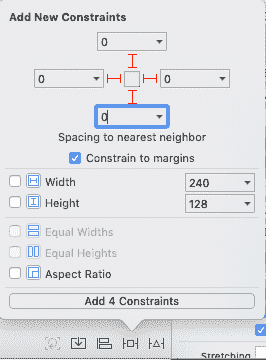

*   将内容视图添加到滚动视图，并定义内容视图的自动布局规则。

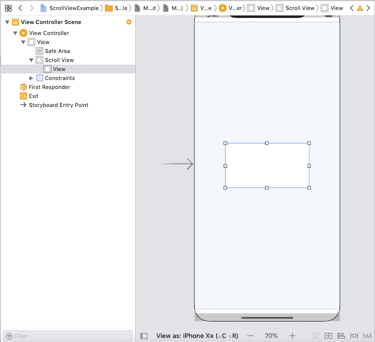

将约束边距 0 赋予 ScrollView 中的 contentView。我们还需要使它们的高度和宽度相等。

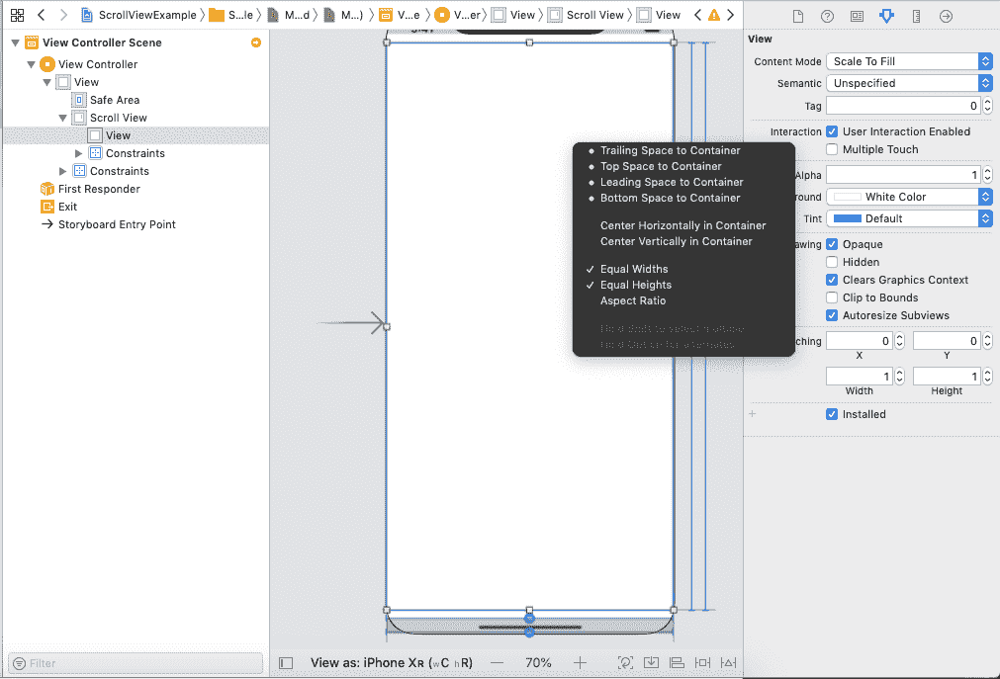

将内容视图的优先级设置为低，如下图所示。这是这个设置中最重要的一步；否则，scrollview 不会滚动。

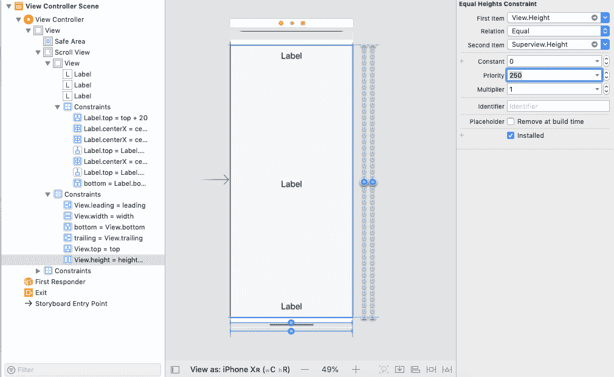

我们将在故事板上有滚动视图和内容视图。因为当内容大小不适合 iPhone 屏幕的整个屏幕时，ScrollView 可以工作。我们在 XCode 的大小检查器中定义视图控制器屏幕的大小。默认情况下，视图控制器的模拟大小是固定的。然而，我们需要使它自由，并给高度大于当前屏幕高度的任何东西，如下图所示。

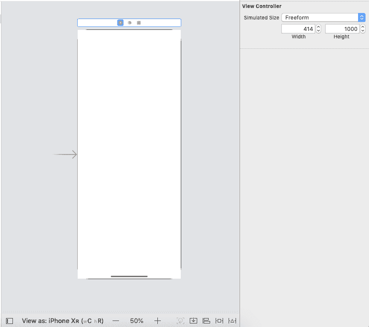

在滚动视图的顶部、中心和底部添加一个建筑标签，并给出它们之间的垂直间距，以测试滚动视图是否工作。在添加用户标签和改变背景颜色之后，界面构建器将看起来像下面的窗口。

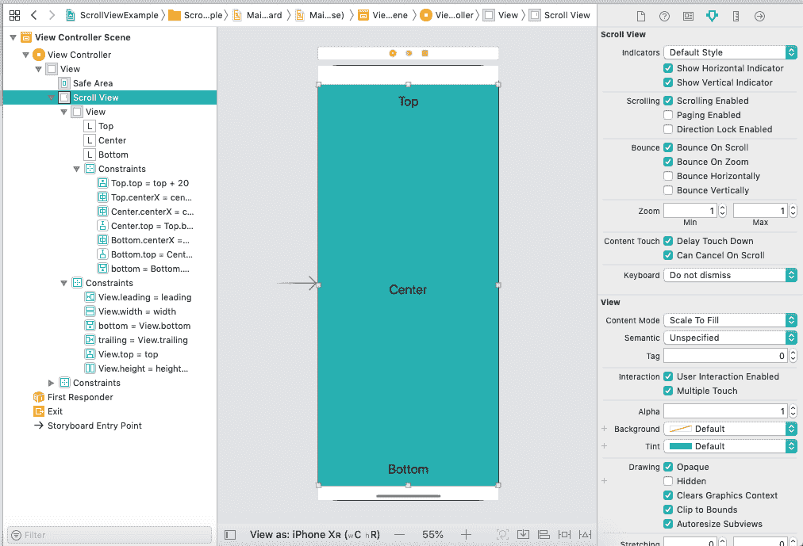

上述设置将使滚动视图滚动到屏幕上显示全部内容。

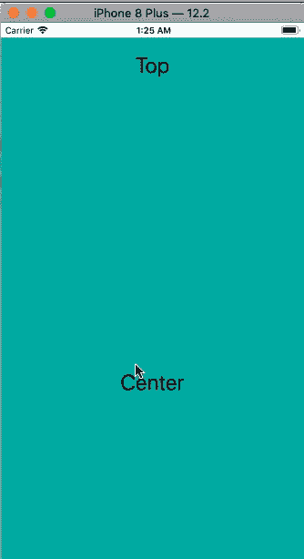

### 滚动视图属性

UIScrollView 类包含以下属性。

| 塞内加尔 | 财产 | 类型 | 描述 |
| one | 代表 | 遵守协议 | 它是 ScrollView 对象的委托。 |
| Two | 滚动范围 | 断续器 | 它表示内容视图的大小。 |
| three | 滚动位置 | CGPoint | 它表示 contentview 的原点从 ScrollView 的原点偏移的点。 |
| four | adjustedContentOffset | 伊奇科昆虫 | 它表示内容插图中的插图和滚动视图的安全区域。 |
| five | 框架布局指南 | UILayoutGuide | 基于滚动视图的未转换框架矩形的布局指南。 |
| six | contentLayoutGuide | UILayoutGuide | 基于滚动视图的未翻译内容矩形的布局指南。 |
| seven | 是克隆的 | 弯曲件 | 它表示告知滚动视图是否启用的布尔值。 |
| eight | isDirectionLockEnabled | 弯曲件 | 它表示告知滚动视图是否可以在特定方向滚动的布尔值。 |
| nine | ispaginagenabled | 弯曲件 | 它是一个布尔值，表示是否在特定方向上启用分页。 |
| Ten | scrollsToTop | 弯曲件 | 它是一个布尔值，控制是否启用滚动到顶部手势。 |
| Eleven | 弹回 | 弯曲件 | 它是一个布尔值，表示滚动视图是否在内容边缘反弹。 |
| Twelve | 总是弹性的 | 弯曲件 | 它是一个布尔值，表示当垂直滚动到达内容末尾时是否总是发生跳跃。 |
| Thirteen | alwaysbounchehorizontal | 弯曲件 | 它是一个布尔值，表示当水平滚动到达内容末尾时是否总是出现跳跃。 |
| Fourteen | 长袜 | 弯曲件 | 它是一个布尔值，表示用户是否触摸内容来启动滚动 |
| Fifteen | 正在拖动 | 弯曲件 | 它是一个布尔值，表示用户是否已经开始滚动内容。 |
| Sixteen | 正在加速 | 弯曲件 | 当用户停止拖动或抬起手指时，内容是否在 scrollview 中移动是一个布尔值。 |
| Seventeen | 减速速度 | UIScrollView(滚动视图)。减速速度 | 它是一个浮点值，决定了用户抬起手指后的减速率。 |
| Eighteen | 指示器样式 | UIScrollView(滚动视图)。标记样式 | 它代表滚动指示器的样式。 |
| Nineteen | showsHorizontalScrollsIndicator | 弯曲件 | 它是一个布尔值，表示水平滚动指示器是否可见。 |
| Twenty | 显示文章链接指示器 | 弯曲件 | 它是一个布尔值，表示垂直滚动指示器是否可见。 |
| Twenty-one | 刷新控制 | UIRefreshControl | 它表示与滚动视图关联的刷新控件。 |
| Twenty-two | canCancelContentTouches | 弯曲件 | 它是一个布尔值，用于控制。 |
| Twenty-three | delayContentTouches | 弯曲件 | 它是一个布尔值，表示滚动视图是否会延迟触摸手势的处理。 |
| Twenty-four | 方向压力手势识别器 | 手势识别 | 方向按钮按压的基础手势识别器。 |
| Twenty-five | 拖动手势 | 拖动手势 | 平移手势的基础手势识别器。 |
| Twenty-six | 捏合手势 | 缩放手势 | 用于捏手势的基础手势识别器。 |
| Twenty-seven | 缩放比例 | CGFloat 函数 | 这是一个浮点值，用于缩放滚动视图的内容。 |
| Twenty-eight | maximumZoomScale | CGFloat 函数 | 这是一个最大浮点值，可用于缩放滚动视图的内容。 |
| Twenty-nine | 最小 | CGFloat 函数 | 这是可用于缩放滚动视图内容的最小浮点值。 |
| Thirty | isZoomBouncing | 弯曲件 | 它是一个布尔值，表示缩放是否超过了相关的缩放限制。 |
| Thirty-one | 正在缩放 | 弯曲件 | 它是一个布尔值，表示内容视图当前是否正在缩放。 |
| Thirty-two | 弹跳缩放 | 弯曲件 | 它是一个布尔值，表示当缩放超过最大或最小限制时，滚动视图是否动画显示内容缩放。 |

### 例子

这是一个简单的例子，我们将创建一个滚动视图和内容视图。我们将在滚动视图中创建两个 UIViews 来显示实际内容。

**界面构建器**

在这个例子中，我们将使用 scrollview，它包含一个内容视图。内容视图将被滚动以显示两个 uiviews。为此，使用本教程中给出的说明将 scrollview 添加到接口生成器，并将 scrollview 添加到接口。

将用户界面视图添加到滚动视图中，并为用户界面视图定义自动布局规则。将 UIView (ContentView)添加到 scrollview 之后，我们需要向故事板添加两个 UIView 和一个 UIButton。

为了使滚动视图可滚动，我们需要将视图控制器的大小从固定更改为自由形式，并在视图之间定义一些垂直间距。

为滚动视图、内容视图、用户视图和提交按钮设置自动布局规则。

**滚动视图的自动布局规则**

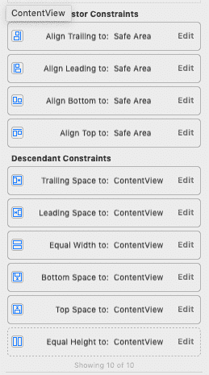

内容视图的自动布局规则

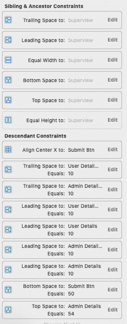

管理详细信息视图的自动布局规则

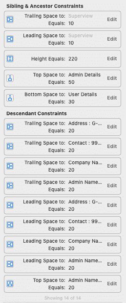

用户的自动布局规则详细信息视图

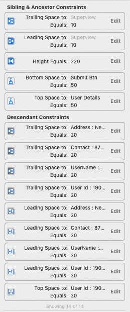

**主故事板**

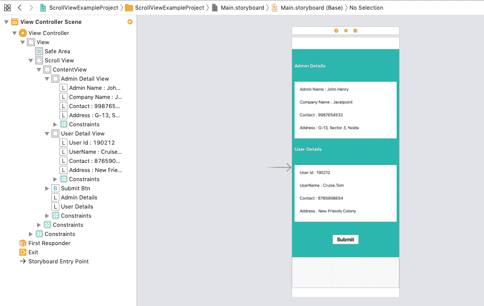

**ViewController.swift**

```

import UIKit

class ViewController: UIViewController {

    @IBOutlet weak var adminDetailView: UIView!

    @IBOutlet weak var userDetailView: UIView!

    @IBOutlet weak var submitBtn: UIButton!

    override func viewDidLoad() {
        super.viewDidLoad()
        // Do any additional setup after loading the view.
        adminDetailView.layer.cornerRadius = 10
        adminDetailView.layer.borderColor = UIColor.black.cgColor
        adminDetailView.layer.borderWidth = 1
        adminDetailView.layer.shadowOffset = CGSize(width: 2, height: 2)
        adminDetailView.layer.shadowColor = UIColor.black.cgColor
        adminDetailView.layer.shadowRadius = 5

        userDetailView.layer.cornerRadius = 10
        userDetailView.layer.borderColor = UIColor.black.cgColor
        userDetailView.layer.borderWidth = 1
        userDetailView.layer.shadowOffset = CGSize(width: 2, height: 2)
        userDetailView.layer.shadowColor = UIColor.black.cgColor
        userDetailView.layer.shadowRadius = 5

        submitBtn.layer.cornerRadius = 10
        submitBtn.layer.borderColor = UIColor.black.cgColor
        submitBtn.layer.shadowColor = UIColor.black.cgColor

    }

}

```

**输出:**

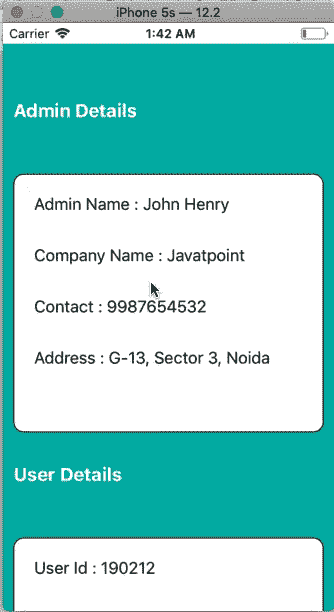[Click Here to Download Project](https://static.javatpoint.com/tutorial/ios/download/ScrollViewExampleProject.zip)

* * *