# 卷动检视

> 哎哎哎:# t0]https://www . javatppoint . com/IOs-imageview

不使用 imageview 几乎不可能设计和开发任何 iOS 应用程序。ImageView 可以定义为一个可以在 iOS 应用程序界面上显示图像的对象。它是继承 UIImageView 的 UIImageView 类的实例。

```

class UIImageView : UIView

```

ImageView 在 UIImage 对象指定图像的界面上绘制图像。我们可以使用 imageview 对象来显示各种图像文件的内容，如 JPG 或巴布亚新几内亚。UIImageView 类包含各种方法和属性，我们可以使用它们以编程方式配置 ImageView。我们还可以配置动画图像显示在界面上。

### 向界面添加图像视图

1.  在对象库中搜索 UIImageView，并将结果拖到故事板。
2.  定义图像视图的自动布局规则，以控制其在不同屏幕设备上的位置和大小。
3.  在视图控制器类中创建 imageview 的连接出口。
4.  以编程方式或使用故事板将图像辅助到 imageview。

### 在 Xcode 中向项目添加图像

在 Xcode 中向项目添加图像就像将图像文件从本地设备存储拖到 Xcode 中项目的资产文件夹一样简单。

访问 Xcode 中的 Assets.xcassets 文件夹，如下图所示。此文件夹包含项目中正在使用的所有资源，包括应用程序图标。

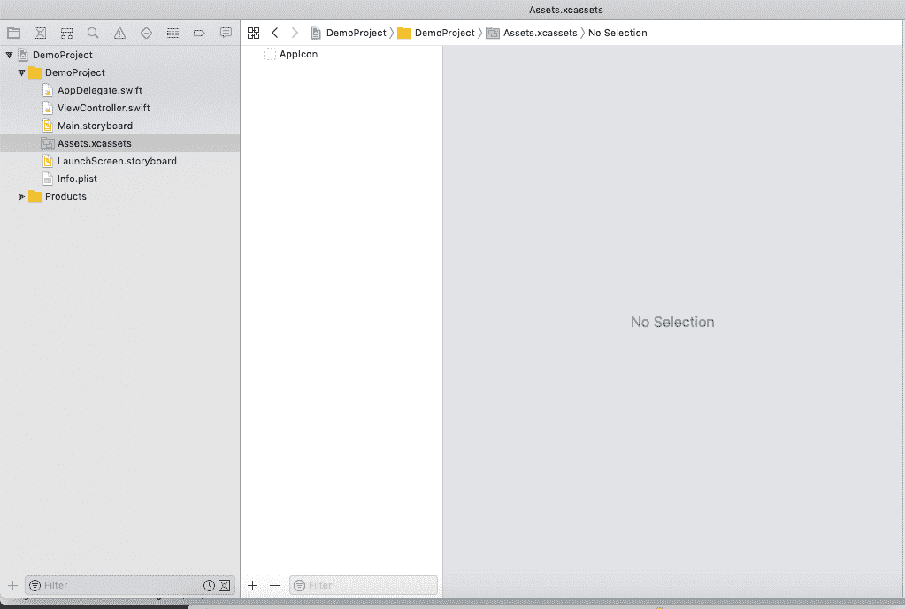

最初，Xcode 中没有资产。要在资产中添加新的图像集，请右键单击应用图标下方的左窗格，然后从列表中选择新建图像集。

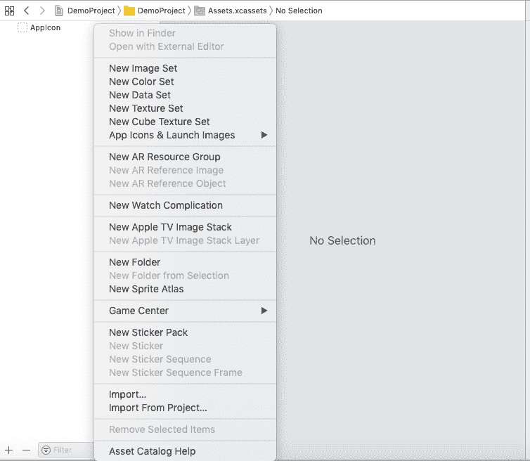

这将创建新的图像集(资源中的文件夹)。这里，我们需要将图像文件从本地设备拖放到 Xcode 中的新图像集中。

下图显示了一个图像集，我们可以在其中从本地设备中删除所需的图像。

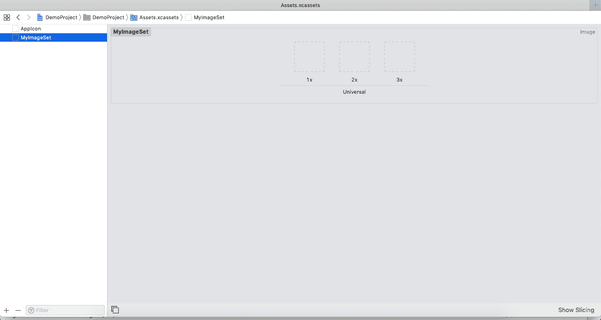

在 iOS 应用程序中，有三类图像可以根据维度添加到项目中，即 1X、2X 和 3X。上图也显示了下图中提到的环球。这意味着图像可以用于通用设备，包括 IPad 和 iPhone。但是，我们可以在窗口的右窗格中指定设备的预期类别，如下图所示。

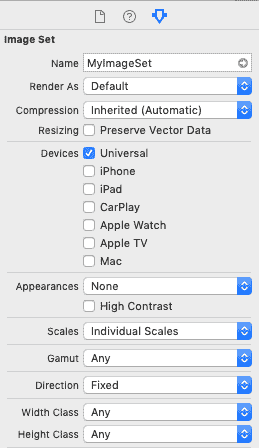

### 界面构建器属性

| 塞内加尔 | 属性 | 描述 |
| one | 图像 | 它表示要显示的 UIImage 对象。我们可以从故事板中设置图像，或者通过使用 UIImageView 类的 image 或 animatedImages 属性以编程方式设置图像。 |
| Two | 突出的 | 它表示当 imageview 高亮显示时显示的 UIImage 对象。要以编程方式设置此属性，我们可以使用 highlightedImage 或 highlightedAnimationImages 属性。 |
| three | 状态 | 此属性用于将 imageview 的初始状态更改为高亮显示。使用 isHighlighted 属性检查 imageview 是否处于突出显示状态。 |

## 在 ImageView 中缩放图像

图像视图的 contentMode 属性用于确定如何正确显示图像。如果使用 imageview 显示的图像大小与 imageview 本身的大小不匹配，那么我们需要在界面上配置图像的外观。但是，最佳做法是使用相同大小的图像，但是 imageview 可以缩放图像以适合所有或部分可用空间。UIView。ContentMode.scaleAspectFit 和 UIView。ContentMode.scaleAspectFill 模式缩放图像以适合或填充空间，同时保持图像的原始纵横比。UIView。ContentMode.scaleToFill 值缩放图像时不考虑原始纵横比，这可能会导致图像看起来失真。其他内容模式将图像放置在图像视图边界的适当位置，而不缩放图像。

### 图像透明度

如果图像的大小小于 imageview，则图像中的任何透明度都会导致背景显示，因为图像会先合成到 imageview 背景上，然后再合成到可用图像的其余部分上。

*   如果图像视图的“等色”属性为真，则图像的像素将合成在图像视图的背景颜色之上，而图像视图的“alpha”属性将被忽略。
*   如果图像视图的“等透明度”属性为假，则每个像素的 alpha 值将乘以图像视图的 alpha 值，结果值将成为该像素的实际透明度值。如果图像没有 alpha 通道，则假设每个像素的 alpha 值为 1.0。

### 例 1

在本例中，我们将创建一个 Imageview，并通过使用其 image 属性以编程方式将一个 UIImage 对象设置为 imageview。为此，我们将向 Xcode 项目添加一个新图像。

**界面构建器**

要向故事板添加图像视图，请在对象库中搜索 image view，并将结果拖到故事板。

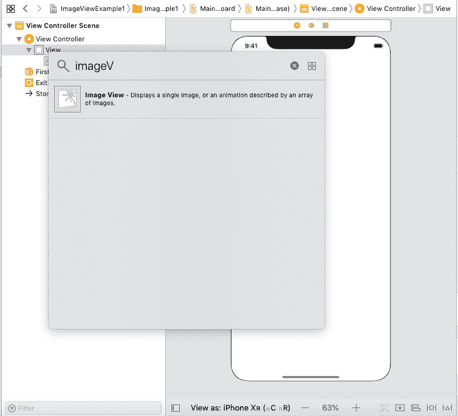

定义图像视图的自动布局规则，以控制其在不同屏幕尺寸上的大小和位置。但是，我们还将从本地设备向 Xcode 中的资产添加一个映像，如下图所示。

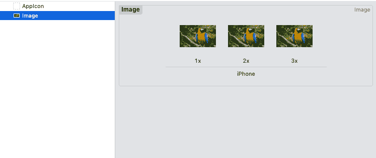

main .故事板如下图所示。

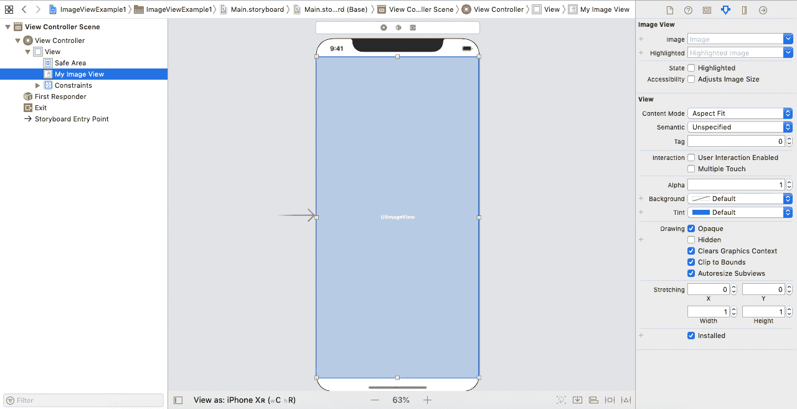

**ViewController.swift**

```

import UIKit

class ViewController: UIViewController {

    @IBOutlet weak var myImageView: UIImageView!
    var img:UIImage = UIImage(named: "Image") ?? UIImage()
    override func viewDidLoad() {
        super.viewDidLoad()
        // Do any additional setup after loading the view.
        myImageView.image = img
        //myImageView.contentMode = .scaleToFill

    }
}

```

**输出:**

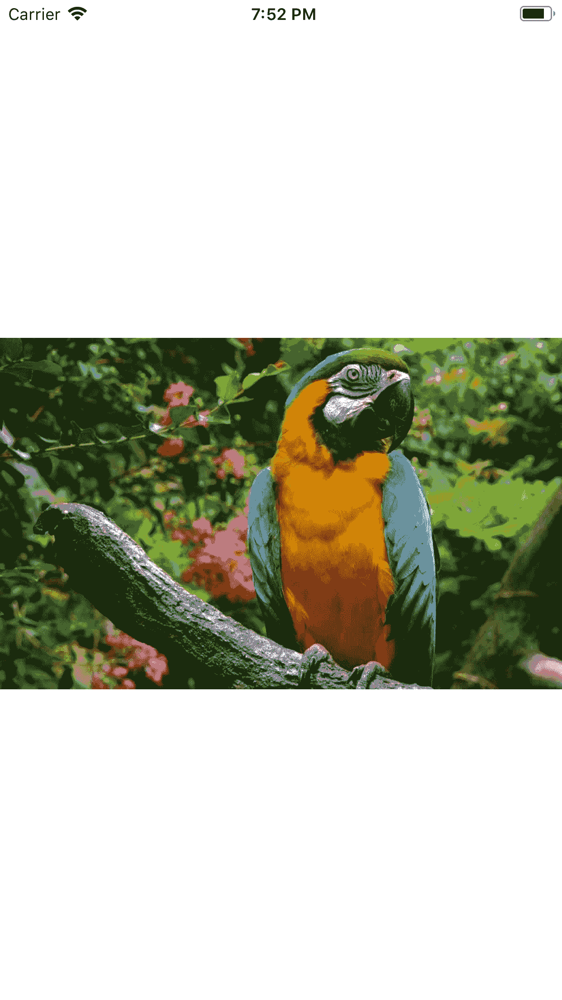

默认情况下，imageview 的内容模式设置为 scaleToFit。但是，如果我们将其设置为 scaleToFill，则上面程序的输出如下图所示。

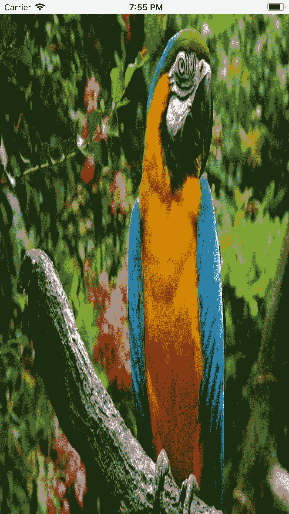

### 向 imageview 添加触摸事件

默认情况下，imageview 不响应事件。但是，我们可以将 imageview 的 isUserInteractionEnabled 属性设置为 true，以便为 imageview 启用用户交互。我们可以使用 UITapGestureRecognizer 为 imageview 配置轻击手势。

考虑下面的图像，在该图像中，我们将为示例 1 中所示的 imageview 配置轻击手势。

### 例子

In this example, we will add another view controller to the storyboard we created in example 1\. We will define a segue between the View Controllers with the identifier string "segue" as shown in the following image.

**主故事板**

我们将为图像视图定义轻击手势识别器，并将设置 isUserInteractionEnabled 属性

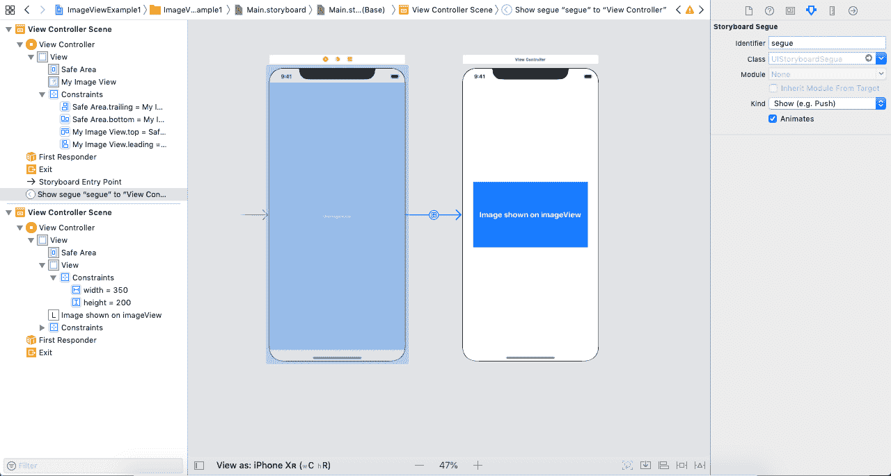

**ViewController.swift**

```

import UIKit

class ViewController: UIViewController {

    @IBOutlet weak var myImageView: UIImageView!
    var img:UIImage = UIImage(named: "Image") ?? UIImage()
    override func viewDidLoad() {
        super.viewDidLoad()
        // Do any additional setup after loading the view.
        myImageView.image = img
        myImageView.isUserInteractionEnabled = true
        let tapGesture = UITapGestureRecognizer(target: self, action: Selector("tappedImageView"))
        myImageView.addGestureRecognizer(tapGesture)
    }

    @objc func tappedImageView (){
        performSegue(withIdentifier: "segue", sender: self)
    }
}

```

**输出:**

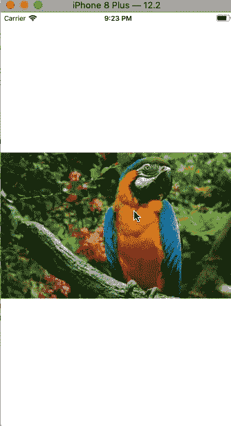

* * *